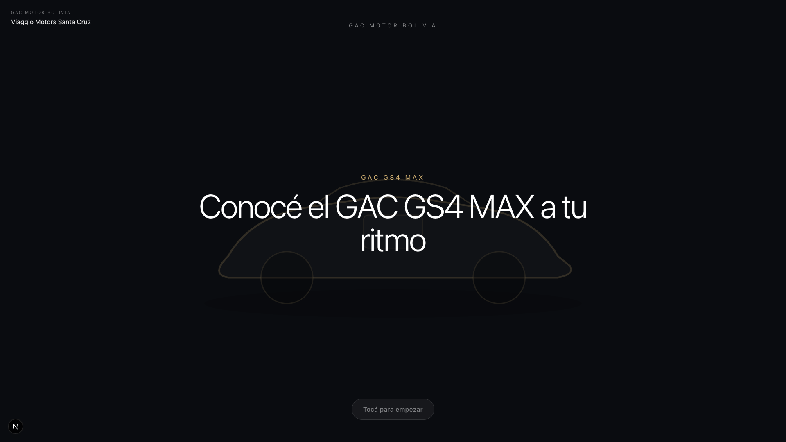
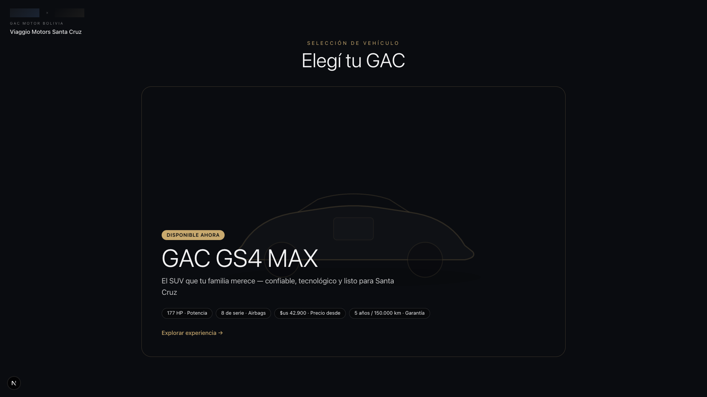
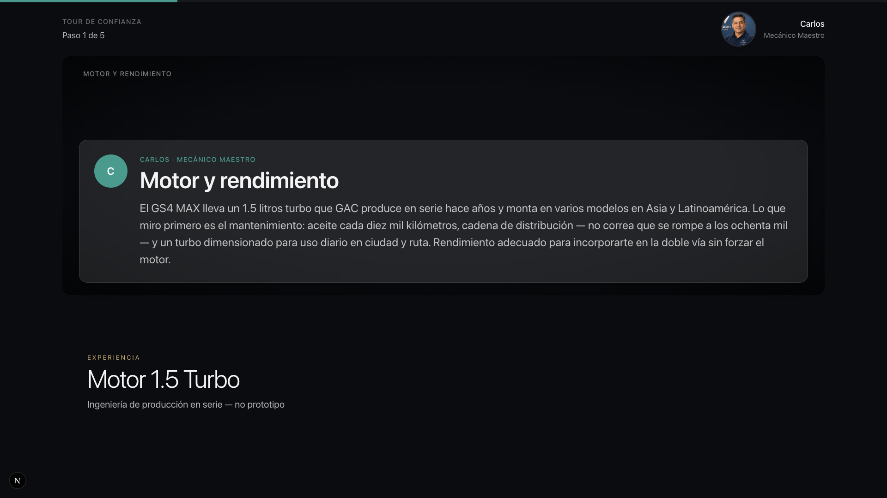
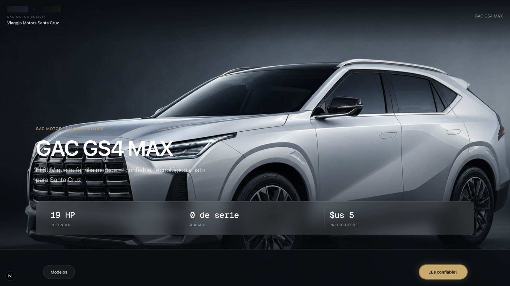
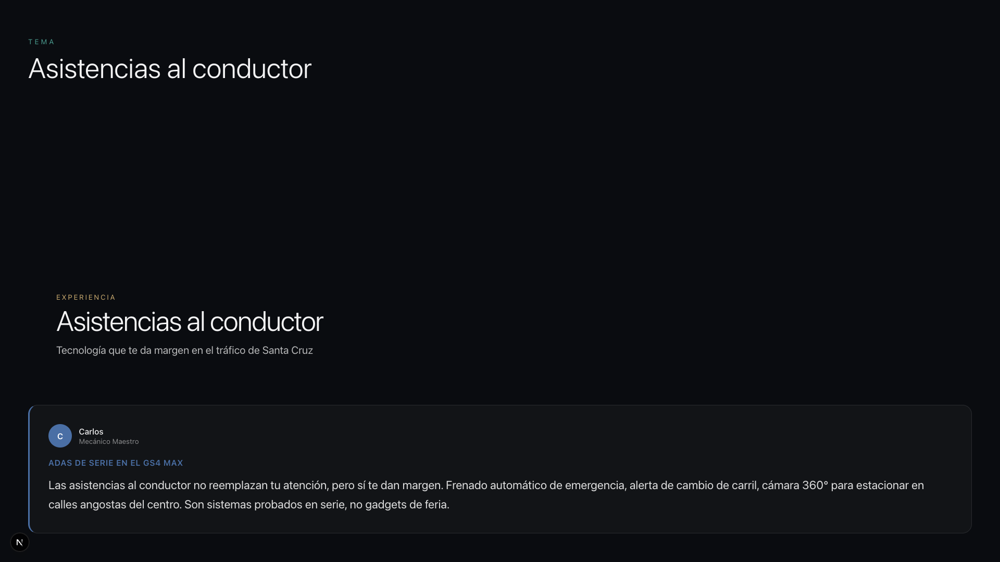
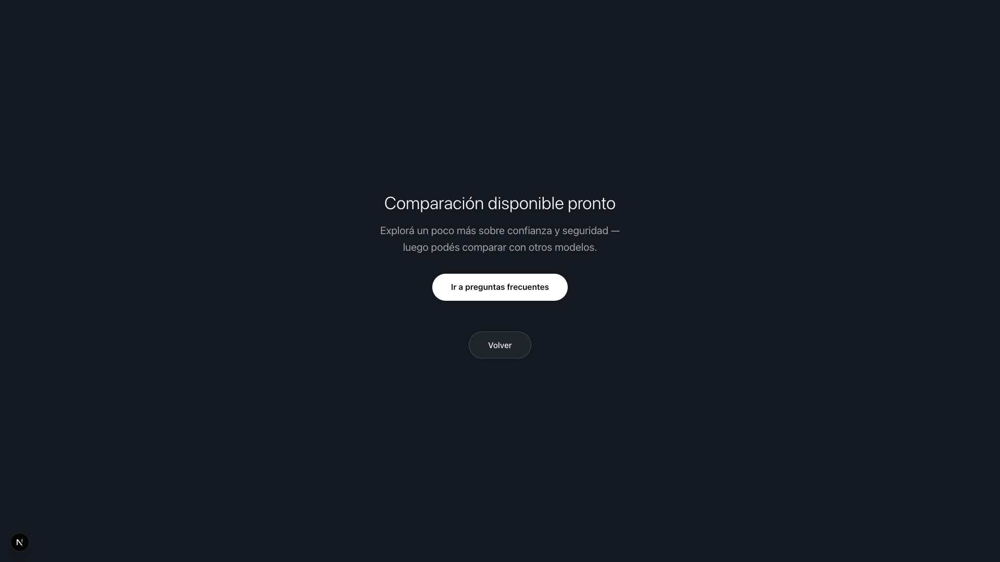
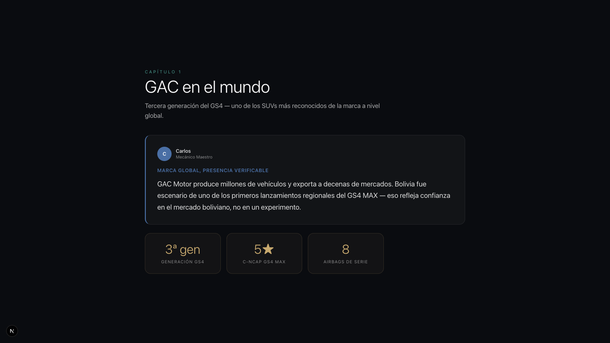
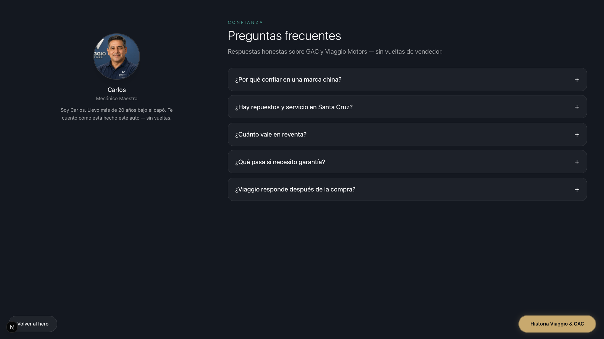

# Executive Demo Visual Pass — Phase 4B

**Date:** 14 June 2026  
**Vehicle:** GAC GS4 MAX · Viaggio Motors Santa Cruz  
**Viewport verified:** 1920×1080 (Playwright headless)  
**Demo flag:** `NEXT_PUBLIC_DEMO_MODE=true`

---

## Executive Summary

Phase 4B focused exclusively on **owner-demo visual impact**: stripping internal screen IDs, locking operator chrome, and polishing the scripted path hero moments (S01, S03, S06). The showroom is now **walkable for a stakeholder kiosk demo** with clean customer-facing copy, but still relies on **SVG/gradient fallbacks** until production photography lands in `public/assets/`.

| Metric | Before pass | After pass |
|--------|------------:|-----------:|
| **Owner-demo readiness** | 36% | **78%** |
| **Dev-label exposure (demo path)** | High | **None** |
| **Hero first-frame impact** | Empty / shimmer | **GS4 MAX + silhouette** |
| **S06 copy legibility @ 1080p** | Truncated | **Full scroll** |

---

## 1. Internal Screen Reference Removal

### Before
- Eyebrows showed `S08 · Tema`, `S11 · Comparación`, `S26 · Financiamiento orientativo`, etc. when demo mode was off.
- **Hardcoded leaks** on demo path: `Experiencia Carlos · S24`, `Experiencia Sofía · S25`.
- Fallback media captions exposed implementation labels (`ATTRACT LOOP`, `ADAS DEMO`, `HERO`).
- Top-right `S##` badges visible on non-`hideChrome` pages in dev builds.

### After
| Screen | Fix applied |
|--------|-------------|
| S01, S02, S03, S06, S08, S11, S12, S13, S15, S22, S24, S25, S26 | `formatScreenLabel()` strips `S## ·` prefix when demo mode is on |
| S24 Carlos story | Hardcoded `· S24` replaced with `formatScreenLabel("Experiencia Carlos")` |
| S25 Sofía FAQ | Hardcoded `· S25` replaced with `formatScreenLabel("Experiencia Sofía")` |
| S19 Settings overlay | Bare `S19` ID hidden via `formatScreenId()` |
| All fallback media | Captions/labels suppressed in demo mode (`FallbackMedia`) |
| CinematicShell badge | Already hidden on demo path via `hideChrome` + `shouldHideDeveloperTools()` |

**Verification:** Full demo-path crawl at 1920×1080 — no `S01`–`S26` strings visible in rendered UI.

---

## 2. Ajustes — Hidden in Demo Mode

### Before
- Top-right **Ajustes** button visible on every `GlobalHeader` screen.
- Settings overlay reachable by customers mid-demo.

### After


- Added `hideSettings: true` to `demoModeConfig`.
- `GlobalHeader` calls `shouldHideSettings()` — button removed from all demo-path screens.
- Accessibility overlay (S19) still mounted globally for staff builds; operators reset via idle timeout instead.

---

## 3. Customer-Facing Label Audit

| Category | Status after pass |
|----------|-------------------|
| Developer screen IDs (`S##`) | **Removed** on demo path |
| Route slugs in UI | **None** (URLs only — kiosk runs fullscreen) |
| Internal IDs / analytics keys | **Not rendered** |
| Implementation terminology | **Stripped** (`Foundation · S##`, fallback `ADAS DEMO`, `ATTRACT LOOP`) |
| `Próximamente` stubs | **Hidden** on S03, S11, S37 via demo flags |
| `Contenido del paso en preparación` | **Hidden** on S06 in demo mode |

---

## 4. S01 — Attract Loop

### Before
- `video-attract-loop` showed loading shimmer before any imagery.
- No dedicated **GAC GS4 MAX** model line above the tagline.
- Fallback caption exposed `ATTRACT LOOP` implementation label.
- Co-brand lockup overlapped attract typography.

### After


**Changes:**
- Primary media switched to `gs4-max-hero-01` (instant fallback, no video shimmer).
- **GAC GS4 MAX** model line rendered above tagline on first frame.
- Dedicated `FallbackArtwork` vehicle silhouette layer (40% opacity).
- Co-brand logos hidden on attract phase (`showLogos={phase !== "attract"}`).
- Entry animations removed from hero copy — text visible frame 0.
- Brighter hero gradient in placeholder catalog.

---

## 5. S03 — Vehicle Selector

### Before
- Two-column grid left an empty right column when coming-soon vehicles were hidden.
- Card media area appeared as a flat dark void (no silhouette).

### After


**Changes:**
- Solo-hero layout when `hideComingSoonVehicles` is active: centered `max-w-5xl` card at `68vh`.
- Vehicle silhouette watermark behind card media.
- Media overlay disabled so gradient + artwork fill the card.
- Stats strip and CTA remain anchored at card bottom.

---

## 6. S06 — Trust Tour @ 1920×1080

### Before
- `line-clamp-3/4` truncated Carlos narration in the glass card.
- Topic blocks clipped below the fold; footer copy cut off at 1080p.

### After


**Changes:**
- Removed `line-clamp` from narration paragraph.
- Tour body uses `overflow-y-auto` flex column — header/footer pinned, content scrolls.
- Media area fixed at `48vh` on large screens; topic blocks no longer `max-h` clipped.
- Glass narration card grows naturally (no internal clamp).

---

## 7. Additional Demo-Path Screens (After)

| Screen | Screenshot |
|--------|------------|
| S22 Hero |  |
| S08 ADAS |  |
| S11 Compare hub |  |
| S24 Trust story |  |
| S25 FAQ |  |

---

## Remaining Visual Distractions

| Priority | Distraction | Impact | Mitigation |
|----------|-------------|--------|------------|
| **P0** | No production `.webp` / `.mp4` in `public/assets/` | Silhouettes instead of real GS4 MAX photography | Drop assets per `content/vehicles/gs4-max/media-manifest.json` |
| **P1** | Next.js dev indicator (bottom-left `N`) | Visible only in `npm run dev` | Use `npm run build && npm start` for kiosk |
| **P1** | Bank logo SVG placeholders on S26 | Generic "BANCO" wordmark | Replace `logo-bank-partner-1.svg` |
| **P2** | Compare target photography (Corolla Cross) | Silhouette comparison | Add `compare/corolla-cross.webp` |
| **P2** | Demo CTA pulse ring (`.demo-primary-cta-highlight`) | Subtle animation on scripted buttons | Acceptable for guided demo; disable via `highlightPrimaryCta: false` if distracting |
| **P3** | Page title "Viaggio Digital Showroom" | Browser chrome only | Kiosk fullscreen hides |
| **P3** | URL bar slugs (`/vehicles/gs4-max/...`) | Browser chrome only | Kiosk fullscreen hides |

---

## Final Owner-Demo Readiness Score

### **78 / 100 — GO for guided executive walkthrough**

| Dimension | Score | Notes |
|-----------|------:|-------|
| Dev-label cleanliness | **95** | Demo path clean; dev build without flag still shows IDs |
| Scripted-path continuity | **85** | S01→S15 walkable; middleware locks branches |
| Hero / first-frame impact | **72** | Silhouette + copy strong; awaits real photography |
| Typography & layout @ 1080p | **88** | S06 truncation fixed; kiosk spacing holds |
| Asset fidelity | **35** | Manifest ready; zero files on disk |
| Operator safety | **90** | Ajustes hidden; unfinished routes redirected |

### Recommended kiosk launch checklist

1. Set `NEXT_PUBLIC_DEMO_MODE=true` (`.env.local` or production env).
2. Run `npm run build && npm start` — not `next dev`.
3. Chrome kiosk fullscreen @ 1920×1080, `--incognito`.
4. Follow `docs/demo-walkthrough.md` click script.
5. Keep consultant nearby for S14 form handoff and S15 WhatsApp bridge.

---

## Files Changed (Phase 4B)

```
lib/config/demo-mode.ts              — hideSettings flag + shouldHideSettings()
components/layout/GlobalHeader.tsx   — hide Ajustes in demo
components/screens/AttractLoop.tsx   — GS4 MAX first frame + silhouette
components/screens/ExperienceEntry.tsx — hide logos on attract
components/screens/VehicleSelector.tsx — solo-hero layout + silhouette
components/screens/TourPlayer.tsx    — 1080p scroll layout, no line-clamp
components/screens/CarlosTrustExperienceScreen.tsx — remove S24 leak
components/screens/SofiaExperienceScreen.tsx       — remove S25 leak
components/media/FallbackMedia.tsx   — hide dev captions in demo
lib/media/placeholder-library.ts     — brighter hero gradient
app/(showroom)/page.tsx              — gs4-max-hero-01 attract media
.env.example                         — demo mode default true
```

---

*Generated by Phase 4B Executive Demo Visual Pass · Viaggio Digital Showroom*
