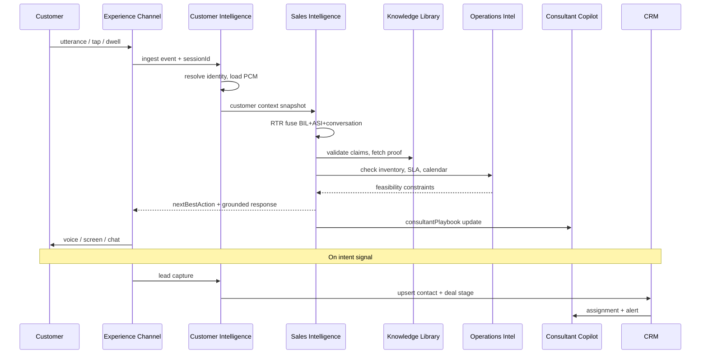
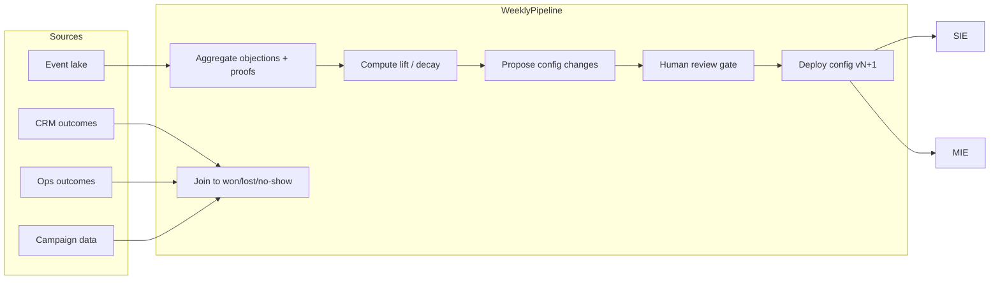

# Future State Architecture — Viaggio Customer Intelligence Platform

**Version:** 1.0  
**Date:** 14 June 2026  
**Audience:** Ownership, investors, GAC regional, engineering, operations  
**Basis:** All specifications, audits, Sprint A, ASI, Phase X, executive roadmaps, operations blueprint, media audits  
**Constraint:** Strategic architecture — not implementation code  

---

## Executive Thesis

Viaggio's current work product is framed as a **digital showroom kiosk**. That framing is the first assumption to challenge.

The real asset being built is a **Customer Intelligence Platform (CIP)** — a closed-loop system that:

1. **Observes** every customer signal (conversation, behavior, CRM, inventory, campaigns)  
2. **Reasons** about intent, objection, readiness, and risk  
3. **Acts** through sales, marketing, and operations channels  
4. **Learns** weekly from outcomes  
5. **Reports** truth to executives with explainability  

The kiosk is one **ingress channel** — like a branch ATM is to a bank. The platform is the institution.

```
Wrong mental model:   "We built a smart kiosk."
Right mental model:   "We built the intelligence layer for high-trust, high-ticket retail."
```

---

## Part 0 — Assumption Audit (Challenge Everything)

Before architecture, name what the existing specs assume — and where those assumptions break at enterprise scale.

| # | Assumption in current specs | Challenge | Consequence if unchallenged |
|---|----------------------------|-----------|----------------------------|
| A1 | **Single vehicle, single dealership** | Viaggio is a multi-brand distributor; GS4 MAX is pilot SKU | Platform cannot scale to GS8, EMZOOM, second location |
| A2 | **Showroom = primary channel** | 60–70% of Santa Cruz buyers research on phone before visit | CIP without pre-visit + WhatsApp = blind to majority of journey |
| A3 | **Session = anonymous until form submit** | Phone is identity; spouse opens share link days later | Fragmented customer record; attribution breaks |
| A4 | **Consultant follows when called** | Floor staffing varies; SLA failures are structural | "2-minute handoff" promise erodes brand if ops not instrumented |
| A5 | **AI replaces first 5 minutes** | Legal, financing, trade-in, and contract require humans in Bolivia | Over-automation risk; regulatory and trust backlash |
| A6 | **Content truth is static JSON** | Pricing, stock, promotions, bank rates change weekly | Stale cuota ranges destroy credibility faster than bad UX |
| A7 | **Learning = config threshold tuning** | True learning needs outcome labels (won/lost), not just dwell time | ASI "self-learning" optimizes engagement, not revenue |
| A8 | **Objections are enumerable (8 types)** | Real objections are compound, cultural, and competitor-specific | OPE misses hybrid fears ("Chinese AND expensive AND spouse") |
| A9 | **Success = test drive booked** | Test drives no-show; financing stalls; spouse vetoes post-visit | Platform optimizes vanity metric, not gross profit |
| A10 | **Media is parallel sprint** | 85% placeholder rate means intelligence outputs point at broken proof | Best reasoning engine with worst visuals = worse than average rep |
| A11 | **CRM = Phase 3 Zoho sync** | Without CRM as system of record from day one, CIP is a data silo | Executive dashboards show kiosk fiction, not dealership truth |
| A12 | **No PII until consent** | Bolivia WhatsApp culture expects continuity; over-minimization loses memory | PCM underperforms; return visits feel cold |
| A13 | **Screens are the product** | Phase X correctly moves to conversation — but specs still anchor on S01–S37 | Engineering builds screen debt while product moves to CSI |
| A14 | **Investor-grade = good copy + architecture docs** | Investors want unit economics, retention, attribution, margin impact | Narrative without closed-loop revenue proof fails diligence |

**Redesign mandate:** Enterprise-grade CIP requires **multi-channel identity**, **CRM-native truth**, **outcome-labeled learning**, **inventory-aware reasoning**, and **ops accountability** — not a smarter brochure.

---

# Part 1 — Platform Architecture

## 1.1 Five Intelligence Engines

The CIP is organized as five engines sharing one **Customer Graph** and one **Governance Layer**.

```
┌─────────────────────────────────────────────────────────────────────────────────┐
│                         VIAGGIO CUSTOMER INTELLIGENCE PLATFORM                   │
├─────────────────────────────────────────────────────────────────────────────────┤
│                                                                                  │
│  ┌──────────────────┐  ┌──────────────────┐  ┌──────────────────┐              │
│  │   CUSTOMER       │  │   SALES          │  │   MARKETING      │              │
│  │   INTELLIGENCE   │  │   INTELLIGENCE   │  │   INTELLIGENCE   │              │
│  │   ENGINE (CIE)   │  │   ENGINE (SIE)   │  │   ENGINE (MIE)   │              │
│  │                  │  │                  │  │                  │              │
│  │ Identity graph   │  │ ASI + BIL + CSI  │  │ Campaign attrib  │              │
│  │ PCM memory       │  │ DPE + CI         │  │ Audience segments│              │
│  │ Journey state    │  │ Consultant copilot│  │ Content perform  │              │
│  │ Consent & privacy│  │ Lead scoring     │  │ Nurture triggers │              │
│  └────────┬─────────┘  └────────┬─────────┘  └────────┬─────────┘              │
│           │                     │                     │                         │
│           └─────────────────────┼─────────────────────┘                         │
│                                 ▼                                               │
│                    ┌────────────────────────┐                                   │
│                    │   CUSTOMER GRAPH       │                                   │
│                    │   (golden record)      │                                   │
│                    └────────────┬───────────┘                                   │
│                                 │                                               │
│  ┌──────────────────┐  ┌───────▼──────────┐  ┌──────────────────┐              │
│  │   OPERATIONS     │  │   GOVERNANCE     │  │   EXECUTIVE      │              │
│  │   INTELLIGENCE   │  │   LAYER          │  │   INTELLIGENCE   │              │
│  │   ENGINE (OIE)   │  │                  │  │   ENGINE (EIE)   │              │
│  │                  │  │ AI guardrails    │  │                  │              │
│  │ Inventory intel  │  │ Human override   │  │ P&L attribution  │              │
│  │ SLA + staffing   │  │ Audit + explain  │  │ Portfolio KPIs   │              │
│  │ Test drive ops   │  │ Model versioning │  │ Investor metrics │              │
│  │ Finance queue    │  │ Compliance       │  │ Risk register    │              │
│  └──────────────────┘  └──────────────────┘  └──────────────────┘              │
│                                                                                  │
└─────────────────────────────────────────────────────────────────────────────────┘
```

## 1.2 Engine responsibilities

### 1. Customer Intelligence Engine (CIE)

**Mission:** One truthful customer — across sessions, channels, household members, and time.

| Capability | Description |
|------------|-------------|
| **Identity resolution** | Phone (primary), WhatsApp ID, resume token, CRM contact ID, optional email |
| **Household graph** | Primary buyer, spouse, influencer links (S33 share recipients) |
| **Persistent memory (PCM)** | Objections, comparisons, proofs seen, outcomes, preferences |
| **Journey orchestration** | Where customer is in decision arc — not which screen |
| **Consent ledger** | What was consented, when, for what purpose — auditable |

**Ingress channels (not the product):** showroom kiosk, consultant tablet, WhatsApp, pre-visit QR (S21), web landing, future voice line.

### 2. Sales Intelligence Engine (SIE)

**Mission:** Maximize qualified conversion with minimal customer friction and maximal consultant leverage.

| Module | Source spec | Role in CIP |
|--------|-------------|-------------|
| Discovery / profile | Sprint A v1.2 | Slot filling — screen or conversational |
| BIL | Sprint A §9 | uncertaintyScore, confidenceLevel, salespersonMode |
| ASI | ADAPTIVE_SALES_INTELLIGENCE | ESE, OPE, BSM, DRM, APC |
| CSI + RTR | PHASE_X | Conversation-first orchestration |
| DPE | PHASE_X | Dynamic proof selection |
| CI | PHASE_X | Close timing, escalation |
| Consultant Copilot | ASI + Phase X | Real-time floor intelligence |
| Lead scoring | Sprint A §6 | Operational priority — distinct from DRM |

**Output:** `nextBestAction`, `nextBestProof`, `consultantPlaybook`, `leadTier`, `escalationSignal`.

### 3. Marketing Intelligence Engine (MIE)

**Mission:** Know which messages brought whom, what they believed, and what to say next — before they walk in.

| Capability | Description |
|------------|-------------|
| **Campaign attribution** | UTM → session → lead → test drive → sale (multi-touch) |
| **Audience intelligence** | Segments from CIE: trust-anxious families, compare-first researchers, etc. |
| **Content performance** | Which proof nodes, personas, and messages move DRM — not just clicks |
| **Nurture orchestration** | WhatsApp templates triggered by objection state, not generic drip |
| **Lookalike signals** | Closed-won profile patterns → target creative briefs |

**Blind spot in current specs:** Marketing is treated as S21 QR landing — not a first-class engine. **Redesign:** MIE owns pre-visit and post-visit; SIE owns in-dealership moment.

### 4. Operations Intelligence Engine (OIE)

**Mission:** Ensure the physical dealership can fulfill what the intelligence promises.

| Capability | Description |
|------------|-------------|
| **Inventory intelligence** | Stock by trim/color, lot location, demo unit availability, aging |
| **Test drive scheduling** | Real calendar, unit prep, no-show prediction |
| **SLA monitoring** | S36 handoff, finance desk, WhatsApp response — measured not promised |
| **Staffing intelligence** | Floor coverage vs live session load; alert before SLA breach |
| **Finance pipeline** | Credit-ready queue, bank partner status, entrada/trade-in flags |
| **Service cross-sell** | Post-sale — warranty, maintenance plan attach (future) |

**Critical gap:** Sprint A/ASI/Phase X reason about **customer state** but not **operational feasibility**. Recommending test drive when no unit is available = intelligence failure.

### 5. Executive Intelligence Engine (EIE)

**Mission:** Translate floor signals into decisions ownership and investors can act on.

| Capability | Description |
|------------|-------------|
| **Revenue attribution** | Kiosk-assisted vs walk-in vs campaign-sourced gross profit |
| **Funnel economics** | Cost per qualified lead, cost per test drive, cost per sale by channel |
| **Objection intelligence (aggregate)** | Top unresolved fears by week; content gaps; competitor pressure |
| **Consultant performance** | Conversion when copilot used vs not; SLA compliance |
| **Platform health** | AI grounding failures, override rate, customer trust scores |
| **Portfolio view** | Multi-SKU, multi-location rollup (future) |

---

## 1.3 Enterprise reference architecture

```
                         ┌─────────────────────────────────────┐
                         │         EXPERIENCE LAYER            │
                         │  Kiosk · Tablet · WhatsApp · Web    │
                         └──────────────────┬──────────────────┘
                                            │ events + commands
                         ┌──────────────────▼──────────────────┐
                         │         API GATEWAY + EVENT BUS       │
                         │  (session events, leads, CRM webhooks)│
                         └──────────────────┬──────────────────┘
                                            │
         ┌──────────────────────────────────┼──────────────────────────────────┐
         ▼                                  ▼                                  ▼
┌─────────────────┐              ┌─────────────────────┐              ┌─────────────────┐
│  CIE            │◄────────────►│  SIE (reasoning)    │◄────────────►│  MIE            │
│  Customer Graph │              │  ASI·BIL·CSI·DPE·CI │              │  Attribution    │
└────────┬────────┘              └──────────┬──────────┘              └────────┬────────┘
         │                                  │                                  │
         │         ┌────────────────────────┼────────────────────────┐         │
         │         ▼                        ▼                        ▼         │
         │  ┌─────────────┐        ┌─────────────────┐        ┌─────────────┐   │
         └──►│  OIE        │        │  KNOWLEDGE      │        │  EIE        │◄──┘
             │  Inventory  │        │  LIBRARY        │        │  Analytics  │
             │  SLA·Ops    │        │  (ground truth) │        │  Warehouse  │
             └──────┬──────┘        └────────┬────────┘        └──────┬──────┘
                    │                        │                        │
                    └────────────────────────┼────────────────────────┘
                                             ▼
                              ┌──────────────────────────┐
                              │  CRM (Zoho) — SYSTEM OF   │
                              │  RECORD for deals + humans  │
                              └──────────────────────────┘
                                             │
                              ┌──────────────────────────┐
                              │  GOVERNANCE LAYER         │
                              │  Guardrails · Audit · HITL │
                              └──────────────────────────┘
```

---

# Part 2 — Data Flows

## 2.1 Real-time customer interaction flow



## 2.2 Batch learning flow (weekly)



## 2.3 Campaign attribution flow

```
Ad / Meta / Radio / QR poster (UTM)
        │
        ▼
Pre-visit landing (S21) ──► sessionId + campaignId
        │
        ├──► WhatsApp nurture (async) ──► CIE identity
        │
        └──► Showroom visit (kiosk resume S37)
                    │
                    ▼
              Lead events (test drive, finance, handoff)
                    │
                    ▼
              CRM deal stage (won/lost)
                    │
                    ▼
              EIE: multi-touch attribution report
```

**Attribution model (v1):** Last-touch for ops; first-touch for marketing spend; **assisted** for kiosk/WhatsApp/copilot (position-based 30/40/30).

---

# Part 3 — Unified Data Model

## 3.1 Customer Graph (golden record)

```yaml
customer:
  customerId: uuid
  identities:
    phone: string?          # primary key Bolivia
    whatsappId: string?
    crmContactId: string?
    emails: string[]
  household:
  members: [{ role, customerId?, name? }]
  consent:
    storage: { granted, at, version }
    marketing: { granted, at }
    voiceRecording: { granted, at }
  profile:
    slots: { concern, family, co_decision, ... }  # Sprint A discovery
    buyingStyle: enum
    preferredChannel: enum
  cognitiveState:           # latest SIE snapshot
    emotionalState, uncertaintyScore, decisionReadinessScore, ...
  objectionLedger:
    - { id, firstSeen, lastSeen, status, sessions[], proofs[] }
  comparisonLedger:
    - { competitor, outcome, date }
  campaignHistory:
    - { campaignId, touchType, timestamp }
  sessions: [sessionId]
  deals: [crmDealId]
  narrativeSummary: string  # consultant-facing, grounded
```

## 3.2 Event taxonomy (minimum viable)

| Event family | Examples | Engine consumer |
|--------------|----------|-----------------|
| `session.*` | start, idle, end, resume | CIE, EIE |
| `conversation.*` | turn, intent, slot_fill | SIE |
| `behavior.*` | dwell, exit_velocity, compare_row | SIE (BIL) |
| `proof.*` | shown, completed, repeated | SIE (DPE), MIE |
| `objection.*` | raised, addressed, unresolved | SIE, EIE |
| `lead.*` | test_drive, finance, handoff, whatsapp | OIE, EIE |
| `ops.*` | sla_breach, no_show, unit_unavailable | OIE, EIE |
| `campaign.*` | impression, click, scan | MIE |
| `crm.*` | stage_change, won, lost, reason | EIE, learning |
| `governance.*` | ai_override, grounding_fail, escalate | Governance |

## 3.3 Knowledge Library (ground truth)

Separate from reasoning. Versioned. Owner-assigned.

| Domain | Source of truth | Update cadence |
|--------|-----------------|----------------|
| Vehicle specs | GAC official + Viaggio validated | On model year change |
| Pricing / cuota bands | Finance manager approval | Weekly |
| Compare data | Product + legal review | Per competitor change |
| Objection scripts | Sales director + Carlos playbook | Monthly |
| Proof media assets | Marketing + media audit checklist | Per asset |
| Promotions | GM sign-off | Per campaign |
| Inventory | DMS / manual feed | Real-time (target) |

**Rule:** SIE may not emit spec, price, or legal claims without `knowledgeRef` + version match.

---

# Part 4 — AI Guardrails

## 4.1 Non-negotiable guardrails

| # | Guardrail | Implementation principle |
|---|-----------|-------------------------|
| G1 | **Grounded claims only** | Specs, prices, warranties, compare scores from Knowledge Library — never LLM-invented |
| G2 | **No fabricated urgency** | "Solo hoy" only if OIE confirms real promotion with expiry |
| G3 | **No financing promises** | Cuota = "orientativo" with disclaimer; never approval language |
| G4 | **Honest comparison** | Toyota reventa advantage must surface when compare discussed (CEO audit) |
| G5 | **Consent before PII persistence** | PCM write requires explicit opt-in; session-only before |
| G6 | **One commercial ask per turn** | Phase X invariant — prevents pressure cascade |
| G7 | **Escalation on low grounding confidence** | If knowledgeRef missing → human or "no tengo ese dato" |
| G8 | **No denigration of competitors** | Factual compare only; no mockery |
| G9 | **Child / kiosk safety** | No open external links; no personal data visible after idle reset |
| G10 | **Audit trail** | Every AI recommendation stores rationale + snapshot version |

## 4.2 Model role separation

| Component | Allowed | Forbidden |
|-----------|---------|-----------|
| **Rule engine** | Scores, gates, routing, compliance | Natural phrasing |
| **LLM (phrasing)** | Mirror, empathy, question wording | Inventing facts, prices, policies |
| **LLM (NLU)** | Intent, slot extraction | Autonomous close without CI gate |
| **Human consultant** | Override any recommendation | Unlogged contradiction of grounded truth |

## 4.3 Failure modes and safe degradation

```
STT failure        → text input + touch discovery checklist
LLM timeout        → template response from rule engine
Grounding fail     → escalate human + log governance event
Inventory conflict → "Confirmemos disponibilidad con un asesor"
CRM unavailable    → queue lead locally; never drop intent
```

---

# Part 5 — Learning Loops

## 5.1 Three learning horizons

| Horizon | Loop | Data required | Owner |
|---------|------|---------------|-------|
| **Real-time** | BIL/ASI score update per event | Session events | SIE (automatic) |
| **Weekly** | Config threshold + proof ranking tuning | Events + CRM outcomes | Revenue ops + sales director |
| **Quarterly** | Proof catalog, objection taxonomy, persona strategy | Aggregate EIE + qualitative floor review | GM + marketing |

## 5.2 Weekly improvement process (operational ritual)

**Monday — Intelligence Review (45 min)**

| Step | Input | Output |
|------|-------|--------|
| 1. Funnel truth | EIE dashboard: sessions → leads → drives → sales | Red/yellow/green per stage |
| 2. Objection heatmap | Top 5 unresolved objections (aggregate OPE) | Content or proof gap list |
| 3. Proof performance | DPE nodes: dwell, exit, conversion lift | Promote/demote proof nodes |
| 4. SLA post-mortem | OIE: handoff breaches, no-shows | Staffing or process fix |
| 5. AI health | Grounding fails, override rate | Engineering or guardrail ticket |
| 6. Config proposals | ASI self-learning suggestions | Approved changes → config vN+1 |
| 7. Campaign readout | MIE: attribution by source | Budget shift recommendation |

**Wednesday — Floor huddle (15 min)**  
Consultants report: "What did the copilot get wrong?" → tagged for taxonomy.

**Friday — Ship config**  
Approved threshold changes deploy without code (JSON config layer per ASI Part F).

## 5.3 Outcome labeling requirement (critical fix)

Current ASI self-learning risks optimizing **engagement** not **revenue**.

**Mandatory join keys:**

```
sessionId → leadId → crmDealId → outcome (won | lost | reason_code)
```

**Minimum labels for learning:**

| Label | Source |
|-------|--------|
| `test_drive_completed` | OIE coordinator log |
| `test_drive_no_show` | OIE |
| `deal_won` | CRM |
| `deal_lost` | CRM + reason (price, spouse, competitor, financing, timing) |
| `spouse_blocked` | Consultant S35 tag |

Without these, weekly learning is **guesswork dressed as analytics**.

---

# Part 6 — Trust, Explainability & Human Override

## 6.1 Trust requirements

| Stakeholder | Trust need | CIP response |
|-------------|------------|--------------|
| **Customer** | "Is this true? Is anyone listening?" | Grounded facts; mirror language; human available |
| **Consultant** | "Can I stake my commission on this brief?" | Copilot shows sources + confidence; topics to avoid |
| **GM** | "Is AI helping or hurting close rate?" | EIE: copilot-on vs copilot-off cohort |
| **Investor** | "Is this defensible IP with measurable ROI?" | Attribution + margin impact + config versioning |
| **GAC regional** | "Is brand represented accurately?" | Knowledge Library with OEM approval workflow |
| **Regulator / consumer** | Fair claims, financing disclaimers | Guardrails G2–G4; audit trail |

## 6.2 Explainability (per recommendation)

Every `nextBestAction` exposes:

```yaml
explanation:
  action: show_proof:compare_corolla
  because:
    - "latentObjection validation 78% unresolved"
    - "seekingMode: validation"
    - "proof compare_corolla lifted conversion +12% (8wk cohort)"
  knowledgeRefs: [compare/corolla-cross@v3]
  confidence: 0.84
  alternativesConsidered: [faq_china, finance_tco]
  humanOverrideAllowed: true
```

**Consultant UI:** Expandable "Por qué" — not shown to customer by default.

## 6.3 Human override requirements

| Override type | Who | Effect | Logging |
|---------------|-----|--------|---------|
| **Takeover conversation** | Consultant | AI pauses; human speaks | `governance.human_takeover` |
| **Reject recommendation** | Consultant | SIE learns override tag | `governance.recommendation_rejected` |
| **Correct customer slot** | Consultant or customer | CIE profile update | `profile.manual_correction` |
| **Block AI response** | Supervisor | Template fallback | `governance.supervisor_block` |
| **Force escalate** | Any staff | Immediate floor alert | `lead.handoff_forced` |
| **Disable AI channel** | GM | Kiosk reverts to guided screens only | `governance.ai_disabled` |

**Invariant:** Overrides never delete audit history. Customer sees seamless handoff: *"Te paso con [nombre] que te ayuda con eso."*

---

# Part 7 — Dashboards

## 7.1 Executive Intelligence Dashboard (EIE)

**Audience:** GM, ownership, investors  
**Cadence:** Daily glance, weekly decision, monthly board

| Widget | Metric | Drill-down |
|--------|--------|------------|
| **Revenue pulse** | Units sold · gross · kiosk-assisted % | By SKU, consultant, week |
| **Funnel economics** | Session → lead → drive → sale conversion | By channel, campaign |
| **CAC proxy** | Marketing spend / qualified leads | By campaign (MIE) |
| **AI contribution** | Sales with copilot brief vs without | Consultant cohort |
| **Objection index** | Top fears + resolution rate | Trend 4-week |
| **Trust health** | Grounding fail rate, override rate | By channel |
| **Ops reliability** | SLA %, no-show %, inventory match % | By shift |
| **Platform maturity** | Score vs Level 10 checklist | Gap to target |

## 7.2 Consultant Dashboard (S35+ Copilot)

**Audience:** Floor consultants, sales director  
**Mode:** Real-time tablet

| Zone | Content |
|------|---------|
| **Live floor** | Active sessions on kiosk; heat by readiness |
| **Lead queue** | Priority by lead tier + DRM + SLA clock |
| **Copilot card** | Per PHASE_X: summary, open line, close strategy, avoid |
| **Handoff brief** | S36 trigger: objection ledger, proofs seen, spouse status |
| **My performance** | Personal conversion, SLA, copilot usage |
| **Actions** | Claim, call, WhatsApp, log test drive, mark won/lost |

## 7.3 Marketing Dashboard (MIE)

**Audience:** Marketing, agency, GAC co-op  
**Cadence:** Weekly

| Widget | Purpose |
|--------|---------|
| **Campaign ROI** | Spend → qualified lead → sale |
| **Creative proof performance** | Which messages/proofs drive DRM |
| **Segment builder** | CIE filters: trust-anxious, compare-first, family, etc. |
| **Pre-visit pipeline** | S21 scans → showroom show rate |
| **WhatsApp nurture** | Template performance, reply rate |
| **Content gaps** | Objections rising without matching proof asset |
| **Geo / channel** | Santa Cruz radio vs Meta vs lot QR |

## 7.4 Operations Dashboard (OIE)

**Audience:** Sales director, coordinator, finance manager

| Widget | Purpose |
|--------|---------|
| **Today's test drives** | Slot, unit, color, consultant, prep status |
| **Inventory match** | AI recommendations vs units on lot |
| **SLA board** | Handoff, finance, WhatsApp — live timers |
| **No-show risk** | Predicted from past behavior + spouse flag |
| **Finance queue** | Credit interest, entrada, trade-in |
| **Staffing** | Sessions per consultant; overload alert |

---

# Part 8 — Domain Intelligence Modules

## 8.1 Inventory Intelligence

**Problem:** SIE can recommend test drive or trim without knowing stock reality.

```yaml
inventoryIntelligence:
  sku: gs4-max
  units:
    - vin, trim, color, location, demoEligible, daysOnLot
  rules:
    - if customer.slots.color_preference and no_match: suggest_alternatives
    - if demoEligible=false: offer_scheduled_drive_not_today
    - if aging_days>60: OIE may authorize soft incentive (GM flag only)
```

**Integration:** Phase 1 manual CSV; Phase 2 DMS API; Phase 3 real-time.

**Customer-facing:** *"Tenemos el MAX en blanco perlado en sala — ¿querés verlo después de la prueba?"* — only if true.

## 8.2 Objection Intelligence

**Two levels:**

| Level | Scope | Consumer |
|-------|-------|----------|
| **Individual** | OPE per customer | SIE, Copilot |
| **Aggregate** | Taxonomy trends across CIE | EIE, MIE, content team |

**Aggregate outputs:**

- Objection velocity (rising/falling week over week)  
- Resolution rate per proof node  
- Competitor-linked objection clusters  
- Spouse-block rate  
- "Content debt" score — high objection volume + low resolution proof  

**Feeds:** Weekly content sprint priorities (addresses MEDIA_ASSET_AUDIT gap systematically).

## 8.3 Campaign Attribution

| Touchpoint | Tracking mechanism |
|------------|-------------------|
| Meta / Google | UTM → S21 → sessionId |
| Radio / print QR | Unique QR per campaign |
| Showroom walk-in | Consultant tags "unaided" or links session |
| WhatsApp inbound | Phone match to CIE |
| Referral | Consultant code |

**CRM fields (required):** `first_touch_campaign`, `assisted_channels[]`, `kiosk_session_ids[]`, `copilot_used`.

---

# Part 9 — Weaknesses, Risks, Blind Spots, Failure Modes

## 9.1 Architectural weaknesses (honest inventory)

| Weakness | Severity | Why it matters |
|----------|----------|----------------|
| **Screen-centric legacy** | High | 37-screen map anchors engineering; Phase X is turn-centric — dual architecture tax |
| **No CRM in critical path** | Critical | CIP without closed-loop outcomes is analytics theater |
| **85% media placeholder** | Critical | Intelligence points at broken proof (MEDIA_ASSET_AUDIT) |
| **Ops layer underbuilt** | Critical | S35/S36/OIE spec exists; not shipped (operations-gap-analysis) |
| **Single-location pilot** | Medium | Multi-tenant not designed |
| **Rule-heavy v1** | Medium | Fast to ship; may plateau before true ML value |
| **Spanish NLU variance** | Medium | Santa Cruz dialect, code-switch, noisy kiosk audio |
| **Spouse graph incomplete** | Medium | Share link ≠ household merge without phone linking |
| **Finance complexity** | High | Bolivia banking, trade-in, entrada — AI must not oversimplify |
| **Consultant adoption** | High | Copilot ignored → platform value collapses |

## 9.2 Risk register

| ID | Risk | Likelihood | Impact | Mitigation |
|----|------|------------|--------|------------|
| R1 | AI states incorrect price/spec | Medium | Critical | Knowledge Library + grounding gate G1/G7 |
| R2 | Customer feels surveilled | Medium | High | Consent UX; transparent "asistente digital" |
| R3 | SLA breach on handoff | High | High | OIE staffing alerts; degrade to WhatsApp queue |
| R4 | Consultant blames AI for lost sale | Medium | High | Explainability + override; never auto-send quotes |
| R5 | Learning optimizes wrong metric | High | High | Outcome labels mandatory (§5.3) |
| R6 | Campaign attribution disputed | Medium | Medium | Multi-touch model + CRM discipline |
| R7 | Inventory mismatch embarrassment | Medium | High | OIE gate before test drive promise |
| R8 | Data silo (kiosk ≠ CRM) | High | Critical | CRM as system of record from Phase 2 |
| R9 | GAC brand misrepresentation | Low | Critical | OEM-reviewed Knowledge Library |
| R10 | Over-automation backlash | Medium | High | Human override always visible; CI escalation |
| R11 | PII leak on shared kiosk | Low | Critical | Idle reset + server-side only persistence |
| R12 | Vendor lock-in (LLM/STT) | Medium | Medium | Abstraction layer; template fallback |
| R13 | Investor diligence finds no unit economics | High | Critical | EIE built before scale narrative |
| R14 | WhatsApp placeholder never replaced | High | High | Roadmap #2 — ops not code |

## 9.3 Blind spots (what specs still miss)

| Blind spot | Description |
|------------|-------------|
| **Post-sale intelligence** | No service retention, referral, or NPS loop |
| **Competitive intelligence** | No systematic ingest of competitor promotions |
| **Weather / seasonality** | Santa Cruz rainy season, 4x2 demand — not in models |
| **Credit bureau reality** | Financing interest ≠ approval; no integration path specified |
| **Trade-in valuation** | Mentioned in journey; no OIE module |
| **Multi-brand cannibalization** | GS4 vs GS8 — no portfolio reasoning |
| **Fraud / lead spam** | Fake test drives waste coordinator time |
| **Child on kiosk** | Settings tap, idle games — CX risk |
| **Consultant gaming** | Marking won/lost to manipulate copilot metrics |
| **Regulatory evolution** | AI disclosure rules in automotive advertising |

## 9.4 Where the system will fail (predictable)

| Scenario | Failure | Detection | Response |
|----------|---------|-----------|----------|
| No consultant on floor | Handoff promise broken | OIE staffing=0 | Auto WhatsApp + queue position |
| Customer speaks quietly in noisy showroom | STT garbage | Low confidence | Switch to text |
| Spouse decides by phone 3 days later | Session context lost | PCM phone link | WhatsApp resume with share summary |
| Bank rate changes mid-session | Stale cuota | Knowledge version mismatch | Grounding fail → human finance |
| Customer asks obscure mechanical detail | LLM hallucination risk | No knowledgeRef | Escalate to Carlos/mechanic story — human |
| Compare asset missing | Visual asymmetry | Media audit flag | Do not route to compare until asset live |
| CRM down during Saturday rush | Leads in local queue only | Health check | Offline buffer + Monday reconcile |
| AI recommends drive; unit in service | Ops mismatch | inventoryIntelligence | Apologize + reschedule |

---

# Part 10 — Enterprise-Grade Redesign

## 10.1 What changes from current specs

| Current | Enterprise redesign |
|---------|---------------------|
| Kiosk app with APIs | **CIP platform** with channel SDKs |
| Screens as navigation | **Proof surfaces** invoked by DPE |
| Session in browser | **Customer Graph** in CIE |
| Sprint A → ASI → Phase X stack | **SIE modules** inside one reasoning service |
| Zoho Phase 3 | **CRM from Phase 2** — non-negotiable |
| Weekly manual review | **Ritualized intelligence review** with config CI/CD |
| Media parallel | **Knowledge Library** includes media readiness gates |
| Lead score only | **Outcome-labeled learning** |
| S35 tablet | **Consultant Copilot** + ops actions + CRM write-back |

## 10.2 Platform boundaries (investor narrative)

**Viaggio CIP is:**

- Vertical SaaS kernel for high-trust, high-ticket considered purchase  
- Proprietary objection taxonomy + proof graph + Bolivia market tuning  
- Closed-loop revenue attribution  
- Human-in-the-loop by design — not full autonomous sales  

**Viaggio CIP is not:**

- A generic chatbot wrapper  
- A replacement for F&I, contracts, or negotiation  
- Dependent on one LLM vendor  
- A kiosk-only product  

## 10.3 Multi-tenant readiness (future)

```yaml
tenant:
  id: viaggio-santa-cruz
  brands: [gac]
  locations: [equipetrol]
  verticalPack: automotive_v1
  knowledgeNamespace: viaggio-sc/gac
  crmConnection: zoho_org_xxx
```

Pilot runs single-tenant; schema supports isolation from day one.

---

# Part 11 — Future AI Opportunities

| Opportunity | Horizon | Value | Prerequisite |
|-------------|---------|-------|--------------|
| **Voice-native showroom** | Phase X1 | Differentiated CX | STT/TTS + CSI |
| **Predictive no-show** | 6 mo | Ops efficiency | OIE labels |
| **Dynamic pricing bands** | 12 mo | Margin optimization | GM guardrails + inventory |
| **Spouse co-pilot bot** | 6 mo | Permission mode async | PCM + WhatsApp |
| **Compare auto-update** | 12 mo | MIE content | Competitor feed or manual |
| **Consultant real-time whisper** | 9 mo | Close rate | Earbud + low-latency RTR |
| **Multimodal proof** | 12 mo | Emotional impact | AR interior on tablet |
| **Cross-dealer benchmark** | 18 mo | Investor story | Multi-tenant + anonymized EIE |
| **Fine-tuned objection NLU** | 12 mo | Bolivia accuracy | 10k+ labeled turns |
| **Autonomous nurture** | 18 mo | Pipeline revival | MIE + consent + outcome loop |
| **Portfolio recommender** | 24 mo | GS4 vs GS8 | Multi-SKU inventory intel |
| **Insurance / F&I pack** | 24 mo | Ancillary revenue | OIE + partner APIs |

**Not recommended near-term:** Fully autonomous closing without human — fails A5, R10, and Bolivia trust culture.

---

# Part 12 — Future Roadmap

## Phase map (platform, not kiosk)

| Phase | Name | Duration | Deliverable | Maturity |
|-------|------|----------|-------------|----------|
| **P0** | Foundation | Now–3 mo | Sprint A v1.2 on screens; media P0; WhatsApp live; short forms | L6 |
| **P1** | Connected ops | 3–6 mo | CRM sync; S35+OIE; outcome labels; EIE v1 | L7 |
| **P2** | Adaptive intelligence | 6–9 mo | ASI B1–B2; inventory gate; objection aggregate | L8 |
| **P3** | Conversational | 9–12 mo | Phase X0–X1; CSI voice; PCM cross-channel | L8.5 |
| **P4** | Learning platform | 12–15 mo | Weekly config CI/CD; MIE attribution; proof lift | L9 |
| **P5** | Enterprise scale | 15–24 mo | Multi-location; vertical pack #2; investor metrics | L9.5 |
| **P6** | ASIP | 24+ mo | Platform licensing; API marketplace | L10 |

## Dependency graph

```
Media P0 + WhatsApp ops
        │
        ▼
Sprint A (discovery, BIL, routing, 1 CTA)
        │
        ├──► CRM integration + outcome labels  ◄── CRITICAL PATH
        │           │
        │           ▼
        │     S35 + OIE + EIE v1
        │           │
        │           ▼
        └──► ASI (OPE, DRM, APC, ESE, BSM)
                    │
                    ▼
              Phase X (CSI, DPE, CI)
                    │
                    ▼
              Weekly learning loop
                    │
                    ▼
              Multi-tenant / second vertical
```

**Critical path insight:** ASI and Phase X without CRM outcomes is **demo intelligence**, not **business intelligence**.

---

# Part 13 — Definition of Level 10 Maturity

## 13.1 Platform maturity model (revised)

| Level | Name | Unit of value | Investor story |
|-------|------|---------------|----------------|
| **1–2** | Digital brochure | Page views | "We have a website on a TV" |
| **3–4** | Guided showroom | Screen completion | "Better than PDF" |
| **5–6** | Qualified showroom | Discovery + BIL | "Kiosk qualifies leads" — **Sprint A today** |
| **7** | Connected intelligence | Lead → CRM → outcome | "Attributable pipeline" |
| **8** | Adaptive sales brain | Proof + objection per customer | "AI salesperson" |
| **9** | Learning platform | Weekly measurable lift | "Compounding data moat" |
| **10** | **Autonomous Sales Intelligence Platform** | Revenue per customer graph | "Vertical OS for considered purchase" |

## 13.2 Level 10 — full definition

> **Level 10** is achieved when Viaggio's Customer Intelligence Platform demonstrably:

1. **Knows the customer** across kiosk, WhatsApp, and return visits — with consent — including household influence and objection history  
2. **Reasons in real time** using grounded knowledge — never inventing specs, prices, or policies  
3. **Selects proof dynamically** based on emotion, objection, and readiness — and stops when enough proof has been shown  
4. **Closes at the right moment** — test drive, finance, share, or human — with operational feasibility confirmed (inventory, SLA, calendar)  
5. **Empowers consultants** with copilot intelligence that increases their close rate measurably — not replaces them  
6. **Attributes revenue** to campaigns, channels, and AI assistance with CRM-validated outcomes  
7. **Learns weekly** from won/lost/no-show labels — improving objection resolution and proof ranking without code deploys  
8. **Explains every recommendation** to staff and auditors — with human override always available  
9. **Reports executive truth** — funnel economics, objection trends, ops reliability, AI health — in one dashboard  
10. **Replicates** to a second SKU, location, or vertical with a configuration pack — not a rewrite  

## 13.3 Level 10 customer moment (Viaggio GS4 MAX)

A skeptical father visits Equipetrol on a Saturday. He scanned a Meta ad Tuesday; CIE already knows he compared Corolla Cross on WhatsApp. He speaks to the kiosk in Spanish. CSI infers family + trust concern without a form. SIE surfaces Viaggio service proof — not heritage lecture. His wife joins; PCM links her share view from Thursday. CI detects permission mode; primary close is joint test drive, not cuota. OIE confirms white unit available; consultant receives copilot card before he asks for a human. Test drive logs completed. CRM marks won nine days later. EIE attributes assisted sale to Meta + kiosk + copilot. Weekly learning records that `compare_corolla` + `viaggio_service` sequence lifted conversion for trust-anxious families.

**That is not a kiosk. That is a Customer Intelligence Platform.**

---

# Part 14 — Document Map

| Document | Role in future state |
|----------|---------------------|
| CEO_SALES_STRATEGY_AUDIT | Problem definition; scroll/CTA failures → DPE + one-action invariant |
| KIOSK_UX_AUDIT | Experience constraints → channel SDK requirements |
| MEDIA_ASSET_AUDIT | Knowledge Library media gate; credibility risk R6 |
| EXECUTIVE_ROADMAP_V2 | Prioritization input → P0/P1 sequencing |
| EXECUTIVE_TRANSFORMATION_PLAN | Gap truth → critical path |
| SPRINT_A_PRODUCT_SPEC v1.2 | SIE foundation: discovery, BIL, routing, lead score |
| SPRINT_A_PSYCHOLOGY_REVIEW | Discovery psychology → CSI slot inference rules |
| ADAPTIVE_SALES_INTELLIGENCE | SIE modules: ESE, OPE, BSM, DRM, APC |
| PHASE_X_CONVERSATIONAL_SALES_BRAIN | Conversation layer: CSI, RTR, DPE, CI, PCM |
| PHASE1_IMPLEMENTATION_BACKLOG | Engineering sprint mapping |
| Dealership Operations Blueprint | OIE source: lifecycle, SLA, S35 |
| Operations Gap Analysis | Risk R8, weaknesses — CRM/staff critical |
| Lead Capture Strategy | CIE identity + lead pipeline design |

---

# Part 15 — Closing Thesis

The Viaggio team has already written **investor-grade sales psychology** and **credible product architecture** for a digital showroom. The future state is not more screens — it is **closing the loop**:

```
Observe → Reason → Act → Outcome → Learn → Report
```

Every specification to date is a **component** of the Customer Intelligence Platform. The enterprise redesign names the whole, forces CRM and ops into the critical path, and defines Level 10 as **measurable revenue intelligence** — not a smarter kiosk.

**Build the platform. Deploy the kiosk as one channel. Own the customer graph.**

---

*End of Future State Architecture — Viaggio Customer Intelligence Platform v1.0*
