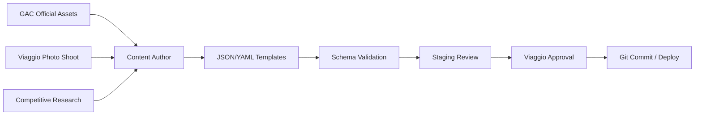

# Content Strategy

Content plan for Viaggio Digital Showroom — GS4 MAX launch with multi-vehicle extensibility. Aligns with [Information Architecture](./information-architecture.md), [Voice Strategy](./voice-strategy.md), and [Conversion Strategy](./conversion-strategy.md).

## Strategic Goals

1. **Educate before human contact** — answer 80% of pre-sales questions digitally
2. **Build trust in GAC brand** in Santa Cruz market skeptical of Chinese OEMs
3. **Drive test drives and WhatsApp** — measurable conversion actions
4. **Scale to new models** without content architecture changes

## Content Pillars

| Pillar | Weight (GS4 MAX) | Primary Guide | Success Signal |
|--------|------------------|---------------|----------------|
| Reliability | 20% | Carlos | Time on engineering topics |
| Safety | 15% | Carlos | ADAS + structure views |
| Family comfort | 20% | Diego | Family theme completion |
| Technology | 15% | Sofía | Media plays, infotainment |
| Warranty & maintenance | 15% | Carlos | Warranty CTA from section |
| Value for money | 10% | Sofía | Compare engagement |
| Driving experience | 5% | Diego | Santa Cruz topic views |

## Content Formats

| Format | Use Case | Production |
|--------|----------|------------|
| **Persona narration** | Topic intros, tour steps | Copywriting from voice guide |
| **Hero photography** | Hub cards, topic headers | GAC official + Viaggio lifestyle shoot |
| **Short video (15–45s)** | Engine, ADAS demo, interior | GAC assets + local overlay |
| **Feature grid** | Equipment highlights | Icon + short copy |
| **Stat callouts** | Warranty km, consumption, dimensions | Verified data only |
| **Comparison tables** | vs. segment competitors | Research-backed, updated quarterly |
| **Accordion detail** | Spec depth for power users | Technical writing |
| **Lifestyle imagery** | Diego stories | Santa Cruz locations (family, city, road trip) |

## GS4 MAX Content Inventory (Launch)

### Minimum Viable Content (Phase 2 Launch)

| Theme | Topics Required | Blocks per Topic (min) |
|-------|-----------------|------------------------|
| reliability | 4 | 4 |
| safety | 3 | 4 |
| family | 4 | 4 |
| technology | 3 | 3 |
| value | 3 | 3 |
| warranty | 3 | 3 |
| driving | 3 | 3 |
| design* | 2 | 3 |

*Design can roll into `value` and `family` if timeline tight.

### Tours

| Tour | Steps | Est. Words |
|------|-------|------------|
| Trust | 8 | ~800 |
| Family | 7 | ~700 |
| Desire | 7 | ~700 |
| Complete | 16 | ~1,400 |

### Compare Targets (Launch)

1. Toyota Corolla Cross (hybrid or gasoline — specify in content)
2. Haval H6 or Chery Tiggo 7 Pro (Chinese competitor — honest positioning)
3. Hyundai Tucson (aspirational benchmark)

Add `gac-gs8` when GS8 content pack exists.

## Bolivia / Santa Cruz Localization

### Language

- Primary: **Spanish (Bolivia)** — `es-BO`
- Register: professional but warm; *tú* default, *vos* acceptable in Diego's voice if aligned with Viaggio brand
- Avoid: Spainisms, Mexican slang, Rioplatense-only terms

### Cultural Trust Signals

| Signal | Content Treatment |
|--------|-------------------|
| Viaggio local presence | Photos of Santa Cruz showroom and service bay |
| Physical address | Footer on every conversion screen |
| Years in market | Carlos narration in `local-service` topic |
| Post-sale support | Warranty + maintenance with BOB cost examples |
| Word of mouth | Future: testimonial videos (Phase 3) |

### Local Use Cases (Diego Content)

- Traffic: Doble Vía a Cotoca, centro histórico parking
- Family trips: Warnes, Buena Vista, Pantanal (road conditions)
- Climate: 35°C+ summer, cabin heat soak
- Fuel: YPF/ Petrobras pricing context (static content, updated manually)

### WhatsApp-First

- No lengthy email forms in primary flows
- Content CTAs prefer WhatsApp with context
- Shareable summary for spouse (Phase 3) via WhatsApp link

## Content Production Workflow

### Roles

| Role | Responsibility |
|------|----------------|
| GAC Bolivia | Spec accuracy, asset approval |
| Viaggio Marketing | Local copy, pricing bands, competitor selection |
| Copywriter | Persona voice adherence |
| Developer | Schema compliance, media optimization |
| Sales manager | Compare table accuracy sign-off |

## SEO & Discovery (Secondary)

Primary channel is in-dealership, but content structure supports future web/QR:

- Semantic headings per topic
- `vehicleSlug` + `themeId` in URLs
- Open Graph metadata per vehicle (Phase 3)

## Multi-Vehicle Content Playbook

When launching **GS8**, **EMZOOM**, or **EMKOO**:

1. Copy `docs/content/templates/` → `src/content/vehicles/{new-slug}/`
2. Replace vehicle-specific media, specs, persona lines
3. Reuse theme structure (same `themeId`s where applicable)
4. Update `registry.json` status to `active` or `preview`
5. Add compare cross-links from existing vehicles
6. **No new block types or routes**

### EV-Specific Content (EMZOOM, future)

Additional themes when needed:

- `charging` — home charging, range, Bolivia grid context
- `battery-warranty` — separate from ICE warranty

Add as new `themeId` in content only.

## Content Governance

| Item | Review Frequency |
|------|------------------|
| Pricing bands | Monthly |
| Competitor compare data | Quarterly |
| Warranty terms | On GAC policy change |
| Media assets | Per model year refresh |
| Persona copy | Annual voice audit |

## Sample Content Templates

See [`content/templates/`](./content/templates/) for:

- `vehicle.gs4-max.json`
- `topic.gs4-max.adas.json`
- `personas.json`
- `dealership.json`
- `compare.gs4-max.corolla-cross.json`

## Quality Bar

Every published topic must:

- [ ] Pass JSON schema validation
- [ ] Have assigned persona matching IA
- [ ] Include at least one visual block
- [ ] End with suggested next topic or CTA block
- [ ] Be readable in under 3 minutes at kiosk pace
- [ ] Have Viaggio-approved technical claims

---

*Related: [Voice Strategy](./voice-strategy.md) · [JSON Schemas](./json-schemas.md) · [Conversion Strategy](./conversion-strategy.md)*
