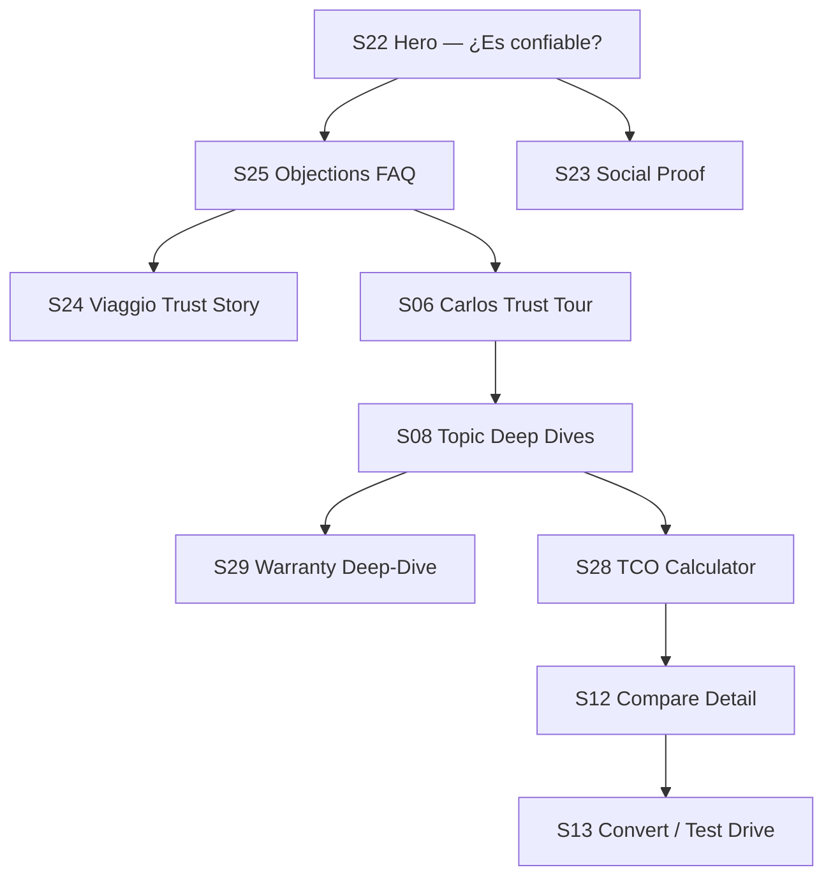

# Análisis de objeciones — Guiones de Carlos

Revisión crítica de `carlos-narration.md` desde cinco lentes:

| Lente | Qué exige |
|-------|-----------|
| **Mecánico maestro (25 años)** | Evidencia de taller, fallas reales, intervalos verificables, sin marketing vacío |
| **Periodista automotriz independiente** | Terceros independientes, admisión de límites, datos auditables, sin claims no verificables |
| **Comprador escéptico de SUV en Bolivia** | Respuesta a *"es chino"*, reventa, repuestos, garantía de papel, red fuera de Santa Cruz |
| **Gerente de servicio** | Proceso de garantía, stock, tiempos, cobertura geográfica, costo post-garantía |
| **Comprador de usado** | Depreciación, liquidez, historial de servicio, transferencia de garantía |

**Veredicto general:** Los guiones actuales establecen bien la voz de Carlos — calmado, honesto, no vendedor — y cubren el núcleo mecánico (motor, transmisión, ADAS, garantía en abstracto). Para un mercado boliviano escéptico ante marcas chinas, **dejan fuera las objeciones que más bloquean la compra**: reventa, certificación independiente, red nacional, costo real de propiedad, escepticismo frente a la garantía y la pregunta directa sobre origen de marca.

---

## 1. Señales de confianza ausentes

### Por qué el cliente las necesita

En Santa Cruz y el resto de Bolivia, la confianza no se compra con adjetivos. El comprador busca **prueba externa** (certificación, testimonio local, taller visible) porque ya vio marcas entrar y salir del mercado, y concesionarios que desaparecen después de la entrega.

### ¿Lo aborda Carlos hoy?

| Señal | Estado en guiones actuales |
|-------|---------------------------|
| Garantía 5 años / 150.000 km | ✅ Parcial — mencionada, sin visual ni proceso |
| Certificación independiente (C-NCAP, Latin NCAP) | ❌ Ausente |
| Mantenimiento sin costo (3 años / 100.000 km) | ❌ Ausente — diferencial fuerte en GS4 MAX |
| Escala global GAC (millones de unidades) | ⚠️ Vago — *"decenas de mercados"* sin cifra |
| Viaggio como empresa local (Grupo Roda, años en Bolivia) | ❌ Ausente — solo placeholder `[CONCESIONARIO]` |
| Testimonios de propietarios en Santa Cruz | ❌ Ausente — no es voz de Carlos solo, pero el recorrido no los referencia |
| Video de taller / bahía de servicio | ❌ Ausente |
| Credibilidad personal de Carlos (*"yo manejo un GAC"*) | ❌ Ausente |
| Airbags / estructura con dato verificable (8 airbags, 5★) | ⚠️ Genérico — *"múltiples airbags"* sin número ni organismo |

### Mejoras recomendadas

**En Bienvenida** — añadir una línea que anticipe el escepticismo sin sonar defensivo:

> *"Sé que muchos llegan con la misma duda: marca poco conocida, ¿aguanta? Por eso te voy a mostrar certificaciones, números de garantía y lo que vemos en el taller de [CONCESIONARIO] — no un folleto bonito."*

**En Seguridad** — reemplazar vaguedad por dato auditable:

> *"El GS4 MAX tiene calificación de cinco estrellas C-NCAP y ocho airbags de serie. Eso lo evalúa un organismo independiente, no el departamento de marketing."*

**Nuevo bloque sugerido: «Respaldo local»** (entre Mantenimiento y Confiabilidad):

> *"[CONCESIONARIO] no es un importador de paso: es representante exclusivo GAC en Bolivia, con taller propio, repuestos originales y [N] ubicaciones en [CIUDADES]. Los primeros tres años de mantenimiento programado van sin costo hasta 100.000 km — eso facilita que el auto llegue bien conservado al kilometraje donde la confianza se nota."*

**En Confiabilidad** — anclar a experiencia de taller, no solo a fábrica:

> *"En el taller vemos el desgaste normal — filtros, pastillas, fluidos — no sorpresas estructurales si se respetó el plan. Eso es lo que yo llamo confianza operativa."*

---

## 2. Preocupaciones de confiabilidad no cubiertas

### Por qué el cliente las tiene

El comprador boliviano de SUV asocia confiabilidad con **supervivencia en calor, polvo, baches y tráfico stop-and-go**. Turbo y doble embrague generan desconfianza porque circulan historias de cajas calientes y reparaciones caras. Quien viene de Toyota espera saber *qué se rompe primero* y *a los cuántos kilómetros*.

### ¿Lo aborda Carlos hoy?

| Preocupación | Estado |
|--------------|--------|
| Motor turbo en clima caluroso | ⚠️ Menciona turbo; no calor ni ciclo térmico |
| Doble embrague (7DCT) en tráfico pesado | ⚠️ Breve; no aborda desgaste ni calor en semáforos |
| Cadena de distribución | ✅ Cubierto |
| Electrónica / pantalla / ADAS fallas | ❌ Ausente |
| Comportamiento en altura (La Paz / El Alto) | ❌ Ausente — crítico en Bolivia |
| Polvo y filtros en temporada seca | ✅ Parcial en Mantenimiento |
| Chasis / suspensión en pavimento malo | ⚠️ Solo en bloque Confiabilidad, sin guion propio |
| Qué esperar a los 80.000–120.000 km | ❌ Ausente |
| Consumo real vs. ficha WLTC | ❌ Ausente |

### Mejoras recomendadas

**En Motor** — añadir clima y altitud:

> *"En [CIUDAD], con calor y tráfico que corta y arranca, el turbo trabaja más que en ficha de laboratorio. Por eso insisto en aceite a tiempo y no forzar el motor frío. Si vivís en altura — La Paz, El Alto — probalo en tu ruta: el 1.5 turbo está calibrado para responder, pero cada ciudad tiene su prueba real."*

**En Transmisión** — abrir la duda del DCT sin evadirla:

> *"La doble embrague de siete es eficiente, pero en taco permanente genera más calor que la automática de seis. Si tu día a día es doble vía a las siete de la mañana, preguntame qué versión tenemos en stock y te digo cuál convive mejor con tu manejo. En taller controlamos fluido y adaptaciones en servicio — ahí se previene el 90 % de los problemas de caja."*

**Nuevo bloque sugerido: «Chasis y durabilidad»** (alineado al tour `trust-02`):

> *"La plataforma está pensada para absorber irregularidades — baches, badenes, huecos en pavimento recién 'arreglado'. Eso no es marketing: es lo que probamos en ruta urbana y en caminos a [referencia local: Warnes, Montero]. La suspensión y la estructura no son lo primero que revisás, pero son lo que te salva cuando la calle no perdona."*

**En Confiabilidad** — expectativa a largo plazo con honestidad:

> *"Ningún auto sale perfecto de fábrica para siempre. A los cien mil kilómetros, lo normal es consumibles — pastillas, filtros, batería si descuidaste el estacionamiento al sol. Lo que no debería ser normal son fallas de motor o transmisión con servicio al día. Eso es lo que cubre la garantía larga."*

---

## 3. Preocupaciones de propiedad no cubiertas

### Por qué el cliente las tiene

Comprar un SUV en Bolivia es una decisión familiar y financiera. El cliente calcula **cuota, combustible, seguro, taller en su ciudad y valor al momento de cambiar el auto**. No alcanza con decir que el motor es bueno; necesita el costo mensual real y qué pasa si se muda o viaja al interior.

### ¿Lo aborda Carlos hoy?

| Preocupación | Estado |
|--------------|--------|
| Costo de mantenimiento predecible | ⚠️ Filosofía sí; cifras orientativas no |
| Mantenimiento 3 años sin costo | ❌ Ausente |
| Consumo real en ciudad (9–10 km/l) | ❌ Ausente en guiones |
| Seguro disponible y costo orientativo | ❌ Ausente — S28 TCO |
| Financiamiento / cuota | ✅ Correctamente derivado a ventas |
| Red en otras ciudades (La Paz, Cochabamba) | ❌ Ausente |
| Viajes largos / carga familiar | ❌ Territorio Diego; no referenciado |
| Calidad de combustible local | ❌ Ausente |
| Retoma / trade-in | ❌ Ausente |

### Mejoras recomendadas

**En Mantenimiento** — cuantificar el alivio de los primeros años:

> *"Los primeros tres años o cien mil kilómetros, los servicios programados van sin costo en [CONCESIONARIO]. Eso no elimina combustible ni seguro, pero sí te saca una incógnita grande del presupuesto familiar."*

**En Recomendación final** — puente a economía de propiedad:

> *"Si tu duda es cuánto cuesta vivir con el auto — no solo comprarlo — mirá el calculador de costo mensual: combustible, mantenimiento después del período gratuito y seguro orientativo. Los números exactos te los afina un asesor; yo te doy la base mecánica para que no te sorprenda nada."*

**Nota de asignación:** Costo mensual y cuota son **S28 / S26**; Carlos introduce, Sofía enmarca valor, FAQ aclara disclaimers.

---

## 4. Objeciones por marca china no abordadas

### Por qué el cliente las tiene

En Bolivia, *"chino"* condensa experiencias mixtas: vehículos económicos de marcas que salieron del país, repuestos imposibles, garantía que no honraron, y confusión entre GAC, Chery, Changan y Haval. El comprador no distingue fabricantes — distingue **riesgo**.

### ¿Lo aborda Carlos hoy?

| Objeción | Estado |
|----------|--------|
| *"Es chino, no confío"* | ❌ El guion evita la palabra — correcto en tono, insuficiente en sustancia |
| Diferencia GAC vs. otras marcas chinas | ❌ Ausente |
| ¿Qué pasa si la marca abandona Bolivia? | ❌ Ausente |
| Certificación y estándares de exportación | ⚠️ Mención genérica |
| Comparación honesta con Toyota/Hyundai | ✅ Parcial en cierre — *"hay buenos autos"* sin nombrar reventa |
| Inversión de Viaggio/GAC en el país | ❌ Ausente |

### Mejoras recomendadas

**Nuevo bloque sugerido: «Marca y estándares»** (para tour o tema `brand-heritage`):

> *"Entiendo la duda. No te pido que confíes en la palabra 'china'. Mirá tres cosas: GAC exporta este mismo modelo con los mismos estándares de seguridad que homologa en otros países; el GS4 MAX tiene cinco estrellas C-NCAP; y en Bolivia no comprás solo el auto — comprás a [CONCESIONARIO], empresa local con taller y repuestos. Chery o una marca que se fue no es lo mismo que un fabricante global con representante exclusivo instalado."*

**En Confiabilidad** — reformular la nota de entrega:

En lugar de solo *"evitar la palabra chino"*, instruir: **reconocer la objeción, redirigir a evidencia**. Ejemplo:

> *"Si lo que te frena es el origen de la marca, te entiendo. Yo no vendo banderas — vendo números de taller. Certificación independiente, garantía larga en motor y caja, y un taller acá que responde."*

**Dónde no va Carlos solo:** Testimonios de propietarios locales → **S23**. Historia Viaggio + GAC → **S24**.

---

## 5. Preocupaciones de valor de reventa no cubiertas

### Por qué el cliente las tiene

En Bolivia, muchas familias financian el SUV a 48 meses pensando en **retorno parcial al vender o retomar**. Toyota y Honda educaron el mercado: *"siempre vale algo"*. Un comprador escéptico asume que un GAC perderá 40–50 % en tres años y no habrá comprador.

### ¿Lo aborda Carlos hoy?

| Preocupación | Estado |
|--------------|--------|
| Depreciación esperada | ❌ Ausente |
| Comparación con Toyota en reventa | ❌ Ausente |
| Factores que el propietario controla | ❌ Ausente |
| Liquidez del mercado de usados GAC | ❌ Ausente |
| Impacto del mantenimiento gratuito en reventa | ❌ Ausente |

### Mejoras recomendadas

**Nuevo bloque sugerido: «Reventa — sin mentirte»** (tema `resale-value` — prioridad P0 en readiness doc):

> *"Te digo la verdad que muchos vendedores evitan: hoy Toyota suele retener valor de reventa mejor que marcas más nuevas en el país. No te prometo un porcentaje mágico a los tres años.*
>
> *Lo que sí te digo como mecánico: un auto con historial de servicio oficial, garantía vigente y mantenimiento al día se vende más rápido y con menos regateo — en cualquier marca. Los tres años de mantenimiento sin costo y la garantía de cinco años ayudan a que tu unidad llegue bien documentada y conservada.*
>
> *GAC y [CONCESIONARIO] están posicionando el modelo acá; eso construye demanda de usados, pero lleva tiempo. Si reventa es tu prioridad número uno, decímelo y lo ponemos en la balanza con todo lo demás — sin fingir que es un Corolla."*

**En Recomendación final** — una frase de cierre honesta:

> *"Si comparás solo por lo que valdrá en Facebook Marketplace en tres años, medilo con datos de usados locales — yo no invento cifras. Si comparás por lo que gastás en equipamiento, garantía y mantenimiento, ahí el [MODELO] compite distinto."*

---

## 6. Preocupaciones de disponibilidad de servicio no cubiertas

### Por qué el cliente las tiene

Post-venta es donde muchos concesionarios bolivianos fallan: citas que tardan semanas, taller solo en una ciudad, garantía que *"la mandamos a importar"*. El comprador de provincia pregunta qué pasa en Tarija, Trinidad o Beni sin taller oficial.

### ¿Lo aborda Carlos hoy?

| Preocupación | Estado |
|--------------|--------|
| Taller en Santa Cruz | ⚠️ Genérico |
| Red nacional (La Paz, El Alto, Cochabamba) | ❌ Ausente |
| Tiempos de cita y reparación | ❌ Ausente |
| Proceso de reclamo de garantía | ❌ Ausente |
| Asistencia en carretera | ❌ Ausente |
| Servicio fuera de red oficial | ❌ Ausente |
| Costo de mano de obra post-garantía | ❌ Ausente |

### Mejoras recomendadas

**Ampliar bloque Mantenimiento o nuevo «Servicio en [CONCESIONARIO]»** (alineado a `viaggio-service` en tour paso 8):

> *"Servicio oficial en Santa Cruz, La Paz, El Alto y Cochabamba — [N] puntos con técnicos capacitados por GAC. Agendás por WhatsApp o en mostrador; los servicios programados tienen tiempos definidos. Si vivís en una ciudad sin taller, coordinamos el plan antes de comprar: algunos clientes hacen servicios en viaje; otros prefieren esperar red ampliada. No te vendo humo — te digo qué hay hoy."*

**En Garantía** — proceso en tres pasos:

> *"Si algo falla en garantía: diagnóstico en taller autorizado, aprobación según cobertura, reparación con repuesto original. Sin talleres de pasillo para reclamos — eso anula la cobertura y lo sabés antes de firmar."*

**Prueba visual obligatoria (no es guion, es contenido):** video de bahía en **S24** — el guion de Carlos debe referenciarlo: *"Como ves en el taller, esto existe — no es un pin en el mapa."*

---

## 7. Preocupaciones de disponibilidad de repuestos no cubiertas

### Por qué el cliente las tiene

Repuestos importados = semanas de espera, precio dólar, paros aduaneros. Quien tuvo un Chery o un Geely con panel trasero demorado tres meses proyecta el mismo riesgo. El mecánico independiente pregunta si puede conseguir filtros y pastillas sin pasar por el concesionario.

### ¿Lo aborda Carlos hoy?

| Preocupación | Estado |
|--------------|--------|
| Stock local de consumibles | ⚠️ Una mención en variante corta de Motor |
| Tiempos de importación piezas no stock | ❌ Ausente |
| Precio repuesto original vs. genérico | ❌ Ausente |
| Carrocería / piezas de colisión | ❌ Ausente |
| Repuestos en garantía vs. fuera | ❌ Ausente |
| Política si el modelo se discontinúa | ❌ Ausente |

### Mejoras recomendadas

**En Motor (variante corta ya menciona repuestos)** — expandir a bloque dedicado en Mantenimiento o Servicio:

> *"Filtros, pastillas, aceite y piezas de desgaste los mantenemos en stock en [CONCESIONARIO]. Si una pieza no está, el pedido va por canal GAC oficial — no por importador paralelo. En garantía, el repuesto va con la reparación. Fuera de garantía, pagás el repuesto original; sí, suele costar más que genérico — yo no recomiendo genérico en frenos y suspensión."*

**Para el periodista y el comprador de usado** — transparencia en carrocería:

> *"Después de un choque menor, lo que más demora no es la mecánica — es carrocería y sensores. Por eso el seguro y el taller oficial importan. Preguntá por tiempos reales en mostrador si eso te preocupa."*

---

## 8. Escepticismo frente a la garantía no cubierto

### Por qué el cliente las tiene

*"Cinco años"* suena a folleto hasta que conocés exclusiones, letra chica, deducibles y talleres que dicen *"eso no cubre"*. En marcas chinas previas, la garantía existió en papel y no en práctica. El comprador quiere saber **qué sí, qué no y cómo reclamar**.

### ¿Lo aborda Carlos hoy?

| Preocupación | Estado |
|--------------|--------|
| Reconocer escepticismo (*"¿en serio?"*) | ✅ Bien logrado |
| Cobertura motor/transmisión | ✅ |
| Exclusiones (desgaste, accidente, modificaciones) | ❌ Diferido a ficha — demasiado vago |
| Diferencia garantía 5 años vs. mantenimiento 3 años | ❌ Ausente — confunde al cliente |
| Qué anula la garantía | ❌ Ausente |
| Transferencia al vender usado | ❌ Ausente |
| Ejemplo de reclamo real | ❌ Ausente |
| Piezas de desgaste (pastillas, embrague) | ❌ Ausente |

### Mejoras recomendadas

**En Garantía** — ampliar sin leer el contrato entero:

> *"Cinco años o ciento cincuenta mil kilómetros en motor y transmisión. Tres años o cien mil en mantenimiento programado sin costo — son cosas distintas: la primera es si algo falla de fábrica; la segunda es que vos traés el auto a servicio y no pagás mano de obra ni kit del plan.*
>
> *No cubre lo que es desgaste normal — pastillas gastadas, neumáticos, accidente por choque, o si modificaste el motor. Eso es estándar en cualquier marca; la diferencia acá es la duración en el corazón del auto.*
>
> *Reclamás en taller autorizado con factura y historial. Si vendés el auto, la garantía transferible se gestiona con [CONCESIONARIO] — preguntá el trámite antes de firmar la venta."*

**Derivar profundidad legal a S29** — Carlos en voz dice lo esencial; FAQ y Warranty Deep-Dive llevan tabla de exclusiones.

---

## Matriz resumen: brechas por categoría

| Categoría | Cobertura actual | Prioridad de cierre |
|-----------|------------------|---------------------|
| Señales de confianza | 40 % | **P0** — C-NCAP, mantenimiento gratis, Viaggio local |
| Confiabilidad mecánica | 65 % | **P1** — DCT/calor, altitud, electrónica |
| Propiedad / TCO | 25 % | **P0** — costo real, red nacional |
| Marca china | 15 % | **P0** — bloque dedicado con evidencia |
| Reventa | 5 % | **P0** — tema nuevo obligatorio |
| Servicio disponible | 35 % | **P0** — ciudades, proceso, tiempos |
| Repuestos | 30 % | **P1** — stock, plazos, carrocería |
| Escepticismo garantía | 50 % | **P0** — exclusiones claras, 5yr vs 3yr |

---

## Top 10 objeciones en Bolivia (SUV / GAC GS4 MAX)

Ordenadas por frecuencia e impacto en abandono, según journey doc, readiness P0 y lentes de revisión.

### 1. «Es chino — no me genera confianza»

| Campo | Detalle |
|-------|---------|
| **Por qué** | Experiencias previas con marcas que salieron del país; mezcla GAC con Chery/Changan |
| **¿Carlos hoy?** | No — evita el tema |
| **Respuesta sugerida (Carlos)** | *"Entiendo la duda. No te pido fe ciega: mirá certificación C-NCAP cinco estrellas, garantía larga en motor y caja, y un taller local que responde. GAC no es la marca que se fue — es fabricante global con representante exclusivo en Bolivia."* |
| **Dónde en el journey** | S25 FAQ (categoría marca china) · S24 Trust Story · Tour paso `brand-heritage` · S22 salida *¿Es confiable?* |
| **Persona** | **Carlos** (hechos) + **S23** testimonios (prueba social) + **S24** (Viaggio institucional) |

---

### 2. «¿Hay repuestos en Santa Cruz / Bolivia?»

| Campo | Detalle |
|-------|---------|
| **Por qué** | Miedo a semanas de espera, dependencia de importador paralelo |
| **¿Carlos hoy?** | Mención superficial |
| **Respuesta sugerida (Carlos)** | *"Sí — repuestos originales GAC con stock de consumibles en [CONCESIONARIO]. Lo que no está en estante entra por canal oficial, no por terceros. En garantía, el repuesto va con la reparación."* |
| **Dónde** | S25 FAQ · Tema `viaggio-service` · S06 tour paso 8 · S24 video taller |
| **Persona** | **Carlos** + **FAQ** (lista de ciudades con taller) |

---

### 3. «¿Cuánto vale en reventa a los 3–5 años?»

| Campo | Detalle |
|-------|---------|
| **Por qué** | Financiamiento a 48 meses; comparación mental con Toyota |
| **¿Carlos hoy?** | No |
| **Respuesta sugerida (Carlos)** | *"Toyota hoy suele ganar en percepción de reventa — no te voy a mentir. Tu mejor defensa es historial de servicio oficial, unidad conservada y demanda del modelo. Los tres años de mantenimiento sin costo ayudan. No prometo un porcentaje — prometo que un auto documentado se negocia mejor."* |
| **Dónde** | S25 FAQ · **Nuevo tema `resale-value`** · S28 TCO (contexto costo total) · S12 compare fila *Marca/reventa* |
| **Persona** | **Carlos** (honestidad factual) · **Sofía** (equipamiento vs. depreciación) · **FAQ** |

---

### 4. «La garantía de cinco años es letra chica»

| Campo | Detalle |
|-------|---------|
| **Por qué** | Malas experiencias con garantías no honradas; desconocimiento de exclusiones |
| **¿Carlos hoy?** | Parcial — reconoce escepticismo, no detalla |
| **Respuesta sugerida (Carlos)** | *"Cinco años o 150.000 km en motor y transmisión; mantenimiento programado sin costo tres años o 100.000 km — son dos beneficios distintos. No cubre desgaste ni choques. Reclamás solo en taller autorizado. Te muestro la tabla de exclusiones antes de que firmes."* |
| **Dónde** | S29 Warranty Deep-Dive · S06 paso 6 · S25 FAQ · Bloque Garantía en guiones |
| **Persona** | **Carlos** + **FAQ** (legal) + **Gerente servicio** en S24 video |

---

### 5. «¿Viaggio responde después de la venta?»

| Campo | Detalle |
|-------|---------|
| **Por qué** | Concesionarios que desaparecen; miedo a quedar colgado |
| **¿Carlos hoy?** | Implícito — no demostrado |
| **Respuesta sugerida (Carlos)** | *"El mismo lugar donde lo comprás tiene taller y repuestos. No somos intermediarios que desaparecen — [CONCESIONARIO] es representante exclusivo con operación en [N] ciudades. Si querés prueba, pedí ver la bahía de servicio hoy."* |
| **Dónde** | S24 Trust Story · S23 testimonios post-venta · `viaggio-service` · S25 FAQ |
| **Persona** | **S24** (institucional) + **Carlos** (taller) + **Testimonios** (S23) |

---

### 6. «El turbo o la doble embrague se rompen»

| Campo | Detalle |
|-------|---------|
| **Por qué** | Narrativa popular de turbo caro y DCT problemático en tráfico |
| **¿Carlos hoy?** | Parcial — menciona DCT sin profundizar en calor/tráfico |
| **Respuesta sugerida (Carlos)** | *"Turbo moderno con servicio a los 10.000 km no es el turbo de hace quince años. La doble embrague pide manejo tranquilo en arranque y fluido al día — en taco pesado, la automática de seis puede ser más cómoda. Elegí versión según tu ruta; en taller vemos más desgaste por falta de servicio que por diseño."* |
| **Dónde** | S08 temas Motor + Transmisión · S06 pasos 1–2 · S25 FAQ · S12 compare |
| **Persona** | **Carlos** exclusivo |

---

### 7. «Toyota / Hyundai retiene mejor valor — ¿por qué cambiar?»

| Campo | Detalle |
|-------|---------|
| **Por qué** | Marca conocida; red de usados madura |
| **¿Carlos hoy?** | Casi no |
| **Respuesta sugerida (Carlos)** | *"Si solo mirás marca en reventa, Toyota es referencia fuerte. Mirá también qué trae de serie, cuántos años de garantía y cuánto gastás en mantenimiento equiparable. Yo no te digo que vendas tu lógica Toyota — te digo que compares el costo total con datos."* |
| **Dónde** | S12 Compare (fila honesta *Ellos ganan*) · S25 FAQ · `resale-value` |
| **Persona** | **Carlos** (reventa/TCO) + **Sofía** (equipamiento de serie) + **FAQ** |

---

### 8. «Vivo en La Paz / provincia — ¿hay servicio?»

| Campo | Detalle |
|-------|---------|
| **Por qué** | Red concentrada en eje Santa Cruz–La Paz–Cochabamba; ciudades menores sin taller |
| **¿Carlos hoy?** | No |
| **Respuesta sugerida (Carlos)** | *"Hoy la red oficial está en Santa Cruz, La Paz, El Alto y Cochabamba. Si vivís fuera, planificá servicios en esas ciudades o consultá antes de comprar. En altura, probá el motor turbo en tu ruta — está diseñado para responder, pero tu test drive es la prueba."* |
| **Dónde** | S25 FAQ · `viaggio-service` · S24 mapa de red · FAQ altitud |
| **Persona** | **FAQ** (cobertura geográfica) + **Carlos** (altitud/mecánica) |

---

### 9. «¿Cuánto cuesta mantenerlo de verdad?»

| Campo | Detalle |
|-------|---------|
| **Por qué** | Cuota baja no implica propiedad barata; miedo a sorpresas post año 3 |
| **¿Carlos hoy?** | Filosofía sí, números no |
| **Respuesta sugerida (Carlos)** | *"Tres años o 100.000 km de mantenimiento programado sin costo. Después, seguís el plan GAC: aceite cada 10.000 km, filtros, revisiones. En [CIUDAD] el polvo apura filtros. Usá el calculador de costo mensual para combustible y seguro — yo te cubro la parte mecánica predecible."* |
| **Dónde** | S28 TCO · S08 `maintenance` · S26 financing (después de TCO) · S06 paso 7 |
| **Persona** | **Carlos** (mantenimiento) + **S28** (cifras) + **Sofía** (valor por dinero) |

---

### 10. «Es caro para una marca que no conozco»

| Campo | Detalle |
|-------|---------|
| **Por qué** | Precio visible vs. Chery más barato; desconocimiento del equipamiento incluido |
| **¿Carlos hoy?** | No — correctamente fuera de su rol |
| **Respuesta sugerida (Sofía, con apoyo Carlos)** | Sofía: *"Compará equipamiento de serie — ADAS, airbags, pantalla — no solo precio de lista. Con garantía y mantenimiento incluidos, el costo real a tres años cambia."* Carlos: *"Mecánicamente, no pagás más por adornos frágiles — el conjunto motor-caja está respaldado cinco años."* |
| **Dónde** | S12 Compare · S08 temas valor · S26 · S25 FAQ |
| **Persona** | **Sofía** lidera · **Carlos** respalda mecánica · **FAQ** disclaimer precio orientativo |

---

## Asignación de personas por tipo de objeción

| Tipo de objeción | Carlos | Sofía | Diego | FAQ / Sistema |
|------------------|--------|-------|-------|---------------|
| Motor, caja, turbo, DCT | ✅ Líder | — | — | Apoyo técnico |
| ADAS, estructura, C-NCAP | ✅ Líder | — | — | Enlace certificados |
| Garantía, exclusiones, reclamo | ✅ Líder | — | — | ✅ Tabla legal S29 |
| Repuestos, stock, plazos | ✅ Líder | — | — | ✅ Ciudades, contacto |
| Servicio, taller, red | ✅ Líder | — | — | ✅ S24 mapa/video |
| Marca china / confianza origen | ✅ Hechos | Valor equipamiento | — | ✅ S23 testimonios, S24 |
| Reventa / depreciación | ✅ Honestidad | Equipamiento vs. marca | — | ✅ Datos mercado usado |
| TCO, cuota, seguro | Intro mecánica | Valor / equipamiento | Uso diario | ✅ S28, S26 disclaimers |
| Familia, espacio, calor cabina | — | Confort equipamiento | ✅ Líder | — |
| Precio lista / promoción | — | ✅ Líder | — | ✅ Orientativo |
| Trade-in / retoma | — | Proceso comercial | — | ✅ S27 FAQ |
| Altitud La Paz | ✅ Mecánica | — | — | ✅ FAQ |

**Regla de oro (voice strategy):** Carlos nunca cierra venta ni cotiza. Sofía nunca detalla exclusiones de garantía. Diego nunca discute reventa con porcentajes.

---

## Dónde aparecen en el recorrido del showroom

| Etapa | Objeciones que debe cerrar | Contenido Carlos a añadir |
|-------|---------------------------|---------------------------|
| **S22 → Trust path** | Marca china, confianza general | Bienvenida ampliada con anticipación de escepticismo |
| **S25 FAQ** | Top 10 — todas en acordeón | Respuestas cortas; enlace a temas profundos |
| **S23** | Marca china, post-venta | No es Carlos — propietarios reales |
| **S24** | Viaggio responde, red nacional | Carlos referencia video de taller |
| **S06 Tour** | Motor, caja, ADAS, garantía, servicio | 2 bloques nuevos: Marca/estándares, Reventa |
| **S08 Topics** | Reventa, chasis, servicio, altitud | Temas `resale-value`, `brand-heritage`, `viaggio-service` |
| **S29** | Garantía letra chica | Guion Garantía ampliado + tabla visual |
| **S28** | Costo real propiedad | Puente desde Mantenimiento y Recomendación final |
| **S12 Compare** | Toyota reventa, SUV chinos baratos | Fila honesta *Ellos ganan* + narración Carlos en TCO row |

---

## Prioridad de actualización de `carlos-narration.md`

| Orden | Acción | Impacto en confianza |
|-------|--------|----------------------|
| 1 | Añadir bloque **Reventa** y bloque **Marca/estándares** | Cierra objeciones #1 y #3 |
| 2 | Ampliar **Garantía** (5yr vs 3yr, exclusiones, transferencia) | Cierra #4 |
| 3 | Ampliar **Servicio** con ciudades y proceso de reclamo | Cierra #2, #5, #8 |
| 4 | Profundizar **Transmisión** (DCT/calor/tráfico) | Cierra #6 |
| 5 | Añadir C-NCAP + 8 airbags en **Seguridad** | Señal de confianza independiente |
| 6 | Mencionar mantenimiento 3yr gratis en **Mantenimiento** | Señal económica P0 |
| 7 | Puente a S28 en **Recomendación final** | Propiedad / TCO |
| 8 | Añadir notas de **altitud** y **repuestos carrocería** | Bolivia específico |

---

## Criterio de éxito

Los guiones revisados funcionan cuando un **comprador escéptico** puede responder *sí* a:

1. ¿Me dijeron la verdad sobre reventa sin inventar porcentajes?
2. ¿Entiendo qué cubre la garantía y qué no antes de hablar con ventas?
3. ¿Sé dónde servir y conseguir repuestos en mi ciudad?
4. ¿Hay algo independiente de la marca (C-NCAP) que respalde seguridad?
5. ¿Carlos suena a taller y no a vendedor con delantal?

Si alguna respuesta es *no*, la objeción correspondiente sigue viva al llegar a S12 Compare o S13 Convert — y ahí el abandono cuesta más que en S25.

---

*Relacionado: [carlos-narration.md](./carlos-narration.md) · [Voice Strategy](../voice-strategy.md) · [Customer Journey](../customer-journey.md) · [Screen Map S25](../screen-map.md) · [GS4 MAX Master Content](./gs4-max-master-content.md)*
