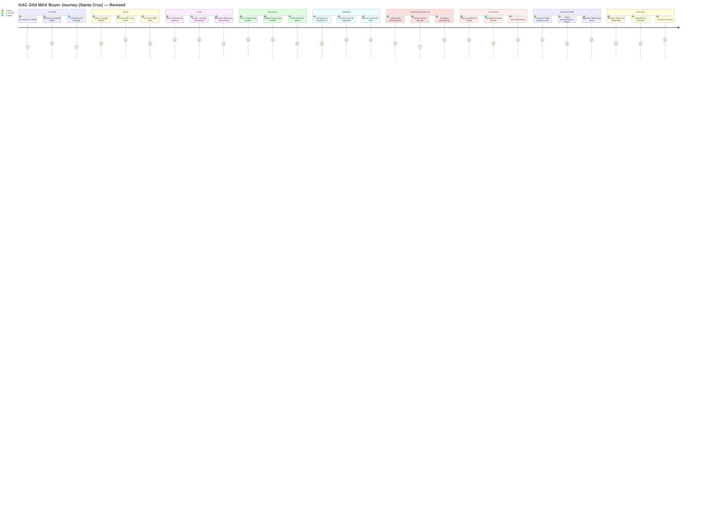

# Customer Journey

## Overview

The Viaggio Digital Showroom journey maps how a Santa Cruz buyer moves from first contact with GAC/Viaggio to a test drive, WhatsApp conversation, or sale. The experience is optimized for **in-dealership** use but supports **pre-visit** entry via QR from social campaigns, WhatsApp forwards, and family sharing.

> **Architecture review:** This journey was expanded after [Phase 1 Architecture Review](./architecture-review.md) to address trust deficits, family co-decision, financing sensitivity, and dealership handoff gaps.

## Journey Stages (Expanded)



---

## Stage Detail

### 1. Awareness (Pre-Visit)

**Touchpoints:** Facebook/Instagram ads, WhatsApp group forwards, Google search, word of mouth, Viaggio showroom signage, influencer posts.

**Customer mindset:** *"Vi un GAC GS4 MAX. ¿Es buena marca? ¿Viaggio es confiable en Santa Cruz? ¿Y si es chino?"*

**Personas involved:** None directly — marketing content may feature Carlos snippets in ads.

**Digital showroom role:** None in-dealership yet. Pre-visit QR (S21) may load limited mobile preview: hero, trust headline, social proof clip, "Continúa en Viaggio" CTA.

**Emotional arc:** Curiosity → Skepticism

**Key content themes:** Reliability snippets, warranty headline, local owner testimonial 15s clip, Viaggio address.

**Metrics:** `campaign_attribution`, QR scans, pre-visit session starts, share to spouse rate.

**Bolivia/Santa Cruz specifics:**
- Ads reference Santa Cruz locations (Equipetrol, Plan 3000, Doble Vía)
- WhatsApp-forward friendly — vertical video, no sound required
- Acknowledge Chinese brand openly in ad copy; don't hide origin

---

### 2. Pre-Visit Digital (QR / Mobile) — **NEW**

**Touchpoints:** Instagram bio QR, Facebook ad QR, consultant-sent link, spouse forward.

**Customer mindset:** *"Quiero ver más antes de ir. ¿Vale la pena el viaje a Viaggio?"*

**Personas involved:** Carlos (trust clip), Diego (15s family clip).

**Digital showroom role:**
- S21 Pre-Visit Landing: hero, 3 trust signals, 1 testimonial, WhatsApp CTA
- Optional: capture phone for session resume link (S37)
- "Guardá este link — continuá en el kiosk" messaging

**Emotional arc:** Skepticism → Cautious interest

**Metrics:** `session_started` (entry_source: qr), topics previewed, `share_initiated`, pre-visit → in-dealership match rate.

**Friction mitigations:** Lightweight mobile — no full 23-topic load; 2–3 min max before visit intent.

---

### 3. Arrival (Dealership Entry)

**Touchpoints:** Reception, showroom floor kiosk, consultant-offered tablet, QR on desk tent card, **QR on physical GS4 MAX windshield**.

**Customer mindset:** *"Vine a ver el SUV. No quiero que me presionen. Ya tengo algunas dudas de lo que vi en Instagram."*

**Personas involved:** System welcome — brief, not three-person carousel unless first visit.

**Digital showroom role:**
- S02 Session Welcome — path choice: *"Primera vez con GAC"* vs *"Ya investigué online"*
- S03 Vehicle Selector
- Resume prior session if QR/link (S37)
- Physical-digital bridge: scan windshield QR → S22 Hero aligned with car in front of them

**Emotional arc:** Anxiety → Relief (no pressure confirmed)

**Metrics:** `session_started` (entry_source: kiosk | qr | consultant), resume rate, time to first content.

**Dealership handoff moment:** Reception may offer tablet; consultant can tap "Presentation mode" (UF-08) — skip welcome, go to S22 or last viewed topic.

**Bolivia specifics:** Family groups common — UI visible from 2m for group viewing; no assumption single user.

---

### 4. Product Hero (Immersive First Moment) — **NEW**

**Touchpoints:** S22 Immersive Vehicle Hero — full-screen GS4 MAX, contextual hot-spots, key stat strip.

**Customer mindset:** *"Ah, este es el que vi afuera. Quiero entender qué estoy mirando."*

**Personas involved:** Sofía (design desire), Carlos (key stat: garantía, consumo).

**Digital showroom role:** Tesla/Apple-style product theater before theme grid. Hot-spots: motor, ADAS, interior, maletero. Optional S30 Configurator Lite entry.

**Emotional arc:** Relief → Wonder

**Metrics:** `hero_viewed`, hot-spot taps, time on hero, path to trust vs. explore.

**Exit CTAs:** *"¿Es confiable?"* → Trust path | *"Explorar libremente"* → S04 Hub | *"Comparar"* → S11

---

### 5. Trust Building (Critical for Bolivia) — **EXPANDED**

**Touchpoints:** S23 Social Proof Hub, S24 Viaggio & GAC Trust Story, S25 Objections & FAQ, Carlos topics, S29 Warranty Deep-Dive.

**Customer mindset:** *"Es chino. ¿Se rompe? ¿Hay repuestos? ¿Cuánto vale después de 3 años? ¿Viaggio responde post-venta?"*

**Personas involved:** Carlos (primary), local owner voices (S23), Viaggio service manager (S24 video).

**Digital showroom role:**
- **Social proof:** 3–5 Santa Cruz owners — barrio, occupation, km driven
- **Trust story:** GAC global + Viaggio local — taller, años en mercado, técnicos certificados
- **Objections FAQ:** Chinese brand evolution, parts stock, resale, warranty claims process
- **Warranty deep-dive:** 5yr/150k immersive — not buried in theme card

**Emotional arc:** Skepticism → Grounded trust

**Metrics:** `objection_faq_viewed`, `social_proof_viewed`, Carlos topic time, warranty deep-dive completion, trust path completion rate.

**Recommended path (not forced):**
1. S23 Social Proof OR S25 FAQ (user choice based on S02 path)
2. Carlos tour OR reliability theme
3. S29 Warranty Deep-Dive

**Never invert:** Hard sell or Sofía desire tour before trust threshold (3+ trust signals consumed).

---

### 6. Discovery (Orientation & Education)

**Touchpoints:** S04 Home Hub, S05–S06 Guided Tours, S07–S08 Themes/Topics, S09 Gallery.

**Customer mindset:** *"¿Por dónde empiezo? Quiero saber si es seguro, cómodo y económico para mi familia."*

**Personas involved:** Carlos → Diego → Sofía (default sequence); user override via PersonaPicker.

**Recommended paths:**

| Profile | Path |
|---------|------|
| Skeptic | Trust stages 5 → Carlos tour → family |
| Family buyer | Diego tour → safety → space |
| Tech-forward | Sofía technology → Carlos ADAS |
| Pre-researched | Skip to S04 hub or compare |

**Emotional arc:** Trust → Confidence → Rising excitement

**Metrics:** First section chosen, hub engagement time, `tour_started`, `topic_viewed`, `media_played`, session depth.

**Bolivia/Santa Cruz content moments:**
- Diego: Warnes road trip, Pantanal dust, 35°C cabin heat soak, Doble Vía traffic
- Carlos: Pothole clearance, filter maintenance in dusty season
- Sofía: Value vs. Corolla Cross / Tucson at Santa Cruz street prices

---

### 7. Deep Exploration (Feature Education)

**Touchpoints:** S08 Topic Deep Dives, S09 Media Gallery, S06 Tour Player, inline compare snippets.

**Customer mindset:** *"¿Cabe mi familia? ¿Qué incluye de serie? ¿Cómo es el motor? ¿La pantalla funciona con mi iPhone?"*

**Persona mapping:**

| Theme | Primary Guide | Example Moment |
|-------|---------------|----------------|
| Engine, chassis, durability | Carlos | *"Este motor 1.5 turbo está probado en más de..."* |
| Cabin, trips, kids, cargo | Diego | *"Los sábados a Warnes, así viajamos nosotros"* |
| Design, tech, price-value | Sofía | *"Mira esta pantalla — es la más grande de su segmento"* |
| Resale & long-term value | Carlos | **NEW** — *"Te digo la verdad sobre reventa en Santa Cruz"* |

**Emotional arc:** Confidence → Excitement

**Metrics:** Sections completed, media plays, scroll depth, `content_block_viewed`.

---

### 8. Comparison & Validation

**Touchpoints:** S11 Compare Hub, S12 Compare Detail, S31 Comparison Shortlist.

**Customer mindset:** *"¿Por qué este y no un Corolla Cross, Tiggo 7 o Tucson?"*

**Personas involved:** Carlos (TCO, warranty rows), Sofía (feature gaps), Diego (family fit rows).

**Digital showroom role:**
- Honest comparison — "Ellos ganan" / "Nosotros ganamos" badges
- Save 2–3 competitors to shortlist (S31)
- Auto-enrich WhatsApp message with compare summary

**Emotional arc:** Excitement → Rational confidence

**Metrics:** `comparison_viewed`, `comparison_row_expanded`, shortlist size, compare → CTA rate.

---

### 9. Ownership Economics — **EXPANDED**

**Touchpoints:** S28 Ownership Cost Calculator, S29 Warranty Deep-Dive, warranty/maintenance topics, S26 Financing Preview.

**Customer mindset:** *"¿Cuánto gasto por mes? ¿Cuánto es la cuota? ¿Cuánto pierdo si lo vendo en 4 años?"*

**Personas involved:** Carlos (maintenance, TCO), Sofía (value framing), Viaggio financing partner (orientative ranges only).

**Digital showroom role:**
- **TCO calculator:** Fuel (YPF/Petrobras price default), maintenance, orientative insurance — monthly total
- **Financing preview:** Cuota orientativa per trim at 24/36/48 months — *"El precio exacto te lo confirma tu consultor"*
- **Trade-in intent (S27):** Current vehicle capture → enriches lead
- Local service center map, GAC warranty plain Spanish

**Emotional arc:** Anxiety → Informed confidence

**Metrics:** `tco_calculated`, `financing_preview_viewed`, `trade_in_intent_submitted`, warranty section views.

**Bolivia specifics:** Financing sensitivity is high — many buyers decide on cuota, not price. Digital must warm up; human closes exact rate.

---

### 10. Desire & Configuration — **NEW**

**Touchpoints:** S30 Configurator Lite, S09 Gallery lifestyle, Sofía topics, physical vehicle on floor.

**Customer mindset:** *"Me gusta. ¿En qué color? ¿Qué versión? ¿Hay uno disponible?"*

**Personas involved:** Sofía (primary).

**Digital showroom role:**
- Color/trim visual selection — 360° or static angles
- Feature diff between trims
- Content-driven "unidades en showroom" stat
- Link selection to test drive request

**Emotional arc:** Rational confidence → Desire

**Metrics:** `configurator_selection`, trim views, desire tour completion.

---

### 11. Conversion Intent

**Touchpoints:** S13 Conversion Hub, S14 Test Drive Form, S15/S32 WhatsApp, S33 Family Share, S34 Test Drive Logistics, S36 Consultant Live Handoff.

**Customer mindset:** *"Me gustó. Quiero manejarlo / hablar de la cuota / que mi esposa lo vea."*

**Personas involved:** All — persona-specific CTA copy per conversion strategy.

**Digital showroom role:**
- Session recap with trust + compare + config summary
- **Test drive:** Extended form — name, phone, day, **time preference**, passengers, current vehicle, first GAC?
- **S34 Logistics:** Route preview, 20–30 min duration, documents, family welcome
- **S33 Family share:** WhatsApp summary for spouse — topics, compare, photos, config
- **S32 WhatsApp bridge:** Rich pre-fill with full session context
- **S36 Live handoff:** "Un consultor te atiende ahora" → S35 staff dashboard ping

**Emotional arc:** Desire → Committed action

**Metrics:** CTA clicks, form completions, `whatsapp_initiated`, `share_initiated`, `staff_handoff_requested`, `test_drive_requested`.

---

### 12. Human Handoff (Dealership Floor) — **EXPANDED**

**Touchpoints:** S35 Staff Dashboard (consultant tablet), S36 Live Handoff, financing desk, test drive coordinator, physical vehicle.

**Customer mindset:** *"Ya sé lo que quiero. Necesito la cuota exacta, mi retoma, y manejarlo."*

**Personas involved:** Human consultant (not digital personas — they step back).

**Digital showroom role:**
- Consultant receives on S35: vehicle, trim/color interest, topics, compare results, TCO inputs, trade-in flag, lead score (Frío/Tibio/Caliente)
- Consultant joins session on tablet — continues from customer's last screen
- **Consultant scope:** Exact financing quote, trade-in appraisal, test drive scheduling, closing — **not** repeating product pitch
- Test drive coordinator: vehicle prep checklist triggered by lead

**Emotional arc:** Committed action → Guided closure

**Metrics:** `consultant_handoff`, time-to-handoff, handoff → test drive rate, handoff → sale attribution, consultant response time.

**Dealership handoff moments:**

| Moment | Digital | Human |
|--------|---------|-------|
| Customer taps "Consultor ahora" | S36 → S35 alert | Consultant approaches within 2 min SLA |
| Test drive submitted | S14 → lead queue | Coordinator confirms via WhatsApp |
| Financing interest | S26 flag on lead | Finance desk receives enriched lead |
| Trade-in captured | S27 on lead | Used car desk notified |
| Session ends on kiosk | S18 Summary | Consultant saves notes on S35 |

---

### 13. Test Drive Experience

**Touchpoints:** Physical test drive, S34 logistics recap on consultant tablet, post-drive WhatsApp.

**Customer mindset:** *"Quiero sentir el manejo en la doble vía. ¿Pueden venir mis hijos?"*

**Digital showroom role:** Pre-brief via S34; post-drive — consultant logs outcome on S35 (Phase 2 manual; Phase 3 CRM sync).

**Emotional arc:** Anticipation → Physical confirmation

**Metrics:** Test drive completion rate, no-show rate, post-drive WhatsApp within 24h.

**Santa Cruz specifics:** Route includes urban + short highway segment; A/C test if hot day; 360° camera demo in tight parking.

---

### 14. Post-Visit Follow-Up — **EXPANDED from optional Phase 3**

**Touchpoints:** S37 Post-Visit Resume, WhatsApp follow-up, retargeting, return kiosk visit, spouse review via S33 link.

**Customer mindset:** *"Sigo pensando en el GS4 MAX. Mi esposa no vino. ¿Sigue disponible el precio?"*

**Digital showroom role:**
- S37 Resume: PIN or link — restore session on phone or kiosk days later
- WhatsApp template: session summary + consultant contact + test drive re-offer
- Family member opens S33 share — limited view of key topics

**Emotional arc:** Desire → Decision (days to weeks)

**Metrics:** `session_resumed`, return visit rate, share link opens, post-visit → sale lag time.

**Bolivia specifics:** Family purchase cycle often 7–21 days; spouse approval critical. Session must survive beyond kiosk idle reset via opt-in resume.

---

### 15. Purchase & Advocacy

**Touchpoints:** Contract signing, delivery, request for S23 testimonial, referral WhatsApp.

**Customer mindset:** *"Tomé la decisión. ¿Fue buena?"*

**Digital showroom role:** Post-sale — invite to S23 testimonial (future); referral CTA (Phase 3).

**Metrics:** Sale attribution to showroom session, NPS, testimonial capture rate.

---

## Journey Variants

### A. Solo Researcher (45–60 min at kiosk)

S22 Hero → Trust path (S23/S25) → Carlos tour → Compare shortlist → TCO → Configurator → Test drive.

### B. Couple / Family (consultant-mediated)

Consultant launches S22 on tablet; Diego sections; S33 share to spouse mid-session; S36 handoff when ready for cuota.

### C. Quick Validator (15 min)

S02 *"Ya investigué"* → S25 FAQ → S28 TCO → S26 Financing preview → S36 Consultant handoff.

### D. Pre-Visit QR (at home → dealership)

Instagram QR → S21 preview → visit → S37 resume on kiosk → continue from trust stage.

### E. Spouse Remote (did not visit) — **NEW**

Receives S33 WhatsApp summary → mobile view of compare + warranty + config → replies via WhatsApp → consultant follows up.

### F. Skeptic Recovery — **NEW**

Abandons at compare → S25 Objections → S23 testimonial video → Carlos warranty → retry CTA.

---

## Emotional Arc (Refined)

```
Pre-visit curiosity
  → Arrival relief (no pressure)
  → Product wonder (S22 hero)
  → Trust (social proof + Carlos + objections resolved)
  → Confidence (structure + economics + compare)
  → Excitement (Sofía + config + media)
  → Desire (ownership stories + physical car)
  → Action (test drive / WhatsApp / handoff)
  → Post-visit persistence (resume + family share)
  → Decision (human close)
```

**Critical rule:** Never invert trust and desire for first-time GAC visitors. Pre-researched and returning visitors may enter at desire/validation stages via path choice.

**Emotional low points to design for:**

| Low point | Stage | Mitigation |
|-----------|-------|------------|
| "Es chino" | Trust | S23, S25, Carlos |
| "No confío en el vendedor" | Arrival | Self-serve kiosk, no auto-consultant |
| "¿Cuánto es la cuota?" | Economics | S26 orientative preview |
| "Mi esposa no vino" | Conversion | S33 family share |
| "Perdí mi progreso" | Post-visit | S37 resume |
| "Me apuraron" | Handoff | Consultant sees session depth — no repeat pitch |

---

## Friction Points & Mitigations

| Friction | Mitigation |
|----------|------------|
| Skepticism toward Chinese brands | S23 social proof, S25 FAQ, Carlos-first path, resale topic |
| WhatsApp preferred over forms | S32 WhatsApp bridge with rich context; S33 share |
| Family needs joint decision | S33 share; S37 resume; spouse mobile view |
| Price/cuota anxiety | S26 financing preview, S28 TCO before human |
| Kiosk intimidation | S22 hero not grid; large UI; skip/restart anytime |
| Trade-in unknown | S27 trade-in intent capture |
| Test drive no-shows | S34 logistics + WhatsApp confirmation |
| Session lost on idle | Opt-in S37 resume before reset |
| Consultant repeats pitch | S35 handoff card with depth score |
| Physical vs. digital disconnect | Windshield QR → S22 aligned with floor vehicle |

---

## Bolivia / Santa Cruz Considerations

### Climate & Environment
- **Heat:** A/C performance, ventilated seats, cabin pre-cool — Diego demo in 35°C+ scenario
- **Dust:** Filter maintenance, paint durability — Carlos in dusty season (Aug–Oct)
- **Rain/flood:** Ground clearance for calles inundadas — brief FAQ entry

### Roads & Driving
- Doble Vía a Cotoca traffic, centro histórico parking, Warnes/Pantanal trips
- Pothole/speed bump comfort — Carlos chassis topic
- Fuel economy with local YPF/Petrobras price in S28 TCO

### Culture & Decision-Making
- **Family purchase:** Spouse, padres, sometimes suegro — S33 share essential
- **WhatsApp-first:** All conversion paths lead to or through WhatsApp
- **Financing-sensitive:** Cuota matters more than MSRP — S26 critical
- **Trust deficit Chinese brands:** Trust stage is not optional for launch
- **Word of mouth:** S23 local testimonials from recognizable barrios (Equipetrol, Urubó, Plan 3000)

### Language & Tone
- Bolivian Spanish — *tú* default, *vos* in Diego if Viaggio brand allows
- Avoid Spain/Mexico idioms
- Financing terms in plain Spanish: *cuota*, *inicial*, *plazo* — not anglicisms

### Commercial Context
- Viaggio partner banks (content placeholder — actual names required before launch)
- BOB pricing bands, updated monthly
- Trade-in common — S27 standard path, not edge case

---

## Stage-by-Stage Metrics Summary

| Stage | Primary Metric | Secondary Metrics | Personas |
|-------|----------------|-------------------|----------|
| 1 Awareness | Campaign reach | QR scan rate | — |
| 2 Pre-Visit | `session_started` (qr) | Share rate | Carlos, Diego |
| 3 Arrival | Session start by source | Resume rate | System |
| 4 Hero | `hero_viewed` | Hot-spot engagement | Sofía, Carlos |
| 5 Trust | Trust signals consumed | FAQ items opened | Carlos, owners |
| 6 Discovery | Session depth | Tour start rate | All |
| 7 Exploration | Topics completed | Media plays | All |
| 8 Compare | `comparison_viewed` | Shortlist size | All |
| 9 Economics | `tco_calculated` | Financing preview views | Carlos |
| 10 Desire | Config selections | Trim views | Sofía |
| 11 Conversion | `test_drive_requested` | WhatsApp, share, handoff | All |
| 12 Handoff | Time-to-consultant | Lead score distribution | Human |
| 13 Test Drive | Completion rate | No-show rate | Human |
| 14 Post-Visit | `session_resumed` | Days to return | — |
| 15 Purchase | Sale attribution | Testimonial capture | — |

---

*Related: [Architecture Review](./architecture-review.md) · [User Flows](./user-flows.md) · [Conversion Strategy](./conversion-strategy.md) · [Screen Map](./screen-map.md) · [Voice Strategy](./voice-strategy.md)*
