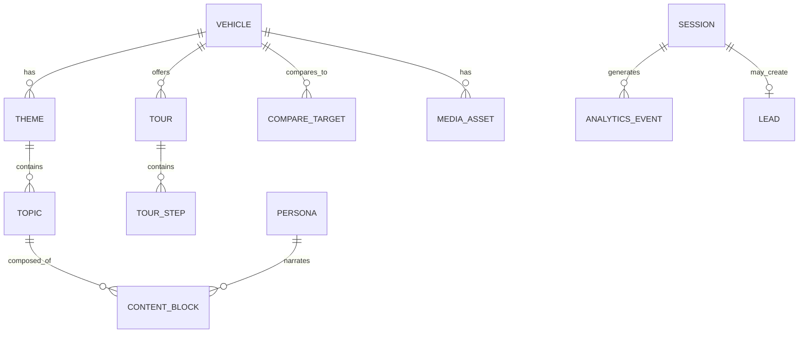

# Data Models

Domain entities, relationships, and Supabase schema outline for Viaggio Digital Showroom. Designed for **content-driven multi-vehicle** extensibility.

## Entity Relationship Overview



---

## Core Entities

### Vehicle

Canonical representation of a GAC model in the showroom.

| Field | Type | Description |
|-------|------|-------------|
| `id` | UUID | Internal ID (Supabase) |
| `slug` | string | URL key: `gs4-max` |
| `modelName` | string | Display: "GAC GS4 MAX" |
| `modelYear` | number | e.g., 2025 |
| `status` | enum | `active`, `preview`, `coming_soon` |
| `tagline` | string | ES marketing line |
| `heroMediaId` | string | Reference to media asset |
| `priceFrom` | number | BOB, orientative |
| `priceDisclaimer` | string | Legal/ orientative note |
| `launchPriority` | number | Sort order in selector |
| `metadata` | jsonb | Extensible key-value |

**Source of truth (content):** `src/content/vehicles/{slug}/vehicle.json`  
**Registry:** `src/content/vehicles/registry.json`

---

### Theme

High-level content grouping per vehicle.

| Field | Type | Description |
|-------|------|-------------|
| `id` | string | e.g., `safety` |
| `vehicleSlug` | string | Parent vehicle |
| `title` | string | ES display title |
| `description` | string | Short intro |
| `icon` | string | Icon identifier |
| `primaryPersonaId` | string | Default guide |
| `sortOrder` | number | Hub card order |
| `coverMediaId` | string | Theme hero image |

---

### Topic

Leaf content unit within a theme.

| Field | Type | Description |
|-------|------|-------------|
| `id` | string | e.g., `adas` |
| `themeId` | string | Parent theme |
| `vehicleSlug` | string | Parent vehicle |
| `title` | string | ES title |
| `personaId` | string | Narration guide |
| `tags` | string[] | Search/filter |
| `blocks` | ContentBlock[] | Composable content |
| `relatedTopicIds` | string[] | Cross-links |

---

### ContentBlock

Composable UI block — see [json-schemas.md](./json-schemas.md).

| Field | Type | Description |
|-------|------|-------------|
| `id` | string | Unique within topic |
| `type` | enum | `hero`, `narration`, `feature_grid`, etc. |
| `personaId` | string? | Override narrator |
| `data` | jsonb | Type-specific payload |
| `sortOrder` | number | Render order |

---

### Persona

Digital guide — not a database entity at runtime; loaded from content.

| Field | Type | Description |
|-------|------|-------------|
| `id` | string | `carlos`, `sofia`, `diego` |
| `name` | string | Display name |
| `role` | string | ES role title |
| `purpose` | enum | `trust`, `desire`, `ownership` |
| `avatarMediaId` | string | Image |
| `voiceTraits` | string[] | For copywriters |
| `colorAccent` | string | UI theme token |

---

### Tour

Guided narrative path.

| Field | Type | Description |
|-------|------|-------------|
| `id` | string | e.g., `trust` |
| `vehicleSlug` | string | Parent vehicle |
| `title` | string | ES name |
| `durationMinutes` | number | Estimated |
| `leadPersonaId` | string | Primary guide |
| `steps` | TourStep[] | Ordered steps |

### TourStep

| Field | Type | Description |
|-------|------|-------------|
| `id` | string | Step identifier |
| `topicId` | string? | Link to topic content |
| `blocks` | ContentBlock[]? | Inline override |
| `personaId` | string | Step narrator |

---

### CompareTarget

| Field | Type | Description |
|-------|------|-------------|
| `id` | string | e.g., `competitor-corolla-cross` |
| `vehicleSlug` | string | Anchor vehicle |
| `targetType` | enum | `competitor`, `gac_model` |
| `targetSlug` | string? | If GAC internal |
| `displayName` | string | ES name |
| `dimensions` | CompareDimension[] | Row data |

### CompareDimension

| Field | Type | Description |
|-------|------|-------------|
| `category` | string | Group header |
| `rows` | CompareRow[] | Individual comparisons |

### CompareRow

| Field | Type | Description |
|-------|------|-------------|
| `label` | string | ES label |
| `anchorValue` | string | GS4 MAX value |
| `targetValue` | string | Competitor value |
| `verdict` | enum | `anchor_wins`, `target_wins`, `tie` |
| `personaId` | string? | Who explains |

---

### MediaAsset

| Field | Type | Description |
|-------|------|-------------|
| `id` | string | e.g., `gs4-max-hero-01` |
| `vehicleSlug` | string? | Optional scope |
| `type` | enum | `image`, `video` |
| `src` | string | Public path or CDN URL |
| `alt` | string | ES alt text |
| `category` | string | `exterior`, `interior`, etc. |
| `tags` | string[] | Gallery filtering |

---

### Dealership

Viaggio Motors static config.

| Field | Type | Description |
|-------|------|-------------|
| `name` | string | Viaggio Motors Bolivia |
| `city` | string | Santa Cruz de la Sierra |
| `address` | string | Physical address |
| `whatsapp` | string | E.164 phone |
| `hours` | object | Opening hours |
| `coordinates` | object | lat/lng |

**Source:** `src/content/shared/dealership.json`

---

## Runtime / Supabase Entities

### Session

Anonymous kiosk session (no login required).

| Field | Type | Description |
|-------|------|-------------|
| `id` | UUID | PK |
| `started_at` | timestamptz | Session start |
| `ended_at` | timestamptz? | Reset or completion |
| `vehicle_slug` | string? | Primary vehicle explored |
| `entry_source` | enum | `kiosk`, `qr`, `consultant` |
| `device_id` | string? | Kiosk identifier |
| `visited_topics` | jsonb | Array of topic refs |
| `preferred_persona` | string? | Most engaged persona |
| `depth_score` | number | Computed engagement |
| `metadata` | jsonb | Extensible |

---

### AnalyticsEvent

| Field | Type | Description |
|-------|------|-------------|
| `id` | UUID | PK |
| `session_id` | UUID | FK → sessions |
| `event_type` | string | See conversion-events schema |
| `vehicle_slug` | string? | Context |
| `payload` | jsonb | Event-specific data |
| `created_at` | timestamptz | Timestamp |

---

### Lead

| Field | Type | Description |
|-------|------|-------------|
| `id` | UUID | PK |
| `session_id` | UUID | FK → sessions |
| `type` | enum | `test_drive`, `whatsapp`, `consultant` |
| `name` | string? | Customer name |
| `phone` | string? | WhatsApp / phone |
| `preferred_date` | date? | Test drive |
| `vehicle_slug` | string | Interest |
| `notes` | text? | Auto-captured context |
| `status` | enum | `new`, `contacted`, `scheduled`, `converted` |
| `created_at` | timestamptz | |

---

## Supabase Schema Outline (SQL — Future)

```sql
-- sessions
create table sessions (
  id uuid primary key default gen_random_uuid(),
  started_at timestamptz not null default now(),
  ended_at timestamptz,
  vehicle_slug text,
  entry_source text check (entry_source in ('kiosk', 'qr', 'consultant')),
  device_id text,
  visited_topics jsonb default '[]',
  preferred_persona text,
  depth_score numeric default 0,
  metadata jsonb default '{}'
);

-- analytics_events
create table analytics_events (
  id uuid primary key default gen_random_uuid(),
  session_id uuid references sessions(id) on delete cascade,
  event_type text not null,
  vehicle_slug text,
  payload jsonb default '{}',
  created_at timestamptz not null default now()
);
create index idx_events_session on analytics_events(session_id);
create index idx_events_type on analytics_events(event_type);

-- leads
create table leads (
  id uuid primary key default gen_random_uuid(),
  session_id uuid references sessions(id),
  type text not null check (type in ('test_drive', 'whatsapp', 'consultant')),
  name text,
  phone text,
  preferred_date date,
  vehicle_slug text not null,
  notes text,
  status text not null default 'new',
  created_at timestamptz not null default now()
);
```

**Note:** Vehicle/content data is **not** in Supabase for Phase 2 — it lives in JSON files for portability and Git-based content workflow. Supabase holds sessions, events, and leads only.

---

## TypeScript Types (Planned Location: `src/types/`)

| File | Exports |
|------|---------|
| `vehicle.ts` | `Vehicle`, `VehicleRegistry`, `VehicleStatus` |
| `content.ts` | `Theme`, `Topic`, `ContentBlock`, `Tour`, `TourStep` |
| `persona.ts` | `Persona`, `PersonaId` |
| `analytics.ts` | `AnalyticsEvent`, `EventType`, `Session` |
| `compare.ts` | `CompareTarget`, `CompareRow` |

Types should be derived from JSON schemas via `json-schema-to-typescript` in Phase 2.

---

## Multi-Vehicle Data Pattern

```
registry.json          → lists all vehicles
vehicles/gs4-max/      → full content pack
vehicles/gs8/          → add when ready (same structure)
```

No code changes — only content additions and registry update.

---

*Related: [JSON Schemas](./json-schemas.md) · [Technical Architecture](./technical-architecture.md) · [Content Strategy](./content-strategy.md)*
