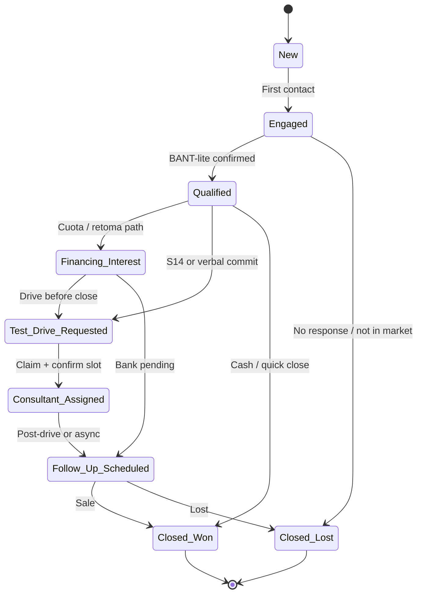
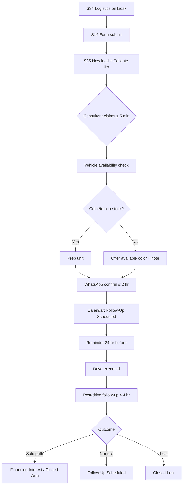
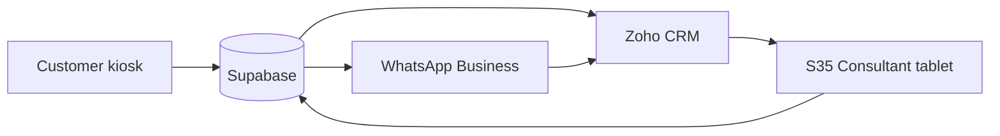

# Dealership Operations Blueprint

Operational playbook for Viaggio Motors Santa Cruz when the Digital Showroom runs on **customer kiosks** and **consultant tablets** on the showroom floor.

This document expands [Lead Capture Strategy](./lead-capture-strategy.md) into day-to-day procedures, ownership, SLAs, and KPIs. It is written for deployment — not as a product spec.

> **Audience:** General Manager · Sales Director · Finance Manager · Showroom Consultant · Customer Experience Director  
> **Market:** Santa Cruz, Bolivia — WhatsApp-first, family co-decision, trust-sensitive  
> **Screens:** S33 (family share) · S35 (staff dashboard) · S36 (live handoff trigger) · S37 (session resume)

---

## Stakeholder Lens

Each role uses the same system differently:

| Role | Primary concern | Daily touchpoint |
|------|-----------------|------------------|
| **General Manager** | Revenue, floor efficiency, brand trust | Weekly KPI review; monthly CRM attribution |
| **Sales Director** | Lead volume, conversion, consultant performance | S35 queue; shift huddles; SLA compliance |
| **Finance Manager** | Credit-ready leads, accurate handoffs, bank pipeline | Financing-interest queue; test drive → finance conversion |
| **Showroom Consultant** | Who to approach, what to say, when to stop pitching | S35 alerts; S36 handoff brief; WhatsApp follow-up |
| **Customer Experience Director** | Journey quality, family share, NPS, kiosk hygiene | S33/S37 adoption; session depth; complaint loop |

**Operating principle:** The kiosk educates and captures intent. Humans confirm, quote, and close. No consultant should repeat a 15-minute product tour the customer already completed on the tablet.

---

## 1. Lead Lifecycle

Every lead moves through nine statuses. Status changes are logged on S35 (consultant action) and sync to Supabase; Zoho CRM receives updates in Phase 3.

### Status definitions

| Status | Definition | Typical trigger |
|--------|------------|-----------------|
| **New** | Intent captured; no human contact yet | Form submit, S36 request, WhatsApp initiated, financing flag |
| **Engaged** | Consultant or Viaggio WhatsApp line has made first contact | Call, floor approach, or WhatsApp reply sent |
| **Qualified** | Budget, timeline, and vehicle interest confirmed | Consultant checklist complete on S35 |
| **Financing Interest** | Customer wants exact cuota, bank simulation, or trade-in math | S26 hard lead, S27 submit, or consultant flags during qualification |
| **Test Drive Requested** | Date/time preference captured; not yet confirmed on calendar | S14 submit |
| **Consultant Assigned** | Named owner responsible for next action | Claim on S35 or Sales Director assignment |
| **Follow-Up Scheduled** | Next touchpoint booked (WhatsApp, visit, finance appointment) | Consultant sets reminder on S35 |
| **Closed Won** | Sale recorded or deposit taken | CRM deal won |
| **Closed Lost** | No purchase; reason coded | Consultant or manager closes with reason |

### Lifecycle flow



*Note:* Leads can hold **Financing Interest** and **Test Drive Requested** concurrently. S35 displays primary status + tags.

### Ownership matrix

| Status | Owner | Backup | Escalation |
|--------|-------|--------|------------|
| **New** | Floor pool (next available consultant) | Sales Director assigns if unclaimed | GM if queue > 15 min average |
| **Engaged** | First contact consultant | Peer if shift ends | Sales Director |
| **Qualified** | Assigned consultant | — | Sales Director at 48 hr stall |
| **Financing Interest** | Finance Manager or finance desk rep | Assigned consultant stays relationship owner | GM if bank delay > 5 business days |
| **Test Drive Requested** | Test drive coordinator + assigned consultant | Any available consultant for confirm | Sales Director if no confirm in 2 hr |
| **Consultant Assigned** | Named consultant on S35 | Sales Director reassigns | — |
| **Follow-Up Scheduled** | Assigned consultant | WhatsApp team (Phase 3) | Sales Director if missed reminder |
| **Closed Won** | Assigned consultant | Finance for paperwork | GM for monthly review |
| **Closed Lost** | Assigned consultant | Sales Director audits reason codes | CX Director quarterly pattern review |

### SLA by status

| Status | SLA | Measurement | If missed |
|--------|-----|-------------|-----------|
| **New** (Caliente / S36) | First contact **≤ 2 min** | S36 claim timestamp | Backup alert; WhatsApp auto-ack (Phase 2) |
| **New** (Caliente, no S36) | Claim **≤ 5 min** | S35 queue age | Sales Director broadcast |
| **New** (Tibio) | First contact **≤ 2 hr** same day | Engaged timestamp | End-of-shift batch assign |
| **New** (Frío) | First contact **≤ 24 hr** | Engaged timestamp | Weekly nurture list |
| **Engaged → Qualified** | **≤ 1 visit** or 1 WhatsApp thread | S35 qualification checkbox | Manager coaching |
| **Financing Interest** | Finance desk contact **≤ 4 hr** | Transfer timestamp | Finance Manager daily standup |
| **Test Drive Requested** | WhatsApp confirm **≤ 2 hr** | Scheduled message sent | Coordinator calls directly |
| **Test Drive Requested** | Calendar confirm **≤ 24 hr** before slot | Calendar field | Reminder + reschedule offer |
| **Follow-Up Scheduled** | Reminder fires **± 15 min** | S35 reminder | Consultant marked overdue on dashboard |
| **Closed Won / Lost** | Close within **7 days** of last activity | CRM close date | Pipeline hygiene audit |

### Status transitions (consultant actions on S35)

| Action button | From → To |
|---------------|-----------|
| **Claim** | New → Consultant Assigned |
| **Mark contacted** | New / Consultant Assigned → Engaged |
| **Qualify** | Engaged → Qualified |
| **Flag financing** | Qualified → Financing Interest (tag) |
| **Confirm test drive** | Test Drive Requested → Follow-Up Scheduled (with datetime) |
| **Schedule follow-up** | Any open → Follow-Up Scheduled |
| **Close won** | Any → Closed Won |
| **Close lost** | Any → Closed Lost (reason required) |

**Required lost reasons:** Price · Financing denied · Chose competitor · Timing · No response · Other (free text)

---

## 2. Consultant Playbooks

Playbooks assume the consultant has read the **S36 handoff brief** or S35 lead card before approaching. Never open with *"¿En qué te ayudo?"* without referencing what the customer already explored.

### Tier: Frío (score 0–39)

**Profile:** Short session, gallery browsing, WhatsApp open with minimal context, or low depth score.

| Element | Guidance |
|---------|----------|
| **Recommended approach** | Async first. Do not interrupt a passive kiosk session unless they submitted a form. |
| **Opening conversation** | WhatsApp: *"Hola [nombre], soy [consultor] de Viaggio. Vi que miraste el GS4 MAX en nuestro showroom. ¿Te gustaría que te cuente qué unidades tenemos hoy o preferís agendar una visita corta?"* |
| **What to avoid** | Hard close, long product pitch, pressure to test drive immediately, dismissing Chinese-brand concerns without listening |
| **Next best action** | Send 1 relevant link (S37 resume or S33-style summary). Offer S34 logistics if they show interest. Re-score on reply. |

**Floor rule:** Frío kiosk sessions — observe only. Place tablet card nearby; let them explore. Offer help after 8+ min if depth score rises.

---

### Tier: Tibio (score 40–69)

**Profile:** Multiple topics viewed, compare or TCO touched, WhatsApp with intent chip, or test drive form abandoned.

| Element | Guidance |
|---------|----------|
| **Recommended approach** | Same-day contact. Floor approach acceptable if still on kiosk and score rising. |
| **Opening conversation** | Floor: *"Hola, vi que comparaste el GS4 MAX con [competidor]. ¿Qué punto te gustaría comprobar en persona — espacio, manejo, o la cuota?"* WhatsApp: reference compare or TCO from session summary. |
| **What to avoid** | Re-running full compare on verbal only; quoting exact cuota without finance desk; ignoring stated intent chip from S32 |
| **Next best action** | Single clear CTA: confirm test drive **or** 10-min finance orientation at desk. Update status to Qualified after one confirming answer. |

**SLA:** Engaged within 2 hours. If on floor, approach within 5 min of score crossing 40.

---

### Tier: Caliente (score 70–100)

**Profile:** Test drive submitted, S36 handoff, financing hard lead, tour + compare complete, or trade-in submitted.

| Element | Guidance |
|---------|----------|
| **Recommended approach** | Immediate. S36 claims within 2 min. Others claim within 5 min. Finance desk on standby if financing tag present. |
| **Opening conversation** | *"Hola [nombre], soy [consultor]. Vi tu solicitud de [prueba de manejo / cuota / consultor ahora]. Ya revisé lo que exploraste — [tema 1, tema 2]. ¿Arrancamos por [test drive / simulación con banco]?"* |
| **What to avoid** | Making them wait without acknowledgment; sending to generic reception; repeating Carlos warranty script verbatim |
| **Next best action** | Test drive: coordinator + vehicle check same conversation. Financing: walk to desk with S35 summary open. Close to Qualified within first interaction. |

**Escalation:** If Caliente waits > 2 min on S36, Sales Director receives alert and assigns nearest consultant.

---

## 3. Persona-Based Handoff

The system tracks **preferred persona** from time on Carlos-, Sofía-, and Diego-narrated content. Consultants adjust tone and first question — not product facts (customer already saw them).

### Carlos-dominant journey (trust / technical)

**Signals:** Warranty topics, S29, TCO, safety structure, FAQ on repuestos/reventa, long dwell on Carlos narration.

| Adjust | How |
|--------|-----|
| **Tone** | Factual, patient, admit trade-offs |
| **Open with** | *"¿Te quedó alguna duda sobre garantía, repuestos en Santa Cruz, o mantenimiento?"* |
| **Emphasize** | Viaggio taller, 5 años/150.000 km, real service stories — not marketing fluff |
| **CTA priority** | Test drive framed as *"comprobá lo que te conté"* before price talk |
| **Avoid** | Hype, overselling design, skipping objection they already raised in FAQ |
| **Bring** | Finance Manager only after trust satisfied — *"Ahora veamos números con calma"* |

**Sales Director note:** Carlos-heavy leads often need **two visits**. Set Follow-Up Scheduled rather than forcing same-day close.

---

### Sofía-dominant journey (desire / value)

**Signals:** Technology, design gallery, configurator S30, GT trim toggled, compare on equipment/value rows.

| Adjust | How |
|--------|-----|
| **Tone** | Enthusiastic but not pushy; benefit-led |
| **Open with** | *"¿Te gustó más la versión GT o la base? Vi que miraste [color/equipamiento]."* |
| **Emphasize** | Unidades en showroom, color availability, equipamiento vs competidor |
| **CTA priority** | Config confirmation → test drive in preferred color → cuota orientativa |
| **Avoid** | Deep technical workshop talk unless they ask; leading with discount |
| **Bring** | Physical vehicle to kiosk if color match available |

**Finance transition:** After trim confirmed — *"Con esta versión, la cuota orientativa que viste en pantalla ronda [rango]. ¿Simulamos con tu entrada?"*

---

### Diego-dominant journey (family / ownership)

**Signals:** Family tour, family theme topics, S33 share initiated, passengers = familia on S14, journey personas Sofia+Diego path.

| Adjust | How |
|--------|-----|
| **Tone** | Warm, inclusive, practical |
| **Open with** | *"¿Venís con familia a la prueba? Vi que te interesó espacio y seguridad para los tuyos."* |
| **Emphasize** | Asientos, A/C, espacio trasero, seguridad familiar; S34 family welcome |
| **CTA priority** | S33 if spouse not present; test drive with family slot; second row demo |
| **Avoid** | Single-buyer assumptions; ignoring co-decision — *"¿Quién más decide con vos?"* |
| **Bring** | Invite family member to kiosk or send S33 immediately |

**Multi-decision rule:** If S33 sent, consultant notes *"decisor secundario"* on lead. Follow-up addresses both names when known.

---

## 4. Financing Readiness Model

Finance Manager and consultants share a common read of **financing readiness** — separate from lead tier (a Tibio lead can be financing-ready).

### Signal map

| Readiness level | Digital signals | Customer language | Consultant response |
|-----------------|-----------------|-------------------|---------------------|
| **Curiosity** | S26 viewed, no form; economics row only; Sofía value topics | *"¿Más o menos cuánto sale?"* | Acknowledge S26 range: *"En pantalla viste orientativo [X–Y]. ¿Te gustaría una simulación exacta con banco?"* — do not quote binding rate |
| **Affordability concern** | S28 TCO calculated; long dwell on plazo tabs; compare price rows | *"No sé si me alcanza"* / *"La cuota es lo importante"* | Empathy first. TCO + cuota bridge: *"Con tus km, el costo mensual total es [TCO]. La cuota depende de entrada y plazo — sentémonos 10 min con financiamiento."* |
| **Purchase intent** | S26 hard lead; S27 trade-in; configurator + financing; Qualified status | *"Quiero saber mi cuota"* / retoma details | Immediate finance desk handoff. Status → Financing Interest. Consultant stays in room for relationship |
| **Urgency** | S36 after S26; test drive + financing same session; repeat visit S37 | *"Lo necesito este mes"* / *"Ya vendí mi auto"* | Same-day finance appointment. Finance Manager priority queue. Pre-pull trade-in data from S27 |

### Transition script: product → financing

Use when customer is product-satisfied but has not asked for numbers yet:

1. **Anchor on their work:** *"Viste [compare/config/tour] — ¿hay algo que te falte confirmar en el vehículo?"*
2. **Permission:** *"¿Te parece si vemos cómo quedaría en cuotas, sin compromiso?"*
3. **Data carry-over:** Open S35 financing panel — trim, plazo preference, TCO, retoma from session — *"Ya tengo acá lo que exploraste, no repetimos todo."*
4. **Handoff:** *"[Nombre de finance] te confirma tasa con [banco aliado]. Yo me quedo por si tenés dudas del auto."*

### What Finance Manager owns

| Task | When |
|------|------|
| Validate orientative ranges on S26 monthly | Content update cycle |
| Bank simulation | Financing Interest status |
| Trade-in appraisal | S27 data present |
| Denial / restructure | Closed Lost only with reason; offer alternative plazo |
| Feedback to CX | If customers consistently stall at S26 → range or copy issue |

### Red flags (consultant → Finance Manager immediately)

- Customer asks for *"cuota sin entrada"* before test drive — qualify income gently; avoid promise
- Trade-in value dispute — separate conversation from new car cuota
- Third-party financing mentioned — note on lead; Viaggio still owns relationship
- Spouse must approve numbers — trigger S33 + joint follow-up

---

## 5. Test Drive Optimization

End-to-end process from kiosk tap to post-drive follow-up. Owner: **Sales Director** (process); **coordinator** (logistics); **consultant** (relationship).

### Process stages



### Stage detail

| Stage | Actor | Action | Tool |
|-------|-------|--------|------|
| **1. Kiosk request** | Customer | S34 → S14; optional S15 WhatsApp confirm | Customer kiosk |
| **2. Consultant assignment** | Sales Director / pool | Auto-route to coordinator queue; consultant claims on S35 | S35 |
| **3. Vehicle availability** | Coordinator | Check stock vs S30 color/trim; update S35 note | DMS / manual list Phase 2 |
| **4. Scheduling** | Consultant | Confirm day + time band; carnet reminder per S34 | S35 + WhatsApp |
| **5. Confirmation** | Consultant | Template: date, time, address, what to bring, contact name | WhatsApp |
| **6. Reminder** | System / consultant | 24 hr before + morning-of if afternoon slot | WhatsApp Phase 3 auto |
| **7. Day-of** | Coordinator | Keys, fuel, A/C on, clean; route briefing | Floor checklist |
| **8. Post-drive follow-up** | Consultant | Within 4 hr: *"¿Qué te pareció?"* → Qualified → financing or second visit | WhatsApp + S35 |

### WhatsApp confirmation template (consultant)

```
Hola [nombre], soy [consultor] de Viaggio Motors.
Confirmamos tu prueba del GAC GS4 MAX:
📅 [día] — [hora]
📍 Av. [dirección], Santa Cruz
Traé tu carnet. [Si familia: pueden acompañarte.]
Cualquier cambio, escribime acá.
```

### Metrics

| Metric | Target | Owner | Cadence |
|--------|--------|-------|---------|
| S14 submit → claim rate | ≥ 95% | Sales Director | Daily |
| Claim → WhatsApp confirm time | ≤ 2 hr median | Consultant | Daily |
| Confirm → show rate | ≥ 75% | Coordinator | Weekly |
| No-show rate | ≤ 25% | Coordinator | Weekly |
| Show → Qualified rate | ≥ 80% | Consultant | Weekly |
| Show → sale (30 day) | Baseline +15% vs non-showroom leads | GM | Monthly |
| Wrong color available rate | ≤ 10% | Coordinator | Monthly |
| Post-drive follow-up ≤ 4 hr | ≥ 90% | Sales Director | Weekly |

---

## 6. Family Decision Journey

In Santa Cruz, **60%+ of SUV purchases** involve spouse, parents, or adult children. The digital showroom must support **async co-decision**, not only the person at the kiosk.

### Decision roles

| Role | Often | Digital behavior | Consultant action |
|------|-------|------------------|-------------------|
| **Primary explorer** | Spouse who visits showroom | Kiosk session, S14, S36 | Main relationship owner |
| **Secondary decider** | Partner at home/work | S33 recipient, S37 resume | Include in WhatsApp thread |
| **Influencer** | Parent funding portion | S33 forwarded, questions on WhatsApp | Respect deference; offer joint visit |
| **User** | Teen / adult child | Gallery, tech topics | Seat demo on test drive |

### S33 Family Share — operational design

**Purpose:** One-page summary the primary explorer sends so others decide without re-watching the full kiosk.

**When consultants should prompt S33:**

- Diego-dominant session
- Customer says *"tengo que consultarlo"* / *"mi esposa/o decide"*
- Before leaving without test drive
- After compare verdict (S12 end)

**Kiosk flow:**

1. Customer taps *"Enviar resumen a mi familia"* (S13 or milestone prompt)
2. S33 shows: hero image, 3 key points from session, compare verdict, config, warranty headline
3. Handoff: **WhatsApp share** or **QR** to mobile summary (limited view — not full kiosk)
4. Recipient CTA: *"Tengo preguntas"* → S32 pre-fill to Viaggio line with session context

**Consultant follow-up after S33:**

| Timing | Action |
|--------|--------|
| Same day | WhatsApp primary: *"¿Pudiste compartir con tu familia? ¿Alguna duda de ellos?"* |
| +48 hr if no reply | Offer joint visit or video call with consultant |
| Secondary replies on WhatsApp | Tag lead *"decisor secundario activo"*; add name to notes |

**CX Director KPI:** S33 send rate on sessions ≥ 12 min with Diego or compare; secondary engagement rate (link open or WhatsApp reply).

### S37 Session Resume — operational design

**Purpose:** Continue exploration days later on phone or return visit — spouse picks up where primary left off.

**When to offer S37:**

- S18 session summary opt-in
- S20 pre-reset save (*"Guardá tu sesión"*)
- Pre-visit QR campaigns (S21)
- Consultant sends link post-visit for undecided family

**Operational rules:**

| Rule | Detail |
|------|--------|
| Token life | 30 days default |
| Resume entry | Summary + *"Continuar donde quedaste"* → last screen |
| Family use | Same link can be forwarded — track `qr_handoff_scanned` / resume opens by device |
| Consultant alert | Optional Phase 2: notify assigned consultant when resume token opens |
| Return to showroom | Customer scans resume on phone → consultant sees returning session on S35 live list |

**Family journey example:**

1. Wife explores GS4 MAX Saturday; sends S33 to husband
2. Husband opens S37 link Sunday; views compare + S26
3. S35 shows resume activity + score increase → consultant WhatsApp Monday: *"Vi que tu familia siguió mirando el GS4 MAX. ¿Agendamos prueba los dos?"*

**Avoid:** Treating resume as cold lead — always reference prior session in opening message.

---

## 7. Showroom Dashboard (S35)

S35 on the **consultant tablet** is the floor operations console. Sales Director monitors during shift; GM reviews daily aggregates.

### Layout priority (top → bottom)

1. **SLA banner** — overdue handoffs, missed follow-ups (red)
2. **Hot leads strip** — Caliente + unclaimed S36
3. **Handoff queue** — S36 live requests with wait timer
4. **Lead queue** — sortable by tier, type, age
5. **Live sessions** — active kiosks with depth score
6. **Follow-up reminders** — due today / overdue
7. **Daily stats widgets** — compact row

### Widget catalog

| Widget | Content | Priority | Refresh |
|--------|---------|----------|---------|
| **SLA clock** | Longest unclaimed handoff timer | P0 — audible at 60s / 120s | Realtime |
| **Hot leads** | Caliente cards: name, type, score, wait | P0 | Realtime |
| **Handoff queue** | S36: session code, vehicle, screen, persona | P0 | Realtime |
| **Lead queue** | All New + Assigned; filters by type | P1 | 30s poll |
| **Live sessions** | Kiosk id, duration, depth, current route | P1 | 30s poll |
| **Financing queue** | Financing Interest unassigned to desk | P1 | 30s poll |
| **Test drive today** | Confirmed slots next 24 hr | P1 | 5 min |
| **Follow-up reminders** | Consultant-filtered due list | P1 | 5 min |
| **Team board** | Who is available / busy / on drive | P2 | Manual + status |
| **Daily stats** | Sessions, leads, handoffs, SLA % | P2 | Hourly |

### Queue sort (default)

1. S36 handoff unclaimed (wait time ↑)
2. Caliente + test drive / financing
3. Caliente + other
4. Tibio (score ↓)
5. Frío
6. Follow-up reminders overdue

### Consultant assignment

| Method | When |
|--------|------|
| **Self-claim** | Default — first available consultant taps Claim |
| **Director assign** | Shift start imbalance; specialist for fleet/finance |
| **Round-robin** | Phase 3 optional — auto-suggest next consultant |
| **Finance transfer** | Financing Interest → finance desk rep; sales consultant retained on card |

**Availability states on S35:** Available · With customer · On test drive · Break · End of shift

### SLA indicators

| Indicator | Green | Yellow | Red |
|-----------|-------|--------|-----|
| S36 claim time | < 90s | 90s–120s | > 120s |
| New Caliente unclaimed | < 3 min | 3–5 min | > 5 min |
| Follow-up due | > 1 hr before | < 1 hr | Overdue |
| WhatsApp confirm (test drive) | < 1 hr | 1–2 hr | > 2 hr |

Red items pin to top of dashboard until resolved or escalated.

### Sales Director shift checklist

- [ ] All consultants logged into S35
- [ ] Kiosk idle reset tested
- [ ] Test drive vehicle list matches S30 colors
- [ ] Finance desk notified of floor traffic
- [ ] Review red SLA items at mid-shift
- [ ] End-of-shift: zero unclaimed Caliente; all Follow-Up Scheduled set

---

## 8. Consultant Handoff Brief (S36 Response)

**Note:** S36 is the **customer-facing** live handoff modal on the kiosk. When S36 fires, the consultant uses **S35** to claim and open the **Handoff Brief** — the operational view described here. Floor language may say *"tengo un S36"* meaning an incoming live handoff.

### What the consultant sees (Handoff Brief)

| Section | Data shown |
|---------|------------|
| **Header** | Session code, wait time, tier badge, lead score |
| **Customer** | Name / phone if captured; otherwise *"En piso — sin formulario"* |
| **Vehicle interest** | Model, trim, color from S30 |
| **Engagement history** | Session duration, topics list, tour complete Y/N |
| **Compare** | Competitor + one-line verdict |
| **Economics** | TCO monthly if calculated; S26 plazo viewed; retoma flag |
| **Persona affinity** | Carlos / Sofía / Diego dominant + % |
| **Objections detected** | FAQ categories opened (repuestos, reventa, marca china, etc.) |
| **Intent** | Latest: test drive / financing / consultor / WhatsApp chip |
| **Recommended approach** | Auto-generated 1-liner from persona + tier playbook |
| **Actions** | Claim · Join session mirror · WhatsApp · Assign · Dismiss |

### Recommended talking points (auto-suggested on brief)

Generated from persona + intent + objections — consultant edits in conversation:

**Example (Carlos + financing curiosity + FAQ repuestos):**

1. *"Vi que revisaste garantía y repuestos — ¿algo no te cerró?"*
2. *"Las cuotas en pantalla son orientativas; sentémonos con financiamiento para el número exacto."*
3. *"¿Preferís manejarlo antes o después de ver la simulación?"*

**Example (Diego + test drive + family):**

1. *"¿Venís con alguien más a la prueba?"*
2. *"Preparamos el GS4 MAX con espacio para todos."*
3. *"Si querés, mandamos resumen a tu familia desde acá."* → S33

### Vehicle interests (consultant use)

| Signal | Talk track |
|--------|------------|
| Color selected S30 | Confirm unit in showroom or alternate |
| GT vs base | Ask which features matter for daily use |
| Compare target | One honest strength of competitor, then GS4 MAX proof point |
| Gallery dwell interior | Offer seat demo before drive |

### Objections detected (from session)

| FAQ / topic opened | Consultant stance |
|--------------------|-------------------|
| Marca china | Acknowledge; Carlos content already shown — offer test drive proof |
| Repuestos | Viaggio stock + lead time facts; no promises without parts desk |
| Reventa | TCO + warranty; honest market context |
| Garantía | S29 summary; service appointment if skeptical |

Do **not** re-play video content unless customer asks.

### Engagement history (how to use it)

| Pattern | Implication |
|---------|-------------|
| Long session, no form | Soft approach; offer one CTA |
| Short session + S36 | High intent, low research — answer direct question fast |
| S37 resume after S33 | Family decision active — ask who else is involved |
| Repeat session same week | Prioritize; reference last visit notes on S35 |

---

## 9. Executive KPIs

### Management view (General Manager)

**Daily (5 min morning review)**

| KPI | Definition |
|-----|------------|
| Showroom sessions | Kiosk sessions started |
| Leads captured | All types, deduped by phone/day |
| Caliente count | Tier distribution |
| S36 SLA % | Claimed within 2 min |
| Closed Won (daily) | Sales attributed to showroom lead source |

**Weekly (leadership meeting)**

| KPI | Definition |
|-----|------------|
| Session → lead rate | Leads / sessions |
| Lead → Qualified rate | Qualified / engaged |
| Test drive show rate | Shows / scheduled |
| Show → sale rate | Won / shows (30-day window) |
| Handoff miss count | S36 timeout events |
| Average lead score | Mean at capture |
| Consultant SLA scorecard | Per-rep claim and follow-up compliance |

**Monthly (board / GAC review)**

| KPI | Definition |
|-----|------------|
| Showroom-attributed revenue | Won deals with session or phone match |
| Cost per qualified lead | Marketing + kiosk ops / qualified |
| Digital vs walk-in mix | Entry source breakdown |
| Family journey impact | S33 send → second visit or sale rate |
| NPS / CX sample | Post-test-drive survey (Phase 3) |
| Inventory alignment | Config interest vs stock gaps |

---

### Sales view (Sales Director)

**Daily**

| KPI | Target direction |
|-----|------------------|
| Unclaimed Caliente at EOD | → 0 |
| Avg claim time (Caliente) | ↓ |
| Engaged same day (Tibio) | ↑ |
| Test drives confirmed | ↑ |
| Pipeline: Qualified count | ↑ |

**Weekly**

| KPI | Use |
|-----|-----|
| Consultant leaderboard | Claims, qualified, shows, wins — balance not just volume |
| Lost reason distribution | Coaching and content fixes |
| Persona mix vs close rate | Carlos-heavy may need longer nurture |
| Compare target frequency | Competitive intel for GAC |

**Monthly**

| KPI | Use |
|-----|-----|
| Consultant conversion funnel | Engaged → qualified → show → won |
| Shift pattern analysis | Staff S35 coverage vs traffic |
| Playbook adherence audit | Mystery shop + S35 note quality |

---

### Marketing view (Customer Experience + Marketing)

**Daily**

| KPI | Use |
|-----|-----|
| Entry source | kiosk / qr / consultant-started |
| S33 shares | Family campaign effectiveness |
| S37 resume opens | Retargeting and ad follow-up |
| Top topics viewed | Content and ad creative |

**Weekly**

| KPI | Use |
|-----|-----|
| QR campaign → session | Pre-visit S21 performance |
| WhatsApp initiate rate | Channel health |
| Session depth distribution | Engagement quality |
| Abandon at S14 | Form friction |

**Monthly**

| KPI | Use |
|-----|-----|
| Campaign ROI | Ad spend vs showroom-attributed leads |
| Content topic correlation | Topics that predict Qualified |
| Family co-decision cycle time | S33 send → sale days |
| Brand trust proxy | Carlos/S29 engagement vs close rate |

---

## 10. Future CRM Integration Strategy

Designed for **Zoho CRM** (deals + activities), **Supabase** (sessions, events, leads), and **WhatsApp** (conversations) — without requiring custom code in this document.

### Integration architecture (conceptual)



**Source of truth:**

| Data | System of record | Sync direction |
|------|------------------|----------------|
| Session analytics, events | Supabase | → Zoho (summary fields) |
| Lead record, status, score | Supabase → Zoho | Bidirectional on status |
| Deal, amount, close | Zoho | → Supabase attribution flag |
| WhatsApp thread | WhatsApp Business API | → Zoho activity log |
| Consultant assignment | Zoho owner / Supabase | Bidirectional |

### Lead → Zoho mapping

| Supabase lead field | Zoho field |
|---------------------|------------|
| `phone` | Mobile (match key) |
| `name` | Lead Name |
| `vehicle_slug` | Product interest / custom |
| `lead_score` | Lead Score |
| `lead_tier` | Rating (Hot/Warm/Cold) |
| `status` | Lead Status (mapped enum) |
| `type` | Lead Source detail |
| `session_id` | Custom: Digital Session ID |
| `topics_explored` | Custom: JSON or multi-line |
| `preferred_persona` | Custom |
| `metadata.*` | Custom module fields |
| `assigned_to` | Owner |

**Dedup rule:** Match on normalized +591 phone; merge session notes into activity timeline rather than duplicate leads.

### Status sync (Supabase ↔ Zoho)

| Blueprint status | Zoho Lead Status | Zoho Deal stage (if deal created) |
|------------------|------------------|-----------------------------------|
| New | New | — |
| Engaged | Contacted | — |
| Qualified | Qualified | Qualification |
| Financing Interest | Qualified + tag | Needs Analysis |
| Test Drive Requested | Qualified | Test Drive Scheduled |
| Consultant Assigned | — (owner set) | — |
| Follow-Up Scheduled | — | Activity task due |
| Closed Won | Converted | Closed Won |
| Closed Lost | Not Converted | Closed Lost |

### WhatsApp integration

| Event | Behavior |
|-------|----------|
| Customer initiates S32/S15 | Log `whatsapp_initiated` in Supabase; create Zoho activity *"WhatsApp — showroom context"* |
| Consultant replies from Viaggio line | Thread in WhatsApp Business; sync to Zoho contact timeline |
| Templates | Test drive confirm, reminder 24 hr, post-drive, S33 link delivery |
| No double outreach | S35 shows *"WhatsApp activo"* if thread open in last 24 hr |

**Phase 1 (manual):** Consultant copies session summary from S35 into WhatsApp.  
**Phase 2:** Pre-filled templates from S35.  
**Phase 3:** WhatsApp Business API webhook → Supabase → Zoho.

### Zoho workflows (recommended)

| Trigger | Action |
|---------|--------|
| Lead Created from Supabase | Assign round-robin; task due 2 hr for Tibio, 15 min for Caliente |
| Status = Test Drive Requested | Task for coordinator; calendar event |
| Status = Financing Interest | Notify Finance Manager; sub-pipeline |
| No activity 48 hr | Reminder to owner |
| Closed Won | Attribution field: *Digital Showroom Y/N* |

### Supabase role ongoing

Even with Zoho, Supabase retains:

- Real-time S35 handoffs (latency)
- Session replay for consultant mirror
- Analytics events not needed in CRM
- Offline kiosk queue

Zoho remains **CRM of record** for pipeline reporting GM and GAC expect.

### Rollout phases

| Phase | CRM capability |
|-------|----------------|
| **Phase 2 launch** | CSV export from S35; manual Zoho import daily |
| **Phase 2b** | Webhook: new lead → Zoho; status one-way Supabase → Zoho |
| **Phase 3** | Bidirectional status; WhatsApp activities; deal creation from Qualified |
| **Phase 3b** | Attribution reporting; marketing campaign IDs on S21/S37 tokens |

### Data governance

| Topic | Policy |
|-------|--------|
| PII | Phone/name only after customer submit; Zoho access sales + finance roles |
| Consent | Form copy + WhatsApp opt-in logged as activity |
| Retention | Supabase session events 24 months; Zoho per Viaggio policy |
| Audit | Status changes require user id on S35 |

---

## Floor Deployment Checklist (Viaggio Santa Cruz)

**Before opening**

- [ ] Customer kiosk on S04 home; idle reset active
- [ ] Consultant tablets on S35; volume on for handoff alerts
- [ ] Test drive vehicle list updated
- [ ] S26 cuota ranges approved this month (Finance Manager)
- [ ] WhatsApp business line staffed

**During hours**

- [ ] Minimum one consultant Available on S35 at all times
- [ ] Red SLA items cleared or escalated within 15 min
- [ ] S33/S37 links tested weekly

**After close**

- [ ] Zero unclaimed Caliente leads
- [ ] All test drives tomorrow confirmed
- [ ] Follow-Up Scheduled set for open opportunities
- [ ] Lost reasons completed for dead leads
- [ ] Daily stats screenshot to Sales Director WhatsApp group

---

## Document Cross-Reference

| Topic | Document |
|-------|----------|
| Capture flows, scoring model | [Lead Capture Strategy](./lead-capture-strategy.md) |
| Screen specs S13–S37 | [Screen Map](./screen-map.md) |
| Funnel and CTAs | [Conversion Strategy](./conversion-strategy.md) |
| Buyer stages | [Customer Journey](./customer-journey.md) |
| Carlos, Sofía, Diego | [Personas](./personas.md) |
| Technical S35/S36 | [Technical Architecture](./technical-architecture.md) |

---

*Prepared for Viaggio Motors showroom operations — Santa Cruz, Bolivia. Aligns with Digital Showroom Phase 2 deployment.*
