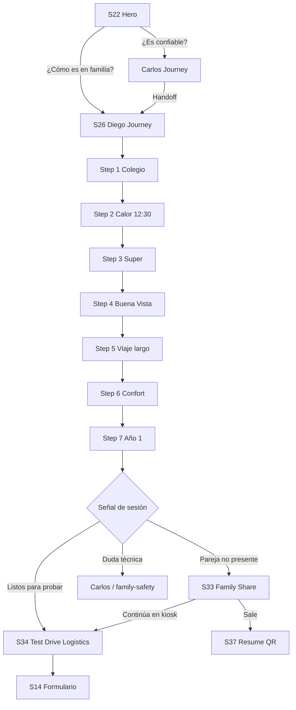
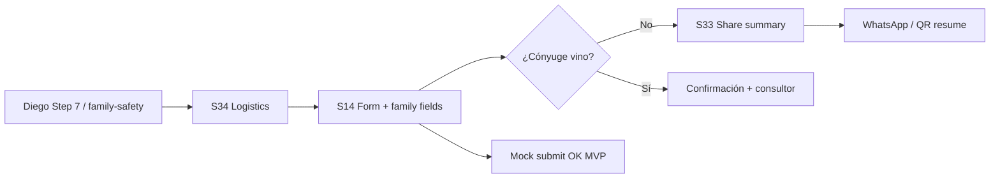
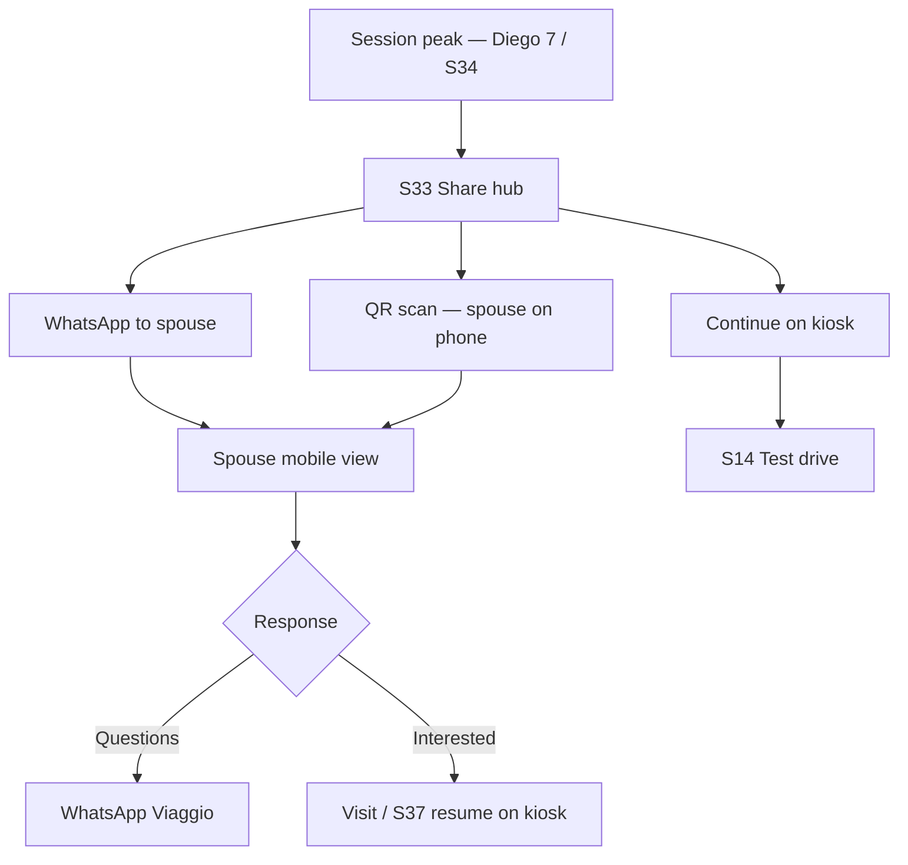

# Family Conversion Implementation Plan

**Project:** Viaggio Digital Showroom · GAC GS4 MAX  
**Role:** UX Architecture · Creative Direction · Family Experience Design  
**Date:** June 2025  
**Status:** Architecture plan — no code in this deliverable  

**Inputs:** [`family-conversion-analysis.md`](./content/family-conversion-analysis.md) · [`diego-emotional-review.md`](./content/diego-emotional-review.md) · [`diego-narration.md`](./content/diego-narration.md) · [`screen-map.md`](./screen-map.md) · [`customer-journey.md`](./customer-journey.md) · MVP implementation (`app/(showroom)/`, `content/vehicles/gs4-max/`)

---

## Executive summary

The MVP scores **41/100** on family conversion because the **architecture is correct but the emotional layer is missing**. Carlos (trust), ADAS, and S29 warranty carry the experience; Diego (ownership imagination) delivers **2 of 7 scenes** in under two minutes. Without that gap closed, families leave with *"lo consulto en casa"* and no tool to continue the decision.

**Highest-ROI P0 bundle (recommended build order):**

| Order | Deliverable | Expected lift |
|-------|-------------|---------------|
| 1 | Full Diego Journey (7 scenes) | Ownership imagination **27 → 65+** |
| 2 | `family-safety` topic (Diego → Carlos) | Trust for mother lens **54 → 68+** |
| 3 | S34 family test-drive planning | Test-drive conversion **34 → 55+** |
| 4 | S33 family share + resume bridge | Co-decision continuity; enables 7–21 day cycle |

These four items reuse existing renderers (`TourPlayer`, `TopicRenderer`, `NarrationRenderer`, `TrustSectionRenderer`, `CTARenderer`) and require **content JSON expansion**, not a platform rewrite.

---

## Family decision architecture (target)

Four psychological gates — **non-interchangeable** for Santa Cruz families:

```
S22 Hero ──► ¿Vale la pena considerarlo?
     │
     ▼
Carlos + family-safety + ADAS + S29 ──► ¿Confío? (madre · abuelo)
     │
     ▼
Diego 7 escenas ──► ¿Puedo imaginar nuestra vida?
     │
     ▼
Sofía + economía (post-Diego) ──► ¿Me gusta lo suficiente?
     │
     ▼
S34 → S14 → S33 ──► ¿Probamos en familia? · ¿Mi pareja lo ve?
```

**Critical rule (unchanged from customer-journey):** First-time GAC visitors must not skip trust before desire — but **families who already touched the physical vehicle** may enter at Diego via hero CTA *"¿Cómo es en familia?"* while skeptics use *"¿Es confiable?"* → Carlos.

---

## Current state vs target (P0 scope)

| Surface | Current MVP | Target (this plan) |
|---------|-------------|-------------------|
| **S26 Diego Journey** | 2 steps · `family-comfort` + `structure` (Carlos voice) | 7 immersive scenes · ~10–12 min |
| **Safety — family layer** | `structure` = 1 narration block · `family-safety` missing | Dedicated topic · Diego opens · Carlos closes |
| **S34 Test Drive Logistics** | Not implemented | Family-first logistics screen before S14 |
| **S14 Test Drive Form** | Name + phone only | Passengers · children · spouse · route · weekend |
| **S33 Family Share** | Not implemented | WhatsApp payload · spouse mobile view · QR resume |
| **S22 Hero CTAs** | Default → Carlos journey | Bifurcation: familia vs confianza |
| **Tour end handoffs** | Generic test-drive CTA | Diego cierre → S34 or S33 by session signal |

---

## P0-1 — Full Diego Journey

### Creative intent

Diego is not a feature tour — he is **time travel through a Santa Cruz family week**. Each scene must pass the *Equipetrol dad test*: recognition in 5 seconds, spouse as co-decider, sensory detail (calor, polvo, motos, WhatsApp del super).

**Recommended scene order** (from emotional review + user P0 list):

| Step | Scene ID | Working title | Emotional beat | Primary topic slug |
|------|----------|---------------|----------------|-------------------|
| 1 | `diego-01` | **Colegio 7:15** | Martes universal — mochilas, Doble Vía, agotamiento evitado | `daily-driving` |
| 2 | `diego-02` | **Calor 12:30** | Recogida al sol — supervivencia, no lujo | `children` |
| 3 | `diego-03` | **Supermercado** | Lista WhatsApp, parking, cajuela que cierra | `shopping` |
| 4 | `diego-04` | **Buena Vista** | Domingo, abuelos, polvo, *"esta vez sí valió"* | `family-trips` |
| 5 | `diego-05` | **Viaje largo** | Maleta, paradas, llegada en familia | `road-trips` |
| 6 | `diego-06` | **Confort** | A/C, asientos, suegro 1,80 — refuerzo sensorial | `comfort` |
| 7 | `diego-07` | **Año 1 · Cierre familiar** | Mes 3 servicio · mes 6 *"buena decisión"* · co-decisión | `ownership-experience` |

> **Note:** Step 2 (*Calor 12:30*) is extracted from the *Los chicos* script in `diego-emotional-review.md` as a standalone beat — highest mother-lens recognition in SCZ. Steps 6 (*Confort*) can be shortened to a 45 s bridge if tour length is constrained; do not cut steps 1, 2, 4, or 7.

### Updated screen requirements — S26 / S06 Tour Player

| Requirement | Detail |
|-------------|--------|
| **Screen IDs** | S26 (`/journey/diego`) · S06 (`/tour/family`) — same player, dual entry |
| **Layout** | Full-bleed lifestyle placeholder per step · progress 1/7 · Diego avatar persistent |
| **Step media** | One `hero` or `video` block per step with `mediaId` from manifest (see content mapping) |
| **Narration** | Primary script from emotional-review *Guion mejorado*; `variante corta` for kiosk auto-advance mode |
| **Transitions** | Diego transition lines between steps (map in emotional review §Transiciones) |
| **Step 7 exit CTAs** | Primary: **S34** *"Agendá con tu familia"* · Secondary: **S33** *"Mandáselo a tu pareja"* · Tertiary: Carlos handoff if trust signal low |
| **Duration** | Target 10–12 min · min 8 min with full narration |
| **Persona integrity** | **No Carlos narration inside Diego steps** — remove current step 2 `structure`/Carlos mismatch |
| **Physical bridge** | Step 3 or 7: optional prompt *"Abrí la cajuela del GS4 MAX en el piso"* when floor vehicle present |

### Content mapping — Diego Journey

#### Tour definition (`content/vehicles/gs4-max/tours/family.json`)

Replace 2-step tour with 7 steps. Each step references a **new or expanded topic** under theme `family`:

```json
{
  "id": "family",
  "title": "Tour Familiar",
  "durationMinutes": 12,
  "leadPersonaId": "diego",
  "steps": [
    { "id": "diego-01", "title": "Colegio 7:15", "topicId": "daily-driving", "personaId": "diego" },
    { "id": "diego-02", "title": "Calor 12:30", "topicId": "children", "personaId": "diego" },
    { "id": "diego-03", "title": "Supermercado", "topicId": "shopping", "personaId": "diego" },
    { "id": "diego-04", "title": "Buena Vista", "topicId": "family-trips", "personaId": "diego" },
    { "id": "diego-05", "title": "Viaje largo", "topicId": "road-trips", "personaId": "diego" },
    { "id": "diego-06", "title": "Confort en Santa Cruz", "topicId": "comfort", "personaId": "diego" },
    { "id": "diego-07", "title": "Año 1 de propiedad", "topicId": "ownership-experience", "personaId": "diego" }
  ]
}
```

#### New topic files (`content/vehicles/gs4-max/topics/`)

| File | Theme | Blocks (min) | Source script |
|------|-------|--------------|---------------|
| `daily-driving.json` | `family` | hero · narration · stat_callout (consumo) · cta | emotional review §Manejo diario |
| `children.json` | `family` | hero · narration · feature_grid (ISOFIX, ventanas, A/C) · cta | emotional review §Los chicos / Calor 12:30 |
| `shopping.json` | `family` | hero · narration · feature_grid (cajuela, 360°) · cta | emotional review §Compras |
| `family-trips.json` | `family` | hero · narration · media_gallery (optional) · cta | emotional review §Viajes en familia |
| `road-trips.json` | `family` | hero · narration · stat_callout · cta | emotional review §Viajes por carretera |
| `comfort.json` | `family` | hero · narration · feature_grid · cta | emotional review §Confort |
| `ownership-experience.json` | `family` | hero · narration · stat_callout (timeline) · cta | emotional review §Experiencia de propiedad |

**Expand** `family-comfort.json` → deprecate in favor of scene-specific topics, or merge into `comfort.json` and remove from tour.

#### Theme update (`content/vehicles/gs4-max/themes/family.json`)

```json
"topicIds": [
  "daily-driving",
  "children",
  "shopping",
  "family-trips",
  "road-trips",
  "comfort",
  "ownership-experience",
  "family-comfort"
]
```

#### Media manifest (placeholder until shoot)

| mediaId | Scene |
|---------|-------|
| `gs4-max-diego-colegio` | Colegio 7:15 |
| `gs4-max-diego-mediodia` | Calor 12:30 |
| `gs4-max-diego-super` | Supermercado |
| `gs4-max-diego-buenavista` | Buena Vista |
| `gs4-max-diego-carretera` | Viaje largo |
| `gs4-max-diego-confort` | Confort |
| `gs4-max-diego-ano1` | Año 1 |

#### CTA block actions (step-specific)

| Step | CTA label | Action | Notes |
|------|-----------|--------|-------|
| 1–5 | Soft | `topic` or inline next | No test drive yet |
| 2 | *"Traé la silla a la prueba"* | `test_drive` | Gated after step 2 only if trust ≥1 |
| 7 | *"Agendá con tu familia"* | route → S34 | Primary conversion |
| 7 | *"Mandáselo a tu pareja"* | route → S33 | Co-decision |

### UX flow — Diego Journey



**Handoff from Carlos (end of trust tour):**

> *"Ya viste cómo está hecho. Diego te cuenta cómo se vive con la familia puesta."*

---

## P0-2 — Family Safety Topic

### Creative intent

The mother lens does not buy ADAS specs first — she buys **peace of mind when the kids are in the back**. Structure is a two-act scene:

1. **Diego (emotional):** ISOFIX, recogida al sol, *"los dos adultos confiamos en cómo van sentados"*
2. **Carlos (factual):** 8 airbags, estructura, C-NCAP — honest, no fear-mongering

### Updated screen requirements

| Requirement | Detail |
|-------------|--------|
| **Route** | `/vehicles/[slug]/themes/safety/family-safety` (S08) |
| **Also surfaced in** | Safety theme landing · Diego step 2 cross-link · Carlos tour optional branch |
| **Layout** | Act 1: full-width Diego narration card · Act 2: `TrustSectionRenderer` variant `safety` with Carlos stats |
| **Handoff animation** | Diego footer line → scroll reveal Carlos block (Framer Motion stagger) |
| **Exit CTAs** | *"Ver asistencias al conductor"* → `adas` topic · *"Tour familiar"* → Diego step 1 · *"Prueba con tu familia"* → S34 |
| **Do not** | Merge into `structure` topic — keep separate for journey routing and analytics |

### Content mapping

#### New file: `content/vehicles/gs4-max/topics/family-safety.json`

```json
{
  "id": "family-safety",
  "themeId": "safety",
  "vehicleSlug": "gs4-max",
  "title": "Seguridad para tu familia",
  "personaId": "diego",
  "tags": ["seguridad", "familia", "isofix", "niños"],
  "relatedTopicIds": ["structure", "adas"],
  "blocks": [
    {
      "id": "fs-hero",
      "type": "hero",
      "data": {
        "mediaId": "gs4-max-family-safety-hero",
        "headline": "Seguridad para tu familia",
        "subheadline": "Cómo van los chicos atrás — y por qué dormimos tranquilos"
      }
    },
    {
      "id": "fs-diego-narration",
      "type": "narration",
      "personaId": "diego",
      "data": {
        "emphasis": "La pregunta de mi esposa no fue el motor",
        "text": "[Guion mejorado — Los chicos / ISOFIX / recogida 12:30 — diego-emotional-review.md]"
      }
    },
    {
      "id": "fs-carlos-handoff",
      "type": "narration",
      "personaId": "carlos",
      "data": {
        "emphasis": "Lo que hay detrás de esa tranquilidad",
        "text": "[8 airbags · estructura · C-NCAP — validar con GAC Bolivia]"
      }
    },
    {
      "id": "fs-stats",
      "type": "stat_callout",
      "data": {
        "stats": [
          { "value": "8", "label": "Airbags de serie" },
          { "value": "ISOFIX", "label": "Anclajes traseros" },
          { "value": "C-NCAP", "label": "Validación independiente" },
          { "value": "ADAS", "label": "Asistencias de serie" }
        ]
      }
    },
    {
      "id": "fs-features",
      "type": "feature_grid",
      "data": {
        "features": [
          { "icon": "shield", "title": "Estructura reforzada", "description": "..." },
          { "icon": "lane", "title": "Alerta de cambio de carril", "description": "..." },
          { "icon": "brake", "title": "Frenado de emergencia", "description": "..." }
        ]
      }
    },
    {
      "id": "fs-cta-family",
      "type": "cta",
      "data": {
        "action": "test_drive",
        "label": "Traé a los chicos a la prueba de manejo"
      }
    }
  ]
}
```

#### Expand `structure.json`

Add `stat_callout` + `feature_grid` with verified structural data; keep Carlos voice; link to `family-safety` via `relatedTopicIds`.

#### Theme update (`safety.json`)

```json
"topicIds": ["family-safety", "adas", "structure"]
```

**Order matters:** `family-safety` first on theme landing for family entry path.

### UX flow — Safety (family path)

```
S22 → Seguridad chip
  → family-safety (Diego → Carlos)
    → adas (deep dive, Carlos)
    → structure (technical, Carlos)
      → S29 Warranty OR S26 Financing OR S34
```

**Diego tour step 2** should link to `family-safety` instead of `structure` for emotional continuity; Carlos `structure` remains available from safety hub for abuelo lens.

---

## P0-3 — Family Test Drive Planning (S34 + S14)

### Creative intent

The mother's blocker is not *"do I want to drive it?"* — it is *"can the kids come, how long is it, what do I bring?"* S34 answers anxiety **before** S14 asks for phone number. Reduces no-shows and *"después te llamo"*.

### Updated screen requirements — S34

| Field | Requirement |
|-------|-------------|
| **Screen ID** | S34 |
| **Route** | `/vehicles/[slug]/test-drive/info` |
| **Entry points** | Diego step 7 · `family-safety` CTA · S29 · hero · tour end · contextual prompt after 5+ min on family content |
| **Layout zones** | 1) Hero reassurance · 2) Family welcome panel · 3) Route map · 4) What to bring · 5) Scheduling hints · 6) Primary CTA |

#### S34 content blocks (new JSON: `content/shared/test-drive-logistics.json` or per-vehicle)

| Zone | Copy direction | Family-specific |
|------|----------------|-----------------|
| **Duration** | 20–30 min · sin presión | *"Los niños pueden subir atrás — no es solo para el conductor"* |
| **Children** | Bienvenidos · sillas propias opcionales | *"Si usan silla, traé las medidas o la silla misma"* |
| **Spouse** | Invitación explícita | *"Si decide con vos, mejor que vengan juntos — o mandale el resumen por WhatsApp"* |
| **Route** | Showroom → Doble Vía loop → regreso | Map placeholder · *"Probamos A/C si hace calor"* |
| **Documents** | Carnet de conducir | Acompañante no necesita carnet |
| **Weekend** | Sábado 9:00–13:00 · citas con reserva | Selector visual mañana/tarde/fin de semana (feeds S14) |
| **Vehicle prep** | *"Preparamos el GS4 MAX en tu color si hay unidad"* | From dealership ops |

**Exit CTAs:** *Agendar ahora* → S14 (pre-filled) · *Mandáselo a tu pareja* → S33 · *Pregunta por WhatsApp* → S32 (P1 if WhatsApp deferred)

### Updated screen requirements — S14 (extensions)

Extend existing S14 form — **do not replace** mock submit pattern in MVP:

| Field | Type | Required | Maps to lead |
|-------|------|----------|--------------|
| Nombre | text | yes | `name` |
| Teléfono / WhatsApp | tel | yes | `phone` |
| **¿Quién asiste?** | multi-select | yes | `attendees` |
| → Solo yo | option | | |
| → Con cónyuge / pareja | option | | |
| → Con hijos | option | triggers children fields | |
| **Cantidad de menores** | 0–4 | if children | `children_count` |
| **¿Trae silla infantil?** | sí / no / no sé | if children | `child_seat` |
| **Día preferido** | date picker | no | `preferred_date` |
| **Horario** | mañana / tarde / fin de semana | no | `preferred_time` |
| **Ruta de interés** | ciudad / doble vía / ambos | no | `route_preference` |
| ¿Primera vez con GAC? | sí / no | no | `first_gac` |
| Comentarios | text | no | `notes` |

**Post-submit:** Confirmation card repeats logistics summary · prompt S33 if spouse not attending · optional S37 resume opt-in (P1).

### Content mapping — S34 / S14

| Asset | Location | Owner |
|-------|----------|-------|
| Logistics copy ES-BO | `content/shared/test-drive-logistics.json` | Viaggio sales ops |
| Route map graphic | `mediaId: viaggio-test-drive-route` | Marketing |
| Weekend hours | `dealership.json` → `hours` | Already exists |
| Form field labels | `content/shared/test-drive-form.json` | Copywriter |
| Diego CTA strings | Topic `cta` blocks + tour step 7 | `diego-emotional-review.md` |

### UX flow — Test drive (family)



**Gating rule (P1 but spec now):** Primary test-drive CTA on technology topics suppressed until `trust_signals >= 2` (ADAS viewed + warranty OR family-safety viewed).

---

## P0-4 — Family Share Experience (S33)

### Creative intent

*"Lo consulto con mi esposa"* is the **most expensive sentence** on the showroom floor if the kiosk has no response. S33 turns departure into **continued selling** — spouse reviews on phone, returns via QR, or replies on WhatsApp.

### Updated screen requirements — S33

| Field | Requirement |
|-------|-------------|
| **Screen ID** | S33 |
| **Route** | `/vehicles/[slug]/share` |
| **Mobile recipient route** | `/vehicles/[slug]/share/[token]` — read-only, vertical |
| **Entry points** | Diego step 7 · S34 · S14 post-submit if spouse absent · S29 · milestone after Diego complete |
| **Layout** | One-page summary · no full kiosk chrome on mobile |

#### Summary payload (session-derived, content-templated)

| Section | Source | Family priority |
|---------|--------|-----------------|
| Hero image | `vehicle.heroMediaId` | Emotional anchor |
| **3 bullets** | Template + session flags | 1) Espacio familiar · 2) Seguridad (ISOFIX/airbags) · 3) Garantía 5 años |
| Diego highlight | Last completed Diego step title | *"Viste: Colegio 7:15, Buena Vista..."* |
| Compare verdict | If S12 viewed (P1) | Optional |
| Warranty headline | From `warranty-terms` | Abuelo lens |
| Test drive invite | If S34 viewed | *"Agendá con los chicos"* |
| Viaggio footer | `dealership.json` | Address · WhatsApp · map link |

#### Share channels (MVP vs production)

| Channel | MVP scope | Production |
|---------|-----------|------------|
| **WhatsApp share** | `wa.me` with pre-filled summary text (no backend) | S32 rich bridge with session context |
| **QR code** | Static URL with resume token in query | S37 token service |
| **Copy link** | Clipboard · `/share/[token]` | Same |
| **Continue later** | QR → S37 resume stub (localStorage token MVP) | Supabase session persistence |

#### Spouse review mode (mobile)

- Vertical layout · max 3 min read
- No full 23-topic navigation
- CTAs: *"Tengo preguntas"* → WhatsApp · *"Quiero probarlo"* → deep link to S34 on mobile or *"Visitá Viaggio"*
- Trust footer: Viaggio address + map

### Content mapping — S33

| Asset | Location |
|-------|----------|
| Share template | `content/shared/family-share-template.json` |
| Bullet definitions | Per vehicle · `content/vehicles/gs4-max/share-summary.json` |
| WhatsApp pre-fill strings | `content/shared/whatsapp-templates.json` (intent: `family_share`) |
| QR resume copy | `content/shared/resume-prompt.json` (S37 bridge) |

**Example share message (WhatsApp):**

> *Mirá lo que vimos del GAC GS4 MAX en Viaggio — espacio para los chicos, ISOFIX, garantía 5 años. ¿Lo vemos juntos? [link]*

### UX flow — Co-decision



**Link to S37 (resume):** S33 QR and S20 idle-reset should offer the same resume token so the 7–21 day family cycle survives kiosk hygiene.

---

## Consolidated screen requirements (P0 delta)

| ID | Screen | Route | Change type | Family-specific addition |
|----|--------|-------|-------------|--------------------------|
| S22 | Hero | `/vehicles/[slug]/hero` | **Update** | CTA *"¿Cómo es en familia?"* → Diego; hotspot family → `family-trips` or step 4 |
| S06/S26 | Diego Journey | `/journey/diego` | **Expand** | 2 → 7 steps · new topics · step 7 dual CTA |
| S08 | family-safety | `.../safety/family-safety` | **New topic** | Diego → Carlos two-act |
| S07 | Safety theme | `.../themes/safety` | **Update** | Order: family-safety first |
| S34 | Test Drive Logistics | `.../test-drive/info` | **New screen** | Children · spouse · route · weekend |
| S14 | Test Drive Form | `.../test-drive` | **Update** | Family attendee fields |
| S33 | Family Share | `.../share` | **New screen** | WhatsApp · QR · spouse mobile view |
| S37 | Resume | `/resume/[token]` | **Stub (P1)** | QR from S33 · localStorage MVP |
| S04 | Hub | `/vehicles/[slug]` | **Update** | Family path card · link Diego + family-safety |

**Screens explicitly deferred (still P0 for full Bolivia launch, not this family bundle):**

- S23 Social proof · S25 FAQ · S28 TCO · S26 Financing · S32 WhatsApp bridge (rich)

---

## Consolidated content mapping

### New files to create

```
content/vehicles/gs4-max/topics/
  daily-driving.json
  children.json
  shopping.json
  family-trips.json
  road-trips.json
  comfort.json
  ownership-experience.json
  family-safety.json          ← P0-2

content/vehicles/gs4-max/
  share-summary.json          ← P0-4 bullets

content/shared/
  test-drive-logistics.json   ← P0-3 S34
  test-drive-form.json        ← P0-3 S14 labels
  family-share-template.json  ← P0-4
  whatsapp-templates.json     ← P0-4 pre-fill (MVP text-only)
```

### Files to update

```
content/vehicles/gs4-max/tours/family.json     ← 7 steps
content/vehicles/gs4-max/themes/family.json      ← topicIds
content/vehicles/gs4-max/themes/safety.json    ← family-safety first
content/vehicles/gs4-max/topics/structure.json ← expand blocks
content/vehicles/gs4-max/vehicle.json          ← hero CTA metadata (optional)
```

### Script source of truth

| Content | Authoritative doc | Production note |
|---------|-------------------|-----------------|
| Diego 7 scenes | `diego-emotional-review.md` §Guion mejorado | Prefer over `diego-narration.md` base draft |
| Transitions | `diego-emotional-review.md` §Transiciones | One line per step in tour JSON `step.transition` (schema extension optional) |
| Carlos handoff | emotional review + `carlos-narration.md` | Validate C-NCAP, airbag count with GAC Bolivia |
| S34 logistics | `gs4-max-master-content.md` + Viaggio ops | Confirm kids policy, route, hours |
| Claims | `gs4-max-truth-matrix.md` | Block publish on F11 data conflicts |

---

## Target family journey (post-P0)

**Duration:** 22–28 min with couple · 12–15 min father pre-sold

```
S02 (Primera vez con GAC)
  → S03 GS4 MAX
  → S22 Hero + CTA familia
  → S26 Diego Journey (7 escenas)          ← P0-1
  → family-safety + ADAS                   ← P0-2
  → S29 Garantía
  → S34 Logística test drive familiar      ← P0-3
  → S14 Formulario (con hijos / pareja)
  → S33 Share si cónyuge ausente           ← P0-4
```

**Alternate — mother-led:**

```
S22 → family-safety → ADAS → S29 → Diego (steps 1–2, 7) → S34 → S33
```

---

## Implementation priorities

### Sprint F1 — Diego content deploy (highest ROI)

| # | Task | Effort | Dependency |
|---|------|--------|------------|
| 1.1 | Author 7 topic JSON files from emotional-review scripts | Content · 2–3 days | Viaggio claim validation |
| 1.2 | Update `family.json` tour to 7 steps | Content · 2 h | 1.1 |
| 1.3 | Update `themes/family.json` topicIds | Content · 30 m | 1.1 |
| 1.4 | Assign placeholder `mediaId` per scene | Content · 1 h | Asset plan |
| 1.5 | Tour step 7 exit routing → S34 / S33 | Eng · 4 h | S34 stub route |
| 1.6 | Remove `structure` from Diego tour | Content · 15 m | — |
| 1.7 | Hero CTA *"¿Cómo es en familia?"* | Eng · 2 h | — |

**Exit criterion:** `diego_step_completed` fires 7 times · tour duration ≥8 min · no Carlos voice in Diego steps

---

### Sprint F2 — Family safety layer

| # | Task | Effort | Dependency |
|---|------|--------|------------|
| 2.1 | Create `family-safety.json` | Content · 1 day | ISOFIX verified per trim |
| 2.2 | Expand `structure.json` | Content · 4 h | GAC Bolivia specs |
| 2.3 | Reorder `safety.json` topicIds | Content · 15 m | 2.1 |
| 2.4 | `TrustSectionRenderer` or two-act layout for handoff | Eng · 1 day | Renderer exists |
| 2.5 | Link Diego step 2 → `family-safety` | Content + Eng · 2 h | F1 |

**Exit criterion:** `family_safety_topic_viewed` · Diego→Carlos handoff visible · mother-lens copy in user testing

---

### Sprint F3 — Test drive family path

| # | Task | Effort | Dependency |
|---|------|--------|------------|
| 3.1 | `test-drive-logistics.json` copy | Viaggio ops · 1 day | Route approval |
| 3.2 | S34 page (full-screen, logistics zones) | Eng · 1–2 days | F1 step 7 CTA |
| 3.3 | S14 form extensions (attendees, children, schedule) | Eng · 1 day | Schema only, mock submit |
| 3.4 | Route S34 → S14 with query pre-fill | Eng · 4 h | 3.2, 3.3 |
| 3.5 | Redirect all family CTAs through S34 not direct S14 | Eng · 4 h | 3.2 |

**Exit criterion:** `test_drive_logistics_viewed` → `test_drive_requested` funnel · form captures `children_count`

---

### Sprint F4 — Family share & resume bridge

| # | Task | Effort | Dependency |
|---|------|--------|------------|
| 4.1 | `share-summary.json` + template | Content · 4 h | — |
| 4.2 | S33 share hub page | Eng · 1–2 days | Session stub |
| 4.3 | Mobile recipient view `/share/[token]` | Eng · 1 day | 4.2 |
| 4.4 | WhatsApp pre-fill from template (MVP) | Eng · 4 h | dealership WhatsApp real |
| 4.5 | QR generation with resume token (localStorage) | Eng · 1 day | S37 stub |
| 4.6 | Prompts on Diego 7, S14 post-submit, S34 | Eng · 4 h | 4.2 |

**Exit criterion:** `share_initiated` · spouse link opens mobile summary · resume token restores Diego step on return

---

### Priority matrix (all P0 items)

| Item | User impact | Build effort | ROI | Sprint |
|------|-------------|--------------|-----|--------|
| Full Diego 7 scenes | ★★★★★ | Medium (content-heavy) | **Highest** | F1 |
| family-safety topic | ★★★★☆ | Low–medium | **Very high** | F2 |
| S34 logistics | ★★★★☆ | Medium | **High** | F3 |
| S14 family fields | ★★★☆☆ | Low | High | F3 |
| S33 share | ★★★★☆ | Medium | **High** (co-decision) | F4 |
| Hero familia CTA | ★★★☆☆ | Low | Medium | F1 |

**Parallel track:** Content producer drafts 7 Diego topics while engineering builds S34 shell — unblocks F1 and F3 simultaneously.

---

## Analytics events (family P0)

| Event | Trigger | Decision signal |
|-------|---------|-----------------|
| `hero_family_cta_tapped` | S22 familia CTA | Bifurcation vs Carlos |
| `diego_step_completed` | Each tour step | Drop-off by scene (target: step 4 Buena Vista peak) |
| `family_safety_topic_viewed` | family-safety page | Mother engagement |
| `diego_carlos_handoff_viewed` | Carlos block in family-safety | Trust completion |
| `test_drive_logistics_viewed` | S34 | Pre-conversion anxiety reduced |
| `test_drive_requested` | S14 submit | + `attendees`, `children_count` |
| `share_initiated` | S33 WhatsApp or QR | Co-decision activated |
| `share_link_opened` | Spouse mobile view | Remote co-decision |
| `session_resume_token_created` | S33/S37 QR | 7–21 day cycle |

---

## Risks and dependencies

| Risk | Mitigation |
|------|------------|
| **F11 data conflicts** (pantalla 12,3" vs 10,1", trim equipment) | Validate with Viaggio before JSON publish · truth matrix gate |
| **ISOFIX per version** | Carlos disclaimer in family-safety · no universal claim |
| **WhatsApp placeholder number** | Replace `dealership.json` before S33/S34 production |
| **"Año 1" narrative legal** | Frame as composite owner story · disclaimer in ownership topic |
| **Tour length on kiosk** | Auto-advance option with `variante corta` per step (S19) |
| **S37 without Supabase** | localStorage + token in URL for MVP demo only |

---

## Success criteria (family P0 complete)

| Metric | Baseline (MVP) | Target post-P0 |
|--------|----------------|----------------|
| Ownership imagination score | 27 | **≥ 60** |
| Family conversion score | 41 | **≥ 58** |
| Test-drive conversion score | 34 | **≥ 50** |
| Diego tour completion (7 steps) | ~5% (2 short steps) | **≥ 35%** of Diego starters |
| Share initiated per 10 family sessions | 0 | **≥ 2** |
| S34 → S14 conversion | N/A | **≥ 40%** |

---

## P1 backlog (after P0 family bundle)

- S23 testimonials (Equipetrol / Plan 3000 families)
- S25 FAQ *marca china*
- S26 cuota orientativa post-Diego step 7
- S28 TCO with YPF default
- CTA gating on technology (trust threshold)
- S32 rich WhatsApp bridge
- S37 full resume with Supabase
- Physical-digital windshield QR mode on S22
- Abuelo narrative block on S29

---

## Document control

| Field | Value |
|-------|-------|
| Created | June 2025 |
| Author | Family conversion implementation plan (UX / Creative / Family Experience) |
| Next action | Content sprint F1 — 7 Diego topic JSON from `diego-emotional-review.md` |
| Related | [`family-conversion-analysis.md`](./content/family-conversion-analysis.md) · [`screen-map.md`](./screen-map.md) · [`customer-journey.md`](./customer-journey.md) |

*This plan defines architecture and content mapping only. Implementation follows existing renderer patterns in `components/content/` and `components/screens/TourPlayer.tsx`.*
