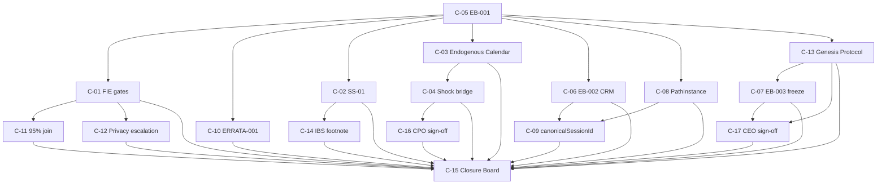

# CPI-OS Canonical Dependency Graph

**Version:** 1.0  
**Date:** 15 June 2026  
**Role:** Verification Board — Engineering Dependency Resolution  
**Source:** [ENGINEERING_READINESS_BACKLOG.md](../../ENGINEERING_READINESS_BACKLOG.md) · [CPI_OS_PERIMETER_COMPLETION_PLAN.md](../../CPI_OS_PERIMETER_COMPLETION_PLAN.md) · [CPI_OS_CONSTITUTIONAL_HARMONIZATION.md](../../CPI_OS_CONSTITUTIONAL_HARMONIZATION.md) v1.0  
**Constraint:** Resolves ambiguities only — no new engines, no architecture redesign  

---

## 1. Purpose

This document is the **authoritative engineering dependency graph** for CPI-OS Phase A certification conditions **C-01 through C-17**. It supersedes conflicting dependency statements in the Engineering Readiness Backlog where noted in §4.

Engineering may treat items on the **hard dependency** edges as blocking. **Soft sequencing** recommendations do not block parallel work.

---

## 2. Certification Condition Audit (C-01 — C-17)

| ID | Name | Type | Hard deps | Soft deps | Primary artifacts | Sprint 1 waiver |
|----|------|------|-----------|-----------|-------------------|-----------------|
| **C-05** | EB-001 namespace binding | Doc + lint | — | — | `docs/governance/EB-001-engineering-binding-memo.md`, `scripts/lint-gate-ids.mjs` | **Yes** |
| **C-01** | FIE constitutional gates | Doc + code | C-05 | — | `CPI_OS_CONSTITUTIONAL_HARMONIZATION.md` v1.1, `lib/governance/gate-registry.ts` | **Yes** |
| **C-10** | ERRATA-001 legacy gate index | Doc + lint | C-05 | — | `docs/governance/ERRATA-001-legacy-gate-index.md` | **Yes** |
| **C-02** | SS-01 Knowledge Library | Doc + code | C-05 | — | `INTELLIGENCE_ASSET_REGISTRY.md` Appendix D, `lib/governance/gates/kl-gates.ts` | No |
| **C-03** | MkIE Endogenous Event Calendar | Doc + code | **C-05** | C-02 (calendar class `KNOWLEDGE_PUBLISH` references SS-01 ops) | `MARKET_INTELLIGENCE_ENGINE.md` Appendix A, `types/mkie.ts` | No |
| **C-04** | CPO ↔ MkIE shock bridge | Doc + code | C-03 | — | `CONSIDERED_PURCHASE_ONTOLOGY.md` §4.9.1, `content/ontology/shock-bridge.json` | **Yes** |
| **C-06** | EB-002 CRM Day-1 | Doc + code | C-05 | — | `docs/governance/EB-002-crm-day1-memo.md`, `lib/crm/close-join.ts` | **Yes** |
| **C-08** | PathInstance canonical schema | Doc + types | C-05 | — | `types/path-instance.ts`, `docs/schemas/path-instance.schema.json` | **Yes** |
| **C-09** | canonicalSessionId cross-channel join | Doc + code | C-08, C-06 | — | `docs/schemas/canonical-session.schema.json`, `lib/session/canonical-session.ts` | No |
| **C-11** | 95% session-join harmonization | Doc + code | C-01 | C-06 (join metric source) | `lib/crm/close-join.ts` `JOIN_RATE_THRESHOLD` | No |
| **C-13** | CPO Genesis Protocol | Doc + code | C-05 | — | `CONSIDERED_PURCHASE_ONTOLOGY.md` Genesis appendix | No |
| **C-07** | EB-003 genesis freeze policy | Doc + code | C-05, **C-13** | — | `docs/governance/EB-003-genesis-freeze-policy.md` | No |
| **C-12** | Privacy Steward escalation | Doc + code | C-01 | — | `CPI_OS_CONSTITUTIONAL_HARMONIZATION.md` §3.3 | No |
| **C-14** | IBS registry footnote | Doc | C-02 | — | `INTELLIGENCE_BALANCE_SHEET_FRAMEWORK.md` §1.1 | No |
| **C-16** | CPO Board §4.9.1 sign-off | Process | C-04 | — | `docs/governance/signoffs/CPO-4.9.1-shock-bridge-signoff.md` | No |
| **C-17** | CEO + CoIE EB-003 sign-off | Process | C-07, C-13 | — | `docs/governance/signoffs/EB-003-genesis-freeze-signoff.md` | No |
| **C-15** | Closure Board re-score ≥82 | Process | C-01…C-14, C-16, C-17 | — | `docs/governance/CPI_OS_CERTIFICATION_AMENDMENT.md` | No |

**Audit notes:**

- C-15 is the **terminal process gate**; it depends on all substantive conditions plus C-16 and C-17.
- C-12 is in the v1.1 constitutional bundle with C-01 but is **not** on the Sprint 1 waiver set.
- C-09 is the only item requiring **both** graph schema (C-08) and CRM join substrate (C-06).

---

## 3. Canonical Dependency Graph

### 3.1 Hard dependency DAG (authoritative)



### 3.2 Recommended parallel workstreams (after C-05)

| Stream | Sequence | May start after |
|--------|----------|-----------------|
| **Governance / gates** | C-01 → C-11, C-12; C-10 parallel | C-05 |
| **Substrate** | C-02 → C-14 | C-05 |
| **MkIE** | C-03 → C-04 → C-16 | C-05 |
| **Session / graph** | C-08 → C-09 (requires C-06 for join validation) | C-05 (+ C-06 before C-09 acceptance) |
| **Genesis** | C-13 → C-07 → C-17 | C-05 |
| **CRM** | C-06 | C-05 |

### 3.3 Critical path (longest chain to C-15)

```
C-05 → C-03 → C-04 → C-16 → C-15
```

Alternate long chain (session join):

```
C-05 → C-08 → C-09 → C-15
```

Genesis sign-off chain:

```
C-05 → C-13 → C-07 → C-17 → C-15
```

---

## 4. Ambiguity Resolutions

### 4.1 C-07 ↔ C-13 circular dependency — **RESOLVED**

**Problem:** Engineering Readiness Backlog listed `C-07 → C-13` on the critical path while C-07 acceptance criteria require C-13 content and C-13 acceptance criteria require EB-003 to reference the Genesis Protocol — implying mutual dependency.

**Resolution:** The cycle is a **documentation ordering artifact**, not a logical deadlock.

| Item | Role | Depends on |
|------|------|------------|
| **C-13** | Defines *what* provisional CPO objects are, 90-day auto-active rule, promotion paths (`CPI-MN-CPO-ACTIVE` or floor sign-off) | C-05 only |
| **C-07** | Defines *how* learning-freeze levels (LF-01, LF-03) apply during genesis quarter | C-05, C-13 |
| **C-17** | Executive attestation that genesis freeze policy is operable | C-07, C-13 |

**Canonical order:** `C-05 → C-13 → C-07 → C-17`

- C-13 **does not** depend on C-07. Provisional object rules are ontology policy, independent of freeze enforcement.
- C-07 **references** C-13 for provisional-object context (EB-003 cites Genesis Protocol appendix).
- C-13 acceptance criterion *"EB-003 references Genesis Protocol"* is a **cross-reference check** completed when C-07 lands — not a blocking dependency for drafting C-13.

**Removed from graph:** `C-07 → C-13` as a hard edge. Replaced with `C-13 → C-07`.

---

### 4.2 C-03 dependency ambiguity — **RESOLVED**

**Problem:** Backlog diagram shows `C-02 → C-03 → C-04`, but C-03 body states `Dependency: None (may run parallel to C-02 after C-05)`.

**Resolution:**

| Dependency class | C-03 relationship |
|------------------|-------------------|
| **Hard** | **C-05** — EB-001 namespace required before MkIE calendar types and gate IDs are bound |
| **Hard (downstream)** | C-04 requires C-03 — calendar `calendar_check` must exist before shock bridge is exercised in classification pipeline |
| **Soft (sequencing)** | C-02 — `KNOWLEDGE_PUBLISH` endogenous events may cite SS-01 knowledge refs; calendar schema does not require SS-01 gate runtime |

**Canonical statement:** `C-03` hard-depends on **C-05 only**. `C-02 → C-03` is removed from the hard graph. Teams may run C-02 and C-03 in parallel after C-05.

**Corrected chain:** `C-05 → C-03 → C-04` (MkIE stream) runs parallel to `C-05 → C-02 → C-14` (substrate stream).

---

### 4.3 PathInstance placement ambiguity — **RESOLVED**

**Problem:** PathInstance is referenced in DECISION_GRAPH_SPEC §4.2, ENGINEERING_READINESS_BACKLOG (types + lib/graph + SessionProvider), and MkIE §8.2 without a single canonical placement contract.

**Resolution — four-layer placement model:**

| Layer | Location | Responsibility |
|-------|----------|----------------|
| **1. Type contract** | `types/path-instance.ts` | Canonical TypeScript types — import boundary for all channels |
| **2. JSON contract** | `docs/schemas/path-instance.schema.json` | Validation, CI, cross-repo interchange |
| **3. Runtime factory** | `lib/graph/path-instance.ts` *(Phase A implementation)* | `create`, `appendEdge`, `freeze`, `attachOutcome` — sole mutator of PathInstance records |
| **4. Session binding** | `lib/session/SessionProvider.tsx` | Holds **active** `pathInstanceId` and `canonicalSessionId` for the current browser session only — not the persistence store |

**Rules:**

1. **Channels emit edges; factory owns the PathInstance object.** Kiosk screen transitions and PCM conversation turns call `appendEdge` with the same edge shape — they do not construct partial incompatible structs.
2. **One active PathInstance per canonicalSessionId per channel** at a time. Cross-channel continuation merges under the same `canonicalSessionId` (see §5).
3. **Freeze on session closure** per DECISION_GRAPH_SPEC §4.2 sets `state: pending_outcome` and `frozenAt`.
4. **Outcome attachment** is CRM-driven (EB-002); only `lib/graph/path-instance.ts` may transition to `outcome_attached`.
5. **MkIE tagging** (MARKET_INTELLIGENCE_ENGINE §8.2) reads frozen PathInstances — it does not embed shock state inside the session provider.

**Not PathInstance:** `SessionProvider` visitor state (trust signals, topics visited) is UX state — it may inform edge creation but is not the graph artifact.

---

### 4.4 canonicalSessionId specification gap — **RESOLVED**

Full specification in §5. Implementation schemas:

- `docs/schemas/canonical-session.schema.json`
- Fields on `PathInstance` and `Lead` payloads (see `types/path-instance.ts`)

---

## 5. canonicalSessionId Specification

### 5.1 Definition

`canonicalSessionId` is the **cross-channel purchase-thread identifier**. It links floor (kiosk), async (WhatsApp), consultant tablet, and voice sessions that belong to one considered-purchase journey for CPI-G-COIE-10 join and SCDG path merge.

| Field | Scope |
|-------|-------|
| `sessionId` | Per-channel, per-tab session — minted on channel session start |
| `canonicalSessionId` | Per purchase thread — stable across channels until outcome or 30-day TTL |
| `pathInstanceId` | Per graph trace — may fork on household subgraph; shares `canonicalSessionId` |

### 5.2 Generation rules

| Trigger | Rule |
|---------|------|
| **Kiosk `session_start`** | Mint new UUID v4 `canonicalSessionId` unless `?csid=` query param or `resume` token carries valid existing ID |
| **Pre-visit landing (S21)** | Mint at landing; propagate via UTM handoff to kiosk `?csid=` |
| **WhatsApp deep link** | **Must** include `csid` query param when continuing floor session; mint new only when cold-start async |
| **Consultant handoff** | Inherit from customer kiosk session; consultant channel gets new `sessionId`, same `canonicalSessionId` |
| **CRM backfill** | Ops may mint retroactive ID for orphan closes — `mintReason: crm_backfill`; flagged in join audit |

**Format:** UUID v4 (RFC 9562). Lowercase hex with hyphens. Reject non-UUID strings at validation boundary.

**Authority:** First mint wins. Later channels **adopt**; they never re-mint for the same thread.

### 5.3 Persistence rules

| Store | Key | TTL | Contents |
|-------|-----|-----|----------|
| `sessionStorage` | `viaggio:canonicalSessionId` | Tab session | Active canonical ID |
| `sessionStorage` | `viaggio:sessionId` | Tab session | Channel session ID |
| `localStorage` | `viaggio:csid:{canonicalSessionId}` | 30 days | Link manifest snapshot (optional client cache) |
| **Lead API** | `lead.canonicalSessionId` | Permanent | Required on all capture paths (C-06) |
| **PathInstance record** | `canonicalSessionId` field | Permanent | Required on all graph artifacts |
| **CRM CloseRecord** | `sessionId` | Permanent | **Must equal `canonicalSessionId`** for join metric (EB-002) |

Server-side link registry (implementation: `lib/session/canonical-session.ts`) is authoritative over client caches. Client stores are hints; server reconciles on lead submit.

### 5.4 Collision rules

| Scenario | Policy |
|----------|--------|
| **Shared kiosk, sequential visitors** | Each `session_start` mints **fresh** `canonicalSessionId`. No device-fingerprint reuse. |
| **Same phone, different people** | **Never** auto-merge on phone alone. Phone is corroboration only. |
| **Spouse opens WhatsApp share link** | New `canonicalSessionId` unless link includes `csid` from primary thread **and** `join=explicit` |
| **Duplicate `csid` in URL + storage mismatch** | URL `csid` wins; log `collisionResolution: url_over_storage` |
| **Two active canonical IDs, same device** | Most recent lead-submit ID becomes primary; older ID marked `superseded` in link registry — edges remain addressable by `pathInstanceId` |
| **Invalid or expired `csid`** | Mint new; do not fail session. Log `collisionResolution: expired_remint` |

### 5.5 Cross-channel join behavior

```
Kiosk session_start
  → mint canonicalSessionId = A, sessionId = K1
  → PathInstance PI-1 { canonicalSessionId: A, channel: kiosk, edges: [...] }

WhatsApp continue (?csid=A)
  → sessionId = W1 (new), canonicalSessionId = A (adopted)
  → PathInstance PI-2 { canonicalSessionId: A, channel: whatsapp, edges: [...] }
  → Link registry: [{ canonicalSessionId: A, sessionId: K1 }, { canonicalSessionId: A, sessionId: W1 }]

Test drive / lead submit
  → lead.canonicalSessionId = A
  → lead.sessionId = K1 or W1 (submitting channel)

CRM close
  → CloseRecord.sessionId = A  (canonical, not channel sessionId)
  → CPI-G-COIE-10: join(PathInstance.canonicalSessionId, CloseRecord.sessionId)

Merge semantics:
  → SCDG treats PI-1 and PI-2 as one thread for outcome backpropagation when canonicalSessionId matches
  → Channel-specific sessionIds preserved for debugging; join key is always canonicalSessionId
```

**Acceptance test (C-09):** Kiosk start → WhatsApp continue (`csid`) → CRM close with `sessionId = canonicalSessionId` passes CPI-G-COIE-10 at 95% threshold.

---

## 6. Implementation-Ready Schema Index

| Schema | File | C-item |
|--------|------|--------|
| PathInstance | `docs/schemas/path-instance.schema.json` | C-08 |
| PathEdge | `docs/schemas/path-instance.schema.json` (`$defs.PathEdge`) | C-08 |
| CanonicalSession | `docs/schemas/canonical-session.schema.json` | C-09 |
| CanonicalSessionLink | `docs/schemas/canonical-session.schema.json` (`$defs.CanonicalSessionLink`) | C-09 |

TypeScript mirrors: `types/path-instance.ts` (includes canonical session types consumed by PathInstance).

---

## 7. Phase A Exit Checklist (dependency-aware)

- [ ] C-05 landed — all downstream items unblocked
- [ ] Parallel streams complete per §3.2
- [ ] C-13 before C-07 (genesis ordering)
- [ ] C-08 before C-09 (schema before join)
- [ ] C-06 before C-09 acceptance (CRM join validation)
- [ ] C-04 before C-16 (bridge before sign-off)
- [ ] C-15 bundle includes C-16 + C-17 sign-offs

---

## 8. Document Control

| Version | Date | Change |
|---------|------|--------|
| 1.0 | 15 Jun 2026 | Initial canonical graph; resolves C-07↔C-13, C-03, PathInstance placement, canonicalSessionId |

**Supersedes:** Informal dependency bullets in ENGINEERING_READINESS_BACKLOG §"Dependency Order" where they conflict with §4 of this document.

---

*End of CPI-OS Canonical Dependency Graph v1.0*
