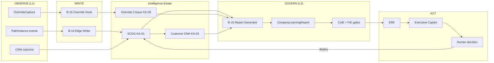

# CPI-OS Pilot Learning Spine

**Version:** 1.0  
**Date:** 15 June 2026  
**Status:** Architecture frozen — no new engines  
**Scope:** Minimum implementation backlog for a functioning CPI-OS learning loop at node zero (Santa Cruz)  
**Sources:** [ENGINEERING_READINESS_BACKLOG.md](../../ENGINEERING_READINESS_BACKLOG.md) · [INTELLIGENCE_ASSET_REGISTRY.md](../../INTELLIGENCE_ASSET_REGISTRY.md) · [DECISION_GRAPH_SPEC.md](../../DECISION_GRAPH_SPEC.md) · [COMPANY_INTELLIGENCE_ENGINE.md](../../COMPANY_INTELLIGENCE_ENGINE.md) · [EXECUTIVE_RECOMMENDATION_ENGINE.md](../../EXECUTIVE_RECOMMENDATION_ENGINE.md) · [CUSTOMER_DNA_ENGINE.md](../../CUSTOMER_DNA_ENGINE.md) · [FINANCIAL_INTELLIGENCE_ENGINE.md](../../FINANCIAL_INTELLIGENCE_ENGINE.md)

---

## Executive Summary

A functioning CPI-OS pilot learning loop requires **one closed circuit**:

> **Observe → Label → Govern → Propose → Decide → Deploy → Measure → Remember**

No new engines. The spine uses only:

| Engine / Asset | Role in loop |
|----------------|--------------|
| **SCDG** (KA-01) | Institutional memory — outcome-labeled edges |
| **Customer DNA** (KA-03) | Cohort compression — backprop from SCDG |
| **Override Corpus** (KA-08) | Human calibration signal |
| **CoIE** | Data quality gate + weekly organizational audit |
| **FIE** (KA-07) | Margin truth gate for financial ERE proposals |
| **ERE** (KA-13 input) | Ranked executive actions from graph diff |

**Three pilot-specific engineering additions** close gaps the Phase A/B backlog does not cover:

| ID | Name | Closes |
|----|------|--------|
| **B-14** | SCDG Edge Writer | Interaction → persistent graph edges |
| **B-15** | CoIE Report Generator | Automated `CompanyLearningReport` |
| **B-16** | Override Capture Hook | Typed human disagreement → KA-08 |

Everything else in this document is **prerequisite selection** from existing Phase A/B items — not new architecture.

---

## 1. Minimum Viable Intelligence Loop

### 1.1 Loop definition



### 1.2 Weekly cadence (pilot minimum)

| When | Artifact / action | Owner |
|------|-------------------|-------|
| Real-time | PathInstance → B-14 → SCDG edge append | Platform Engineering |
| Real-time | Consultant override → B-16 → Override Corpus | Floor + Platform |
| ≤48 hr post-close | CRM outcome → PathInstance attach → edge backprop | Sales + CRM |
| Sunday 23:00 | B-15 → `CompanyLearningReport@v1` | CoIE steward (automated) |
| Monday 07:00 | ERE batch → `ExecutiveRecommendation[]` → Copilot | ERE owner |
| Monday 09:00 | 30-min exception review (CoIE ritual) | GM |
| Wednesday | Override triage (existing CoIE ritual) | Floor supervisor |
| Friday 17:00 | Deploy approved bounded changes | Change owner |

**Pilot exit criterion:** One full cycle completes with (a) ≥1 new outcome-labeled SCDG edge from live kiosk, (b) ≥1 typed override captured, (c) one `CompanyLearningReport` generated without manual data prep, (d) ≥1 ERE recommendation presented with FIE/CoIE gate status attached.

### 1.3 Explicitly out of scope (pilot spine)

Per architecture freeze — defer to Phase B remainder or Phase C:

- MkIE shock registry operations (B-02) — loop runs; graph promotions should respect manual shock freeze until B-02 live
- Salesperson DNA / Marketing DNA full pipelines — consume SCDG; not blocking spine
- Federation / second node (C-FM-*)
- Experiment Genealogy full automation (B-07) — manual registry acceptable for first cycle
- New engines (CIE, MkIE extensions, ASI, etc.)

---

## 2. Pilot Backlog Additions

### B-14 — SCDG Edge Writer

**Description:** Persist typed SCDG edges from canonical `PathInstance` transitions. Real-time append on session events; deferred weight update until CRM outcome (DECISION_GRAPH_SPEC §4.1–4.3).

**Engine:** SCDG (KA-01)  
**Spec:** [DECISION_GRAPH_SPEC.md](../../DECISION_GRAPH_SPEC.md) §3–4

**File(s):**
- `lib/graph/scdg-edge-writer.ts` — **new** — create/append edges from PathInstance
- `lib/graph/path-instance.ts` — consume C-08 scaffold; emit edge candidates
- `lib/graph/outcome-backprop.ts` — **new** — attach outcome, update `outcome_correlation`
- `types/scdg-edge.ts` — **new** — edge schema aligned to DECISION_GRAPH_SPEC §3
- `lib/analytics/trackEvent.ts` — route `path_edge` events to writer
- `lib/crm/close-join.ts` — trigger backprop on close record

**Owner:** Platform Engineering · CoIE steward (graph integrity)

**Effort:** 4 eng days

**Dependencies:** C-08 (PathInstance), C-06 (CRM `sessionId`), C-05 (EB-001 gate IDs)

**Acceptance criteria:**
- [ ] Kiosk screen transition produces `fear_to_proof`, `proof_to_action`, or `action_to_outcome` candidate edge with CPO-typed nodes
- [ ] Edge stored with `evidence_count`, `cohort` (DNA cluster if available), `holdout_eligible`
- [ ] Outcome attach within 48 hr of CRM close backpropagates to all edges in frozen PathInstance
- [ ] No edge weight promotion when `evidence_count < minimum-N` (pilot default: N=30 for genesis quarter per C-13)
- [ ] Override edges (`type: override`) accepted from B-16 without deletion (DECISION_GRAPH_SPEC §7)

**KA / backlog map:**

| Link | Item |
|------|------|
| KA-01 | Primary asset written |
| KA-03 | Backprop triggers DNA `graphAffinity` refresh (existing CDE pipeline) |
| KA-06 | Edge promotions feed proof efficacy (holdout deferred) |
| C-08 | PathInstance schema |
| C-06 | CRM close join |
| C-13 | Genesis provisional CPO objects accepted |
| P1-DISCOVERY-001 | Discovery profile → cohort tag on edges |

---

### B-15 — CoIE Report Generator

**Description:** Automated weekly `CompanyLearningReport@v1` — exceptions only, no human data prep (CoIE §3.3). Feeds Monday ritual and ERE batch input.

**Engine:** CoIE  
**Spec:** [COMPANY_INTELLIGENCE_ENGINE.md](../../COMPANY_INTELLIGENCE_ENGINE.md) §3.3, §7.3, §6.2

**File(s):**
- `lib/coie/learning-report-generator.ts` — **new** — assemble report sections
- `lib/coie/data-quality-score.ts` — **new** — composite gate (CoIE §7.3)
- `lib/governance/gate-runner.ts` — consume B-01 or C-01 scaffold for gate block
- `lib/fie/reconciliation-status.ts` — **new** — FIE clearance stub for report §fie block
- `app/api/coie/learning-report/route.ts` — **new** — read-only latest report
- `types/company-learning-report.ts` — **new** — schema §4.1 below

**Owner:** CoIE steward · Platform Engineering

**Effort:** 3 eng days

**Dependencies:** B-14 (graph delta source), C-11 (95% join threshold), C-01 (FIE constitutional gates), B-01 or C-01 gate scaffold

**Acceptance criteria:**
- [ ] Cron or scheduled job emits report Sunday 23:00 node-local
- [ ] Report contains ≤10 exception items; no raw table dumps
- [ ] `data_quality_score.composite` computed; `gate: pass|fail` when composite ≥0.92
- [ ] `gate` block includes CPI-G-COIE-01 status and CPI-G-FIE-01..05 summary
- [ ] `graph_delta` section cites KA-01 edge count Δ and top 3 weight anomalies
- [ ] `override_summary` cites KA-08 backlog count and untyped override rate
- [ ] `experiment_status` lists active holdouts (empty array valid in genesis)
- [ ] `decision_follow_through` audits prior week Copilot decisions
- [ ] Report JSON validates against `CompanyLearningReport` schema §4.1

**KA / backlog map:**

| Link | Item |
|------|------|
| KA-01 | `graph_delta` section |
| KA-03 | `dna_shift` summary (cluster mix Δ) |
| KA-08 | `override_summary` section |
| KA-10 | `experiment_status` section |
| KA-13 | `decision_follow_through` section |
| B-01 | Gate registry runtime |
| C-01 | FIE gate enrollment |
| C-11 | 95% join harmonization |
| SELF_IMPROVING §3 | Weekly artifact contract |

---

### B-16 — Override Capture Hook

**Description:** Capture typed consultant disagreements with AI recommendations into Override Corpus (KA-08). Feeds SCDG override edges, Salesperson DNA, ERE proof demotion signals, and CoIE Wednesday triage.

**Engine:** Override Corpus (KA-08) · Trust Fabric  
**Spec:** [INTELLIGENCE_ASSET_REGISTRY.md](../../INTELLIGENCE_ASSET_REGISTRY.md) KA-08 · [SELF_IMPROVING_COMPANY_BLUEPRINT.md](../../SELF_IMPROVING_COMPANY_BLUEPRINT.md) §9

**File(s):**
- `lib/governance/override-capture.ts` — **new** — validate and persist OverrideCapture
- `types/override-capture.ts` — **new** — schema §4.2 below
- `lib/recommendations/getNextStep.ts` — emit `reasoningSnapshotId` + `nextBestAction` on every recommendation
- `components/consultant/OverrideDialog.tsx` — **new** — enum reason capture (or extend existing copilot handoff)
- `lib/graph/scdg-edge-writer.ts` — write `override` edge on capture (B-14)
- `lib/analytics/trackEvent.ts` — `governance.recommendation_rejected` event

**Owner:** CIE lead · Platform Engineering

**Effort:** 2 eng days

**Dependencies:** B-14 (override edge persistence), P1-RECO-001 (recommendation engine with snapshot IDs)

**Acceptance criteria:**
- [ ] Every AI recommendation exposes `reasoningSnapshotId`, `nextBestAction`, `alternativesConsidered[]`
- [ ] Override without `reason_tag` enum rejected from corpus (logged, not capitalized)
- [ ] Valid capture writes KA-08 record + SCDG `override` edge linking recommendation → human_action
- [ ] `resolution_status: pending` default; Wednesday triage can set `resolved` with `resolution_action`
- [ ] Untyped override rate surfaced in B-15 `override_summary`
- [ ] Override never mutates Customer DNA genotype (MkIE/DNA immutability preserved)

**Reason tag enum (CPO-aligned, pilot minimum):**

`wrong_proof` · `wrong_tone` · `customer_ready` · `fact_wrong` · `prefer_human` · `timing_wrong` · `brand_risk` · `other_typed`

**KA / backlog map:**

| Link | Item |
|------|------|
| KA-08 | Primary asset written |
| KA-01 | Override edges in SCDG |
| KA-04 | Feeds Salesperson DNA override patterns |
| KA-02 | Reason tags via CPO taxonomy |
| P1-RECO-001 | Recommendation source |
| C-12 | Privacy escalation if household data in capture |

---

## 3. Prerequisite Backlog (Minimum Set)

The spine **does not run** without these existing Phase A/B items. Listed in dependency order.

| ID | Name | Why required for loop | Blocks |
|----|------|----------------------|--------|
| **C-05** | EB-001 namespace | Canonical gate IDs in report + evaluators | C-01, B-15 |
| **C-08** | PathInstance schema | Edge writer input contract | B-14 |
| **C-06** | CRM Day-1 memo | Outcome labeling + join | B-14 backprop |
| **C-11** | 95% join harmonization | CoIE + FIE gate constant | B-15 |
| **C-01** | FIE constitutional gates | FIE block in report; ERE financial gate | B-15, ERE |
| **C-09** | canonicalSessionId | Cross-channel path merge (WhatsApp pilot) | B-14 |
| **B-01** | Gate registry runtime | `CompanyLearningReport.gate` block | B-15 |
| **B-14** | SCDG Edge Writer | Graph compounding | B-15, ERE |
| **B-16** | Override Capture Hook | Human calibration | B-15, ERE |
| **B-15** | CoIE Report Generator | Weekly loop closure | ERE batch |

**Recommended parallel (not blocking first cycle):**

| ID | Name | Rationale |
|----|------|-----------|
| B-08 | FIE Finance Desk Loop | Full margin truth; stub acceptable for cycle 1 |
| B-07 | Experiment Genealogy | Manual registry until automated |
| B-02 | KA-09 shock registry | Manual shock freeze until live |
| P1-CONVERT-001 | Kiosk test drive + lead API | Outcome volume |

---

## 4. Required Schemas

### 4.1 `CompanyLearningReport@v1`

CoIE weekly artifact. Exceptions-only presentation; full payload for machine consumption.

```yaml
CompanyLearningReport:
  schema_version: "1.0"
  report_id: string                    # uuid
  node_id: string                      # e.g. santa_cruz_l0
  week_iso: string                     # e.g. 2026-W24
  generated_at: ISO8601                # Sunday 23:00 target

  data_quality_score:
    components:
      outcome_label_completeness: float   # 0-1, weight 0.30
      session_outcome_join_rate: float    # 0-1, weight 0.25
      mandatory_capture_rate: float       # 0-1, weight 0.15
      assisted_attribution_completeness: float  # 0-1, weight 0.15
      governance_field_completeness: float    # 0-1, weight 0.10
      knowledge_staleness_inverse: float      # 0-1, weight 0.05
    composite: float                   # 0-1
    gate: pass | marginal | fail       # pass ≥0.92, marginal 0.85-0.91, fail <0.85
    anomalies:                         # max 5 in exceptions view
      - domain: string
        consultant_id: string?
        severity: low | medium | high
        detail: string

  gate:
    coie_data_quality: pass | fail
    coie_gate_ids:
      - gate_id: string                # CPI-G-COIE-*
        status: pass | fail
        detail: string?
    fie_clearance: pass | fail | suppressed
    fie_gate_ids:
      - gate_id: string                # CPI-G-FIE-*
        status: pass | fail
    ere_suppression: none | escalation_only | full
    ritual_compliance_score: float     # 0-1 rolling 4-week

  graph_delta:                         # KA-01
    new_edges: int
    outcome_labeled_edges: int
    top_weight_deltas:                 # max 3
      - edge_id: string
        from_node: string
        to_node: string
        delta_sigma: float
        cohort: string?
    pending_outcome_paths: int

  dna_shift:                           # KA-03 summary
    cluster_mix_deltas:
      - cluster_id: string
        delta_pct: float
    emergent_clusters: [string]        # empty if none

  override_summary:                    # KA-08
    captures_this_week: int
    typed_rate: float
    unresolved_backlog: int
    top_reason_tags:
      - reason_tag: string
        count: int

  experiment_status:                   # KA-10
    active:
      - experiment_id: string
        status: draft | active
        minimum_n_progress: float
    blocked_promotions:
      - hypothesis: string
        block_reason: string

  decision_follow_through:             # KA-13 / prior week
    approved: int
    deployed: int
    in_progress: int
    deferred: int
    rejected: int
    ignored: int                       # triggers exception if >0

  exceptions:                          # ≤10 human-facing items
    - id: string
      severity: critical | high | medium
      category: data_quality | graph | override | experiment | ritual | fie | deployment
      summary: string
      accountable_role: string
      required_action: string
      metric_to_clear: string?

  organizational_memory_append:        # M1 snippets for week
    - memory_id: string
      class: M1 | M2 | M3
      summary: string
```

**Consumers:** ERE batch (full payload) · Executive Copilot (exceptions + gate) · CoIE Monday ritual (exceptions only)

---

### 4.2 `OverrideCapture@v1`

Atomic KA-08 event. Untyped captures are audit-logged but **excluded from capital**.

```yaml
OverrideCapture:
  schema_version: "1.0"
  capture_id: string                   # uuid
  captured_at: ISO8601

  # Session context
  session_id: string
  canonical_session_id: string?
  path_instance_id: string
  channel: kiosk | whatsapp | floor | consultant_tablet
  household_id: string?                # requires consent flag if present

  # AI recommendation context (mandatory)
  reasoning_snapshot_id: string
  recommendation:
    next_best_action: string
    action_type: enum                  # show_proof | compare | finance | test_drive | escalate | ...
    proof_id: string?
    alternatives_considered: [string]

  # Human response (mandatory)
  human_action: string                 # what consultant did instead
  reason_tag: enum                     # see B-16 enum; REQUIRED for capital
  reason_detail: string?             # required if reason_tag = other_typed

  # Actor
  consultant_id: string?
  salesperson_dna_id: string?

  # DNA context (phenotype only — no genotype mutation)
  customer_dna_id: string?
  dna_cluster: string?

  # Resolution (CoIE Wednesday triage)
  resolution_status: pending | resolved | escalated
  resolution_action: string?           # model fix | route fix | proof demotion | coaching | no_action
  resolved_at: ISO8601?
  resolved_by_role: string?

  # Outcome linkage (filled at CRM close)
  outcome: won | lost | open | null
  outcome_linked_at: ISO8601?

  # Graph linkage
  scdg_override_edge_id: string?       # B-14 written edge

  # Governance
  cpo_version: string
  ontology_nodes: [string]             # objection/proof nodes active at capture
```

**Consumers:** SCDG (override edge) · Override Corpus KA-08 · B-15 report · ERE proof demotion · Salesperson DNA KA-04

---

### 4.3 `ExecutiveRecommendation@v1`

ERE output object. Executive Copilot consumes this schema exclusively (ERE §1.4 constitutional rule).

```yaml
ExecutiveRecommendation:
  schema_version: "1.0"
  id: string                           # immutable
  cycle_week: string                   # ISO week of ERE batch
  emitted_at: ISO8601

  source: scdg | customer_dna | override_corpus | coie | fie | composite
  recommendation_type: enum            # graph_optimization | proof_promotion | proof_demotion |
                                       # customer_dna_discovery | executive_escalation | ...
  automation_zone: green | amber | red

  confidence: float                    # 0-1
  evidence_quality: float              # 0-1; fraction of gates passed
  operational_feasibility: float         # 0-1
  strategic_risk: float                # 0-1

  expected_margin_impact:
    point_estimate: float              # assisted GP currency or %
    confidence_interval: [low, high]
    horizon_days: int
    reach: int

  ranking:
    expected_value: float
    adjusted_expected_value: float
    rank: int
    materiality: float                 # 0-100

  expiry: ISO8601

  supporting_assets:
    scdg_edges: [string]
    customer_dna_clusters: [string]
    override_capture_ids: [string]?    # proof demotion from KA-08
    coie_gate_ids: [string]
    fie_gate_ids: [string]
    ontology_version: string
    experiment_id: string?
    holdout_status: passed | failed | not_required | pending
    company_learning_report_id: string # B-15 lineage

  narrative:
    situation: string
    inference: string
    proposed_action: string
    alternatives_considered: [string]

  coie_pre_review:
    blocked: bool
    block_reasons: [string]?           # CPI-G-* failures

  fie_clearance:
    required: bool
    status: pass | fail | not_applicable
    suppress_financial_rank: bool

  # Post-decision fields (Executive Copilot)
  human_decision: approve | reject | defer | null
  decision_at: ISO8601?
  reason_code: enum?                   # required on reject/defer per CoIE §11.4
  deployment_owner: string?
  measurement_horizon_days: int?
```

**Note:** Field semantics match [EXECUTIVE_RECOMMENDATION_ENGINE.md](../../EXECUTIVE_RECOMMENDATION_ENGINE.md) §3. Pilot may emit `executive_escalation` and `proof_demotion` categories first; other categories follow as estate matures.

---

## 5. Dependency Graph

### 5.1 Full pilot spine (ASCII)

```
Phase A prerequisites
═══════════════════════════════════════════════════════════════════

C-05 EB-001
  ├──► C-01 FIE gates ──► B-15 (fie block)
  ├──► C-08 PathInstance ──► B-14
  └──► C-06 CRM Day-1 ──► B-14 backprop

C-08 PathInstance
  └──► C-09 canonicalSessionId ──► B-14 (cross-channel)

C-01 + C-11 ──► B-01 Gate registry ──► B-15 (gate block)

Showroom (Phase 1)
═══════════════════════════════════════════════════════════════════

P1-RECO-001 Recommendation engine ──► B-16 (snapshot IDs)
P1-DISCOVERY-001 Discovery profile ──► B-14 (cohort tags)
P1-CONVERT-001 Lead API + sessionId ──► C-06 / B-14 outcomes

Pilot spine additions
═══════════════════════════════════════════════════════════════════

B-14 SCDG Edge Writer
  ├──► Customer DNA backprop (KA-03, existing CDE)
  ├──► B-15 graph_delta
  └──► ERE input (SCDG weekly diff)

B-16 Override Capture Hook
  ├──► B-14 override edges
  ├──► B-15 override_summary
  └──► ERE proof_demotion signal

B-15 CoIE Report Generator
  └──► ERE batch ──► ExecutiveRecommendation ──► Executive Copilot

Loop close
═══════════════════════════════════════════════════════════════════

Human decision ──► deploy ──► measure ──► B-14 + B-15 next cycle
```

### 5.2 Critical path (calendar)

| Order | Item | Eng days | Cumulative |
|-------|------|----------|------------|
| 1 | C-05 | 0.5 | 0.5 |
| 2 | C-08 | 3 | 3.5 |
| 3 | C-06 | 2 | 5.5 |
| 4 | C-01 + C-11 | 3.5 | 9 |
| 5 | B-01 (minimal) | 3 | 12 |
| 6 | B-14 | 4 | 16 |
| 7 | B-16 | 2 | 18 |
| 8 | B-15 | 3 | 21 |
| 9 | ERE batch stub | 2* | 23 |

\*ERE batch stub = rank from `graph_delta` + `override_summary` only; full ERE is existing spec, not a new engine. Implement as `lib/ere/weekly-batch.ts` consuming B-15 output.

**Estimated pilot spine:** ~23 engineering days after Phase A certification minimum waiver set (C-01, C-04, C-05, C-06, C-08, C-10 per ENGINEERING_READINESS_BACKLOG).

---

## 6. Task → Asset → Engine → Backlog Map

| Task | Primary KA | Engines | Existing backlog | Pilot role |
|------|-----------|---------|------------------|------------|
| **C-05** EB-001 | — | CoIE, FIE, ERE | Phase A | Gate ID authority |
| **C-08** PathInstance | KA-01 | SCDG | Phase A | Edge writer input |
| **C-06** CRM Day-1 | KA-01, KA-07 | SCDG, FIE | Phase A | Outcome labels |
| **C-09** canonicalSessionId | KA-01 | SCDG | Phase A | Path merge |
| **C-01** FIE gates | KA-07 | FIE, ERE | Phase A | Financial gate |
| **C-11** 95% join | KA-07 | CoIE, FIE | Phase A | Join threshold |
| **B-01** Gate registry | KA-10 | CoIE, ERE | Phase B | Report gate block |
| **B-14** Edge Writer | KA-01, KA-03 | SCDG, Customer DNA | **Pilot spine** | Observe → remember |
| **B-16** Override Hook | KA-08, KA-01 | Override Corpus, SCDG | **Pilot spine** | Human calibration |
| **B-15** Report Generator | KA-08, KA-10, KA-13 | CoIE, FIE | **Pilot spine** | Govern → propose |
| ERE weekly batch | KA-13 | ERE | ERE spec §7.4 | Propose actions |
| Executive Copilot | KA-13 | ERE, CoIE | EXECUTIVE_COPILOT.md | Decide |
| Customer DNA backprop | KA-03 | Customer DNA | CUSTOMER_DNA_ENGINE.md | Cohort refinement |
| P1-RECO-001 | — | SIE path | PHASE1 #2 | Recommendation source |
| P1-DISCOVERY-001 | KA-03 | Customer DNA | PHASE1 #1 | Cohort seed |
| P1-CONVERT-001 | KA-01 | SCDG | PHASE1 #4 | Outcome volume |
| B-08 FIE desk loop | KA-07 | FIE | Phase B | Full margin truth (parallel) |
| B-07 Experiment genealogy | KA-10 | CoIE | Phase B | Promotion audit (parallel) |

---

## 7. Engine Responsibilities in Pilot Loop

| Stage | SCDG | Customer DNA | Override Corpus | CoIE | FIE | ERE |
|-------|------|--------------|-----------------|------|-----|-----|
| Observe | Receives edges | Phenotype update | — | — | — | — |
| Capture override | Override edge | — | KA-08 record | Adoption metric | — | Demotion signal |
| Outcome label | Backprop weights | graphAffinity refresh | Outcome link | Join rate | Assisted margin | — |
| Sunday report | graph_delta | dna_shift | override_summary | **Owner** | fie_clearance | Input |
| Gate | — | — | — | **Owner** | **Owner** (financial) | Suppression |
| Monday propose | Diff → inference | Cluster shift | Override clusters | Pre-filter | EV gate | **Owner** |
| Human decide | — | — | — | Follow-through audit | — | Corpus KA-13 |
| Deploy | Config affects paths | — | Resolution | Experiment registry | Margin reconcile | Calibration |

---

## 8. Definition of Done — Pilot Learning Spine

The pilot learning spine is **operational** when all of the following are true:

1. **Write path live** — B-14 persists edges from ≥100 kiosk PathInstances in a rolling week  
2. **Override path live** — B-16 captures ≥10 typed overrides; untyped rate <10%  
3. **Outcome path live** — ≥95% of closes in pilot week join to `sessionId` / `pathInstanceId`  
4. **Report automated** — B-15 generates `CompanyLearningReport` with zero manual SQL  
5. **Gate enforced** — ERE emits `escalation_only` when CoIE gate fail or FIE suppress flag set  
6. **One full cycle** — Human approve or reject on ≥1 `ExecutiveRecommendation` with typed reason; follow-through appears in next week's `decision_follow_through`  
7. **No new engines** — Grep confirms no new `*Engine` specs or KA-14+ assets introduced  

**Not required for spine DoD:** MkIE automation, holdout promotions, second node, IEV_index ≥60, Salesperson DNA calibration.

---

## 9. Risk Register (Spine-Specific)

| Risk | Mitigation |
|------|------------|
| PathInstance not wired to kiosk screens | C-08 blocks B-14; golden-path E2E per buyer profile |
| Consultants skip override typing | B-16 hard gate; B-15 surfaces untyped rate as exception |
| CRM close without sessionId | C-06 hard gate; CoIE gate fail → escalation only |
| Empty graph → empty ERE | Genesis quarter: ERE may emit data_quality + label_completeness escalations only |
| FIE not ready | C-01 stub returns `fie_clearance: suppressed`; non-financial recommendations proceed |
| Report becomes dashboard dump | B-15 caps exceptions at 10; CoIE steward reviews template weekly |

---

## 10. Document Map

| Topic | Canonical spec |
|-------|----------------|
| SCDG edges | [DECISION_GRAPH_SPEC.md](../../DECISION_GRAPH_SPEC.md) |
| CoIE report + gates | [COMPANY_INTELLIGENCE_ENGINE.md](../../COMPANY_INTELLIGENCE_ENGINE.md) |
| ERE recommendations | [EXECUTIVE_RECOMMENDATION_ENGINE.md](../../EXECUTIVE_RECOMMENDATION_ENGINE.md) |
| Override taxonomy | [SELF_IMPROVING_COMPANY_BLUEPRINT.md](../../SELF_IMPROVING_COMPANY_BLUEPRINT.md) §9 |
| KA definitions | [INTELLIGENCE_ASSET_REGISTRY.md](../../INTELLIGENCE_ASSET_REGISTRY.md) |
| Phase A/B items | [ENGINEERING_READINESS_BACKLOG.md](../../ENGINEERING_READINESS_BACKLOG.md) |
| Customer DNA backprop | [CUSTOMER_DNA_ENGINE.md](../../CUSTOMER_DNA_ENGINE.md) |
| FIE gates | [FINANCIAL_INTELLIGENCE_ENGINE.md](../../FINANCIAL_INTELLIGENCE_ENGINE.md) |

---

*End of CPI-OS Pilot Learning Spine v1.0*
