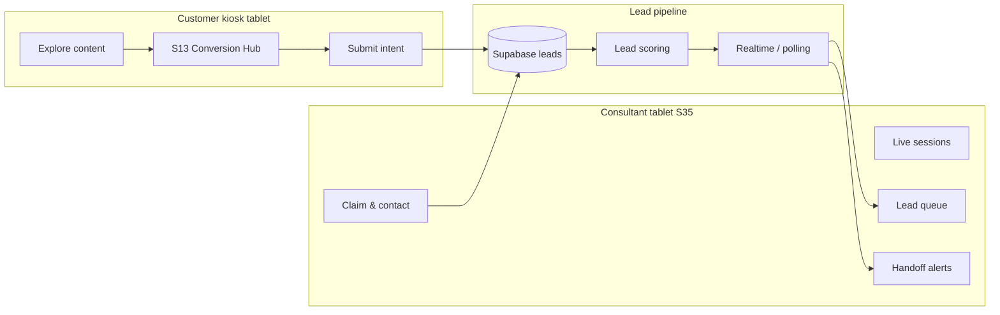

# Lead Capture Strategy

End-to-end design for how Viaggio Digital Showroom captures, qualifies, and routes dealership leads — optimized for **showroom floor tablets** (customer kiosk + consultant device).

> **Related:** [Conversion Strategy](./conversion-strategy.md) (funnel & CTAs) · [Customer Journey](./customer-journey.md) (stage 11–12) · [Screen Map](./screen-map.md) (S13–S36) · [Data Models](./data-models.md) (Lead entity)

## Purpose

The digital showroom educates; humans close. Lead capture is the bridge: it must feel **low-friction on a shared kiosk**, **WhatsApp-native for Bolivia**, and **actionable on the consultant tablet** within minutes of a customer expressing intent.

**Design principles for tablet use:**

| Principle | Rationale |
|-----------|-----------|
| **One hand, one minute** | Customers stand at a kiosk; forms stay short and thumb-friendly |
| **Phone is the identity** | WhatsApp number is the primary key for follow-up and deduplication |
| **Context travels with the lead** | Every submission includes session summary — consultants should not re-ask what the customer already explored |
| **Kiosk ≠ personal device** | Never assume `wa.me` works on the kiosk; always offer QR + optional name/phone on tablet |
| **Consultant tablet is the ops console** | S35 receives, scores, and assigns — not a spreadsheet export days later |
| **Privacy by session** | Idle reset clears PII from kiosk UI; leads persist server-side only after explicit submit |

---

## Showroom Tablet Roles

Two tablet classes share one lead pipeline:



| Device | Typical hardware | Primary jobs |
|--------|------------------|--------------|
| **Customer kiosk** | Fixed 10–12" landscape tablet, 1920×1080 touch | Browse, compare, submit test drive / financing interest / handoff request |
| **Consultant tablet** | iPad or Android, carried on floor | Monitor live sessions, claim leads, respond to S36 handoffs, add notes, mark contacted |

**Session linking:** Every kiosk session gets a `session_id`. All lead types attach to it so S35 can show full context before the consultant approaches.

---

## Lead Types Overview

| Lead type | Customer action | Primary screen | Consultant priority | Event |
|-----------|-----------------|----------------|---------------------|-------|
| **Test drive** | Schedule intent | S34 → S14 | High — same-day scheduling | `test_drive_requested` |
| **Financing** | Credit simulation interest | S26 → flag or form | High — routes to finance desk | `financing_interest_submitted` |
| **WhatsApp** | Start conversation | S32 → S15 | Medium — async follow-up | `whatsapp_initiated` |
| **QR continuation** | Move session to phone | S32 / S33 / S16 | Medium — pre-visit & family | `qr_handoff_scanned` |
| **Salesperson** | Request human now | S36 | **Urgent** — 2 min SLA | `staff_handoff_requested` |

Extended lead schema (Phase 2) adds `financing` and enriches `metadata` for trade-in, TCO inputs, and trim/color from S30.

---

## 1. Test Drive Requests

**Goal:** Convert exploration into a schedulable appointment with enough detail to reduce no-shows and prep the right vehicle.

### Customer journey (kiosk)

1. **Entry** — Sticky bar, tour end (S06), compare verdict (S12), or S13 Conversion Hub
2. **Expectations** — S34 Test Drive Logistics (*"20–30 min, ruta doble vía, qué traer"*) before the form
3. **Capture** — S14 Test Drive Form
4. **Confirmation** — On-screen success + optional WhatsApp confirm (S15)
5. **Next** — S18 session summary or continue exploring (S04)

### Form design (S14)

Optimized for landscape kiosk: single column, large touch targets, progressive disclosure.

| Field | Required | Tablet UX notes |
|-------|----------|-----------------|
| Nombre | Yes | Autocomplete off — shared device |
| Teléfono / WhatsApp | Yes | Bolivia +591 mask; validate mobile format |
| Día preferido | Yes | Date picker — next 14 days, no Sundays if dealership closed |
| Hora preferida | Yes | Chips: *Mañana* / *Tarde* / *Hora específica* (time picker if last) |
| Pasajeros | No | *Solo* / *Con familia* — affects vehicle prep |
| Vehículo actual | No | Free text — trade-in signal |
| ¿Primera vez con GAC? | No | Qualification for consultant pitch |
| ¿Retoma? | No | If *sí* → deep link to S27 with pre-fill |

**Copy (submit):**
> *"Manejalo vos mismo. Un consultor de Viaggio te confirma por WhatsApp."*

**Confirmation screen:**
> *"¡Listo, [nombre]! Te escribimos al [teléfono] para confirmar tu prueba del GS4 MAX."*

### Consultant tablet behavior (S35)

When `test_drive_requested` fires:

- Lead appears in **Lead queue** with badge **Prueba de manejo**
- Card shows: name, phone, preferred day/time, passengers, trim/color if configured (S30), lead score tier
- Actions: **Claim** · **WhatsApp** (opens with confirm template) · **Assign coordinator** · **Add note**
- Status flow: `new` → `contacted` → `scheduled` → `converted` / `lost`

### Operational handoffs

| Role | Trigger | Action |
|------|---------|--------|
| Test drive coordinator | Lead claimed | Prep vehicle (color if available), route briefing |
| Consultant | High score + test drive | Approach customer on floor if still in session |
| WhatsApp bot / human | No claim in 5 min | Auto template: *"Recibimos tu solicitud de prueba..."* |

### Success metrics

- Form start → submit rate (target: >60% after S34)
- Submit → WhatsApp confirm rate
- Scheduled → show rate (no-show tracking)
- Test drive → sale attribution (Phase 3 CRM)

---

## 2. Financing Requests

**Goal:** Capture price-ready buyers without pretending the kiosk gives binding quotes. Orient first on tablet; exact quote stays human.

### Two capture modes

**Mode A — Soft interest (micro-conversion)**  
Customer views S26 Financing Preview, taps *"Quiero simular mi crédito"* without full form.

- Records: trim selected, plazo tab (12/24/36/48), cuota range viewed, session context
- Event: `financing_preview_viewed` + `financing_interest_flagged`
- Routes: S36 consultant handoff or S13 with enriched recap

**Mode B — Hard lead (explicit request)**  
Customer submits financing contact form (S26 extension or S13 path).

| Field | Required | Notes |
|-------|----------|-------|
| Nombre | Yes | |
| Teléfono / WhatsApp | Yes | |
| Trim / versión | Pre-filled | From S30 configurator if available |
| Plazo preferido | Yes | 12 / 24 / 36 / 48 meses |
| Entrada aproximada | No | Range chips: *0%* / *10–20%* / *20%+* |
| Retoma | No | Links to S27 if yes |

**Disclaimer (always visible on S26):**
> *"Cuota referencial. Tu consultor confirma tasa exacta con bancos aliados de Viaggio."*

### Customer journey

```
S04 economics row → S26 Financing Preview
  → {Ver cuota orientativa}
  → {Quiero simular mi crédito}
    → [Soft flag] → S36 or S13
    → [Hard form] → Confirmation → S35 lead queue (type: financing)
```

**Pairing with TCO (S28):** After TCO calculation, inline CTA *"Ver cuota con este uso mensual"* deep-links to S26 with km/mes carried in metadata.

### Consultant tablet behavior

- Financing leads sort **below** live S36 handoffs, **above** passive WhatsApp initiations
- Card shows: orientative cuota range, plazo, trim, trade-in flag, TCO inputs if present
- Recommended action copy on S35: *"Cliente vio cuota orientativa — confirmar con banco aliado, no repetir pitch de producto"*
- Route to finance desk: **Transfer** action assigns to finance role (Phase 2)

### Why this matters on the floor

Santa Cruz buyers ask *"¿cuánto es la cuota?"* before test drive. Capturing financing intent on the kiosk prevents consultants from spending 15 minutes on orientative math that the tablet already showed.

---

## 3. WhatsApp Handoff

**Goal:** Meet customers on their preferred channel with **pre-filled context** so Viaggio's first reply is relevant, not generic.

WhatsApp is P0 for Bolivia — often higher volume than form submissions.

### Paths

| Path | Screen | When to use |
|------|--------|-------------|
| **Quick** | S15 | Sticky CTA from any screen; minimal context |
| **Rich** | S32 WhatsApp Bridge | Conversion hub, post-compare, post-financing |
| **Confirm** | S15 after S14 | Test drive submitted — optional confirmation thread |
| **Family** | S33 → S32 fallback | Share failed; spouse has questions |

### S32 Bridge experience (kiosk)

1. **Message preview** — Customer sees editable pre-fill before sending
2. **Intent selector** — Chips: *Prueba de manejo* · *Precio y cuota* · *Más información* · *Retoma*
3. **Context chips** (read-only): vehicle, trim, top 3 topics, compare verdict, TCO range if calculated
4. **Handoff method** — See QR section below
5. **Confirm** — Opens WhatsApp or shows success if QR scanned

**Pre-fill template (Spanish):**
```
Hola Viaggio, exploré el GAC GS4 MAX en el showroom digital.
Me interesa: [intent chip].
Temas que vi: [seguridad, familia, garantía].
[Si compare] Comparé con: [competitor] — [veredicto breve].
Mi nombre: [___]
```

**Viaggio line:** Configured in `dealership.json` — Santa Cruz business WhatsApp.

### Lead record for WhatsApp

Even without a form, `whatsapp_initiated` creates or enriches a lead:

- `type`: `whatsapp`
- `phone`: captured if customer entered on S32 optional field; otherwise null until first reply
- `notes`: auto-generated session summary
- `metadata.intent`: selected chip from S32

### Consultant tablet

- WhatsApp leads appear as **Tibio** by default unless session depth is high
- S35 shows *"Conversación iniciada — esperando respuesta del cliente"* until CRM marks contacted
- Consultant should not duplicate outreach if customer already messaged Viaggio line

---

## 4. QR Code Handoff

**Goal:** Move the relationship from **shared kiosk** to **personal phone** without re-entering context.

Kiosks often cannot run WhatsApp natively. QR is the reliable bridge.

### QR use cases

| Scenario | QR content | Screen |
|----------|------------|--------|
| **WhatsApp conversation** | `wa.me` link with URL-encoded pre-fill | S15, S32 |
| **Session resume** | `/resume/[token]` — continue exploration later | S18, S20 pre-reset |
| **Family share** | Mobile summary page + optional WhatsApp CTA | S33 |
| **Consultant scan (legacy)** | Session summary payload for S35 | S16 fallback |

### Kiosk UX pattern

1. Primary button: *"Escribinos por WhatsApp"* (attempts deep link — may fail on kiosk)
2. Fallback (always visible): **QR panel** with short instruction
   > *"Escaneá con tu celular para continuar en WhatsApp"*
3. QR minimum size: 200×200 px touch-safe margin; high contrast on dark showroom UI
4. Optional: customer enters phone on kiosk → SMS link (Phase 3)

### Tracking

- Event: `qr_handoff_scanned` (via landing page hit or resume token activation)
- Distinguish `entry_source`: `kiosk` vs `qr` when customer returns on phone
- Resume token (S37) ties pre-visit QR campaigns to in-dealership sessions

### Privacy

- QR resume tokens expire (e.g., 30 days)
- Token reveals session summary only — no other customers' data
- Idle reset on kiosk does not invalidate an already-scanned resume link

---

## 5. Salesperson Handoff

**Goal:** When a customer is ready to talk **now**, the floor knows within 2 minutes — not when they wander to the front desk.

### Primary flow: S36 Live Handoff

**Customer-facing modal (kiosk):**
> *"Un consultor de Viaggio te atiende en breve"*  
> *"Usualmente menos de 2 minutos"*

| Element | Behavior |
|---------|----------|
| Session ID | Short code displayed — consultant matches live session on S35 |
| Wait state | Customer can continue exploring; banner shows *"Consultor en camino"* |
| Cancel | Dismisses alert; logs `staff_handoff_cancelled` |
| Timeout (2 min) | Offer S32 WhatsApp fallback — *"¿Preferís escribirnos?"* |

**Triggers (contextual emergence):**

- Explicit: S13 *"Consultor ahora"*
- Soft: S26 after *"Quiero simular mi crédito"*
- Automatic prompt: 10+ min session + depth score ≥ 50 (once per session)

### Consultant tablet: S35 handoff queue

When S36 fires:

1. **Audible + visual alert** on consultant tablet (Realtime channel `handoffs` or 5s polling fallback)
2. **Handoff card:** session ID, vehicle, current screen, lead score, top topics, compare summary, waiting since timestamp
3. **Actions:** **Claim** · **Join session** (read-only mirror of customer screen) · **Dismiss** (with reason)

**Consultant approach script (suggested):**
> *"Hola, soy [nombre] de Viaggio. Vi que estabas explorando el GS4 MAX — ¿en qué te ayudo, prueba de manejo o cuota?"*

### S16 legacy QR card

S16 remains **print/fallback only** when Realtime is down or consultant tablet unavailable. In-dealership default is S36, not *"escaneá este QR para que te atiendan"*.

### SLA and escalation

| Time | Action |
|------|--------|
| 0 s | Alert on S35 |
| 60 s | Secondary alert to backup consultant |
| 120 s | Customer sees WhatsApp fallback; lead flagged *"handoff missed"* |
| End of shift | Sales manager reviews missed handoffs in daily stats |

### Consultant scope after handoff

Digital personas step back. Human handles:

- Exact financing quote and bank submission
- Trade-in appraisal (S27 data as starting point)
- Test drive scheduling confirmation
- Closing — not repeating product content the customer already viewed

---

## 6. Lead Scoring

**Goal:** Prioritize consultant attention on the floor — **Caliente** customers get immediate approach; **Frío** can async WhatsApp follow-up.

### Score model (0–100)

Computed at lead creation and updated on each high-intent action.

#### Session engagement signals

| Signal | Points | Event / computation |
|--------|--------|-------------------|
| Tour completed | +20 | `tour_completed` |
| Compare viewed | +15 | `comparison_viewed` |
| Warranty / trust deep-dive | +10 | S29 or Carlos warranty topics |
| 5+ topics viewed | +10 | `depth_score` threshold |
| 15+ min session | +10 | session duration |
| TCO calculated | +10 | `tco_calculated` |
| Financing preview viewed | +10 | `financing_preview_viewed` |
| Configurator used (S30) | +10 | trim/color selected |
| Trade-in submitted | +15 | `trade_in_intent_submitted` |

#### Intent signals

| Signal | Points | Event |
|--------|--------|-------|
| Test drive form started | +10 | form open |
| Test drive submitted | +25 | `test_drive_requested` |
| Financing interest submitted | +20 | hard form or flag + consultant path |
| WhatsApp initiated | +15 | `whatsapp_initiated` |
| Staff handoff requested | +30 | `staff_handoff_requested` |
| Family share sent | +10 | `share_initiated` |

#### Negative / neutral adjustments

| Signal | Points | Notes |
|--------|--------|-------|
| Session < 3 min | −10 | Likely bounce |
| Only gallery viewed | −5 | Low commercial intent |
| Handoff cancelled | −15 | May still be warm — do not auto-dismiss |

Cap score at 100. Recalculate on each qualifying event.

### Tiers (display on S35)

| Tier | Score | Label | Consultant behavior |
|------|-------|-------|---------------------|
| **Caliente** | 70–100 | 🔴 Caliente | Claim within 2 min if on floor; prioritize over queue |
| **Tibio** | 40–69 | 🟡 Tibio | Contact same day via WhatsApp |
| **Frío** | 0–39 | ⚪ Frío | Batch follow-up; nurture content |

Tier badge appears on: S35 lead cards, S35 live session list, S16/S18 summary (if shown to consultant).

### Persona affinity (supplementary)

Track `preferred_persona` from time spent with Carlos (trust), Diego (family), Sofía (desire). Used for **CTA copy**, not score:

| Dominant persona | Suggested first question on handoff |
|------------------|-----------------------------------|
| Carlos | *"¿Te quedó alguna duda sobre garantía o repuestos?"* |
| Diego | *"¿Venís con familia a la prueba?"* |
| Sofía | *"¿Te gustó la versión GT o la base?"* |

### Lead queue sort order (S35 default)

1. Unclaimed **S36 handoffs** (by wait time)
2. **Caliente** test drive + financing leads
3. **Tibio** leads (by score desc)
4. **Frío** / WhatsApp-only (by timestamp)

---

## Unified Lead Record

All capture paths normalize to one structure for S35 and future CRM export.

| Field | Source |
|-------|--------|
| `session_id` | Kiosk session |
| `type` | `test_drive` · `whatsapp` · `consultant` · `financing` |
| `name`, `phone` | Form or S32 optional |
| `vehicle_slug` | Current vehicle |
| `lead_score` | Computed |
| `lead_tier` | `frio` · `tibio` · `caliente` |
| `topics_explored` | Session analytics |
| `preferred_persona` | Session affinity |
| `metadata.trim`, `metadata.color` | S30 |
| `metadata.compare_target` | S12 |
| `metadata.tco_monthly` | S28 |
| `metadata.trade_in` | S27 |
| `metadata.financing_plazo` | S26 |
| `metadata.intent` | S32 chip |
| `entry_source` | `kiosk` · `qr` · `consultant` |
| `status` | `new` → `contacted` → `scheduled` → `converted` |
| `assigned_to` | Consultant claim on S35 |

**Offline kiosk:** Leads queue locally if Supabase unreachable; flush on reconnect. Consultant tablet shows *"Sync pendiente"* badge.

---

## S13 Conversion Hub — Lead Capture Command Center

S13 is the primary consolidation point on the customer kiosk:

| Path | Destination | Lead effect |
|------|-------------|-------------|
| Prueba de manejo | S34 → S14 | Full test drive lead |
| WhatsApp | S32 → S15 | WhatsApp lead + context |
| Compartir con familia | S33 | Share event; may spawn QR/WhatsApp lead |
| Consultor ahora | S36 | Urgent handoff + score boost |
| Financiamiento | S26 | Soft or hard financing capture |

**Session recap** on S13 (sections viewed, compare, config, TCO) is the same payload attached to every lead — consultants see it on S35 without asking the customer to repeat their journey.

---

## Privacy, Consent & Kiosk Hygiene

| Concern | Approach |
|---------|----------|
| Shared device | Clear form after submit; idle reset clears UI state |
| Phone storage | Persist only on server after submit; not in localStorage long-term |
| WhatsApp opt-in | Copy implies consent: *"Te contactamos por WhatsApp"* |
| LGPD / local law | Viaggio privacy notice link on S14 and S26 forms |
| Consultant notes | Internal only; not shown to customer on kiosk |

---

## Metrics & Quality

### Daily (sales manager via S35 / analytics)

| Metric | Definition |
|--------|------------|
| Leads by type | test drive / financing / whatsapp / handoff |
| Capture rate | `lead captured` / `conversion_hub_viewed` |
| Handoff SLA | % S36 claimed within 2 min |
| Tier distribution | % caliente / tibio / frío |
| Claim → contact rate | Consultant action within 1 hr |

### Weekly tuning

- Score threshold adjustments if too many false *Caliente*
- Form field A/B (per conversion strategy): 3-field vs enriched S14
- QR vs deep-link ratio — if QR dominates, kiosk browser config may be wrong

---

## Phase Rollout

| Phase | Lead capture scope |
|-------|-------------------|
| **Demo (7-day kiosk)** | Mocked S14 + S15 QR; S36 modal without S35 Realtime |
| **Phase 2 production** | Full S14, S26, S32, S36 → S35, scoring, lead queue |
| **Phase 3** | CRM sync, SMS fallback, finance desk routing, return visit scoring |

---

## Open Decisions (Viaggio sign-off)

1. Orientative cuota ranges on S26 — legal/commercial approval cycle
2. Auto WhatsApp template when lead unclaimed after 5 min — template copy
3. Consultant tablet count per shift — affects S36 SLA realism
4. Finance desk as separate S35 role vs single queue
5. Sunday / holiday test drive availability in date picker

---

*Related: [Conversion Strategy](./conversion-strategy.md) · [Screen Map](./screen-map.md) · [Pre-Phase 2 Readiness](./pre-phase2-readiness.md) · [Technical Architecture](./technical-architecture.md)*
