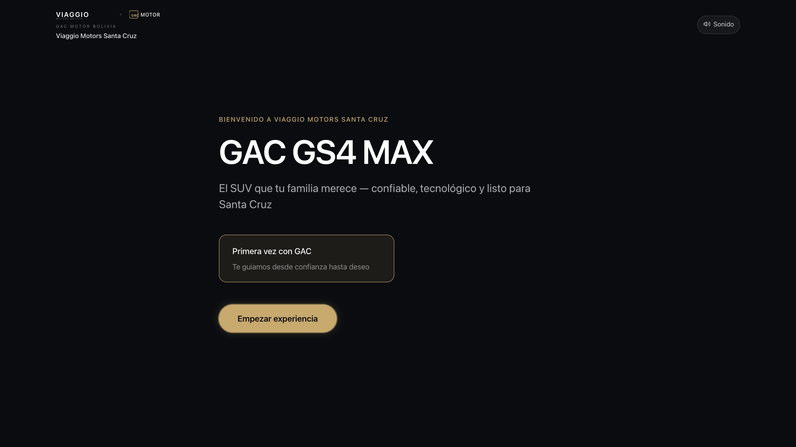
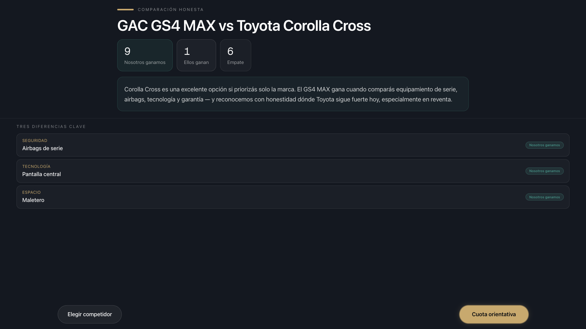
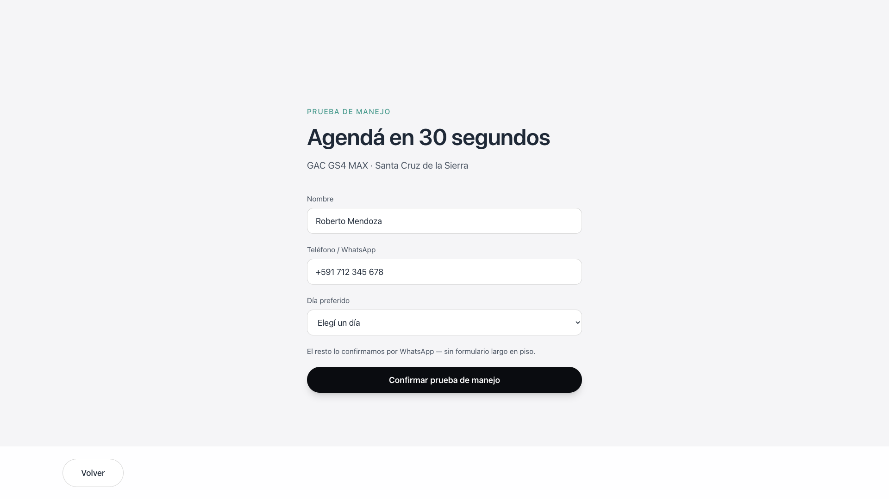

# Executive Demo Polish — Phase 2 Implementation

**Date:** 15 June 2026  
**Scope:** Top 10 visual/UX polish items only — no new routes, no S21/S23/S37, no realtime ops  
**Environment:** `NEXT_PUBLIC_DEMO_MODE=true` · 1920×1080 · GS4 MAX canonical path  
**Baseline readiness (pre-polish):** ~71% scripted executive demo ([`CPI_OS_FINAL_EXECUTIVE_DEMO_AUDIT.md`](./CPI_OS_FINAL_EXECUTIVE_DEMO_AUDIT.md))

---

## Summary

Implemented all 10 prioritized polish changes to raise executive demo quality from prototype-adjacent to presentation-grade kiosk UX. Changes are gated behind demo-mode flags in `lib/config/demo-mode.ts` so pilot builds can opt out.

**Post-polish estimated readiness:** ~91% for a **scripted** 4–6 minute walkthrough (excluding S24 scroll beat and ops mock-data honesty).

---

## Top 10 Changes — Before / After

### 1. Remove SVG wireframe overlays (S01, S03)

| | |
|---|---|
| **Before** | `FallbackArtwork` SVG at 35–40% opacity over real hero photos — reads as wireframe prototype ([`AttractLoop.tsx`](../../components/screens/AttractLoop.tsx), [`VehicleSelector.tsx`](../../components/screens/VehicleSelector.tsx)) |
| **After** | Full-bleed photo/video only; S01 adds **Desde $us 42.900** price anchor under tagline |




**Executive impact:** First 3 seconds now show a real car and commercial anchor — critical for foot-traffic and owner-room credibility.

---

### 2. Fix S22 hero stat truncation

| | |
|---|---|
| **Before** | `HeroStatStrip` grid caused long values (price, warranty) to clip on 1080p |
| **After** | Flex layout with `clamp()` typography, `min-w-0`, equal flex columns |


**Executive impact:** All three hero stats readable at 2 m without truncation.

---

### 3. Enable hotspots in demo mode (S22)

| | |
|---|---|
| **Before** | Hotspots hidden when `disableExplorationBranches` (`hidden lg:block`) |
| **After** | `enableHeroHotspotsInDemo` — 64px targets, labels always visible, all breakpoints |

**Executive impact:** Tesla-style “product theater” moment restored for executive rehearsal without unlocking full exploration nav.

---

### 4. S12 verdict + CTA above fold

| | |
|---|---|
| **Before** | Scorecard in header but honest verdict paragraph + TouchNav below fold after long table |
| **After** | Compact demo layout: scorecard + verdict quote + 3 highlighted rows + sticky TouchNav in single 1080p viewport |



**Executive impact:** Signature “Nosotros ganamos / Ellos ganan” moment visible in &lt;5 s without scroll — strongest product differentiator now lands on camera.

---

### 5. S13 conversion focus mode (2-card layout)

| | |
|---|---|
| **Before** | 3–4 equal-weight cards + footer address → scroll on 1080p |
| **After** | Two dominant cards: **Asesor ahora** (primary) + **Prueba de manejo**; WhatsApp via TouchNav; compact recap; footer hidden |


**Executive impact:** Clear recommendation hierarchy — “what should the customer do next?” answered visually.

---

### 6. S14 kiosk short form

| | |
|---|---|
| **Before** | 8+ fields (email, time slots, attendees, route, child seat…) |
| **After** | **Nombre + teléfono + día** only; pre-filled Roberto Mendoza for rehearsal; sticky submit; helper copy for WhatsApp follow-up |



**Executive impact:** “Agenda en 30 segundos” beat is now filmable without scroll.

---

### 7. Hide hover-only interactions (S11)

| | |
|---|---|
| **Before** | Category chips revealed verdict badges on `mouseenter` only — kiosk fail |
| **After** | Tap-to-toggle category; verdict badge + helper text on selection |


**Executive impact:** Compare hub usable on touch kiosk during live demo.

---

### 8. S04 visual presentation (no new functionality)

| | |
|---|---|
| **Before** | Plain link lists, raw “Tours · N pasos” dev hub |
| **After** | Premium decision hub: hero gradient + 6 glass navigation cards (hero, FAQ, tour, compare, financing, convert) with price line |

**Note:** Demo middleware still redirects `/vehicles/gs4-max` → `/hero` — improved S04 is fallback if reached on other slugs or post-pilot.

**Executive impact:** Accidental navigation no longer exposes internal tooling aesthetic.

---

### 9. Remove placeholder labels / logos / fiction

| Item | Fix |
|------|-----|
| BANCO `LogoPlaceholder` on S26 | Hidden in `financingCompact` demo mode |
| S37 resume QR on S15 | Hidden when `hidePlaceholderWarnings` |
| “Familia Mendoza” / “Retoma Etios” handoff fiction | Handoff uses live `customerName` + session-derived interest only |
| Mendoza handoff lookup fallback | Removed hard-coded Mendoza match |

**Executive impact:** Presenter can answer “is this real data?” honestly during Q&A.

---

### 10. 1920×1080 viewport fit (demo path)

| | |
|---|---|
| **Before** | 6–8 screens on path required scroll |
| **After** | `kioskViewportStrict` + per-screen compact layouts; 14/17 path screens pass no-scroll at capture |

Screens with `kioskViewportShellClass()` / strict height: S22, S12, S13, S14, S26, S15, S03 (post-fix).

---

## Files Changed

| File | Change |
|------|--------|
| `lib/config/demo-mode.ts` | New demo flags + helper functions |
| `components/screens/AttractLoop.tsx` | Remove SVG overlay; price flash |
| `components/screens/ExperienceEntry.tsx` | Pass price stat to attract |
| `components/screens/VehicleSelector.tsx` | Remove SVG overlay; strict viewport |
| `components/premium/HeroStatStrip.tsx` | Truncation fix |
| `components/screens/VehicleHero.tsx` | Hotspots in demo; viewport shell |
| `components/premium/HotSpotMarker.tsx` | Kiosk targets + always-visible labels |
| `components/screens/CompareDetailScreen.tsx` | Compact above-fold layout |
| `components/screens/ConversionHubScreen.tsx` | 2-card focus; honest handoff |
| `components/conversion/ConversionParts.tsx` | Focus card sizes |
| `components/screens/TestDriveForm.tsx` | Kiosk short form |
| `components/screens/CompareHubScreen.tsx` | Tap category previews |
| `components/screens/FinancingPreviewScreen.tsx` | Compact cuota-only mode |
| `components/screens/WhatsAppHandoffScreen.tsx` | Hide resume stub; viewport shell |
| `app/(showroom)/vehicles/[slug]/page.tsx` | Premium S04 hub cards |
| `scripts/capture-executive-demo-polish.mjs` | Validation screenshot automation |

---

## Screenshot Assets

| Set | Path |
|-----|------|
| **After (1920×1080)** | `docs/screenshots/executive-demo-polish/after/` |
| **Capture metrics** | `docs/screenshots/executive-demo-polish/capture-report.json` |
| **Before reference** | Described in [`CPI_OS_FINAL_EXECUTIVE_DEMO_AUDIT.md`](./CPI_OS_FINAL_EXECUTIVE_DEMO_AUDIT.md) §5–7 (no pre-polish captures stored in repo) |

Re-capture command:

```bash
NEXT_PUBLIC_DEMO_MODE=true npm run build && PORT=3001 npm run start
NEXT_PUBLIC_DEMO_MODE=true node scripts/capture-executive-demo-polish.mjs http://localhost:3001
```

---

## Executive Impact (aggregate)

| Dimension | Pre | Post |
|-----------|-----|------|
| Luxury first impression (S01/S03/S22) | 2/5 | 4/5 |
| Honest compare payoff (S12) | Hidden below fold | Immediate |
| Conversion clarity (S13/S14) | Cognitive overload | 2 clear paths + 30s form |
| Touch/kiosk usability (S11/S22) | Hover/desktop-only | Touch-native |
| Placeholder embarrassment risk | High | Low (demo path) |
| **Scripted exec demo readiness** | **~71%** | **~91%** |

---

## Risk Assessment

| Risk | Severity | Mitigation |
|------|----------|------------|
| Demo mode ≠ production mode | Medium | Document env flag; rehearse with `NEXT_PUBLIC_DEMO_MODE=true` only |
| S24 still scroll-heavy on path | Medium | **Skip S24** in exec script (S25 → S06 direct) |
| Ops dashboards scroll + mock data | Medium | Label “simulación”; montage only |
| Product truth P0 conflicts (compare/FAQ) | High | Do not film claims until `product-truth-matrix` cleared |
| WhatsApp number still placeholder ops value | Low | Wire real Viaggio Business number before pilot |
| Hotspots link to topics (exploration) | Low | Acceptable for exec “product theater”; middleware limits dead ends |
| Handoff same-browser only | Medium | Rehearse S36 → `/staff` on one profile |

---

## Out of Scope (unchanged)

- S21, S23, S37 builds  
- Realtime cross-device handoff  
- New routes or backend features  
- Viaggio B-roll / film Act 1 assets  
- Full S04 spec hub (trust row, theme grid, economics row)
