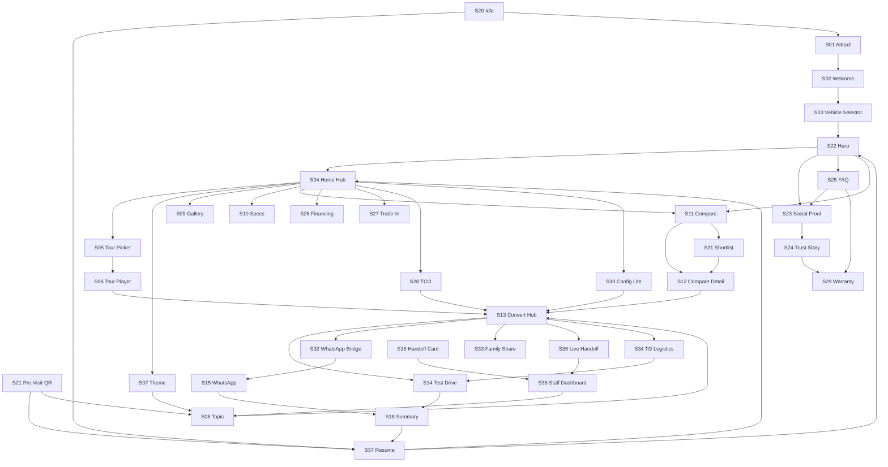

# Screen Map

Complete inventory of screens and major UI states for the Viaggio Digital Showroom. All screens are **planned** — not yet implemented.

> **Architecture review:** 17 screens added (S21–S37) per [Phase 1 Architecture Review](./architecture-review.md). Total: **37 screens**.

## Screen Index

| ID | Screen | Route (planned) | Priority |
|----|--------|-----------------|----------|
| S01 | Attract Loop | `/` | P0 |
| S02 | Session Welcome | `/` (first touch) | P0 |
| S03 | Vehicle Selector | `/vehicles` | P0 |
| S04 | Vehicle Home Hub | `/vehicles/[slug]` | P0 |
| S05 | Guided Tour Picker | overlay on S04 | P0 |
| S06 | Guided Tour Player | `/vehicles/[slug]/tour/[tourId]` | P0 |
| S07 | Theme Landing | `/vehicles/[slug]/themes/[themeId]` | P0 |
| S08 | Topic Deep Dive | `/vehicles/[slug]/themes/[themeId]/[topicId]` | P0 |
| S09 | Media Gallery | `/vehicles/[slug]/gallery` | P1 |
| S10 | Specifications | `/vehicles/[slug]/specs` | P1 |
| S11 | Compare Hub | `/vehicles/[slug]/compare` | P0 |
| S12 | Compare Detail | `/vehicles/[slug]/compare/[targetId]` | P0 |
| S13 | Conversion Hub | `/vehicles/[slug]/convert` | P0 |
| S14 | Test Drive Form | modal / S13 | P0 |
| S15 | WhatsApp Handoff | external + tracking | P0 |
| S16 | Consultant Handoff Card | overlay | P1 |
| S17 | Configurator (full) | `/vehicles/[slug]/configure` | P2 |
| S18 | Session Summary | end-of-session | P1 |
| S19 | Settings / A11y | global overlay | P1 |
| S20 | Idle Reset Prompt | global overlay | P0 |
| **S21** | **Pre-Visit QR Landing** | `/v/[slug]` or `/visit/[slug]` | **P0** |
| **S22** | **Immersive Vehicle Hero** | `/vehicles/[slug]/hero` | **P0** |
| **S23** | **Social Proof Hub** | `/vehicles/[slug]/trust/testimonials` | **P0** |
| **S24** | **Viaggio & GAC Trust Story** | `/vehicles/[slug]/trust/story` | **P0** |
| **S25** | **Objections & FAQ** | `/vehicles/[slug]/trust/faq` | **P0** |
| **S26** | **Financing Preview** | `/vehicles/[slug]/economics/financing` | **P0** |
| **S27** | **Trade-In Intent** | `/vehicles/[slug]/economics/trade-in` | **P0** |
| **S28** | **Ownership Cost Calculator** | `/vehicles/[slug]/economics/tco` | **P0** |
| **S29** | **Warranty Deep-Dive** | `/vehicles/[slug]/trust/warranty` | **P0** |
| **S30** | **Configurator Lite** | `/vehicles/[slug]/configure-lite` | **P1** |
| **S31** | **Comparison Shortlist** | `/vehicles/[slug]/compare/saved` | **P1** |
| **S32** | **WhatsApp Bridge** | modal / inline | **P1** |
| **S33** | **Family Share Summary** | `/vehicles/[slug]/share` | **P0** |
| **S34** | **Test Drive Logistics** | `/vehicles/[slug]/test-drive/info` | **P0** |
| **S35** | **Staff Dashboard** | `/staff` (consultant tablet) | **P0** |
| **S36** | **Consultant Live Handoff** | modal / S13 | **P0** |
| **S37** | **Post-Visit Resume** | `/resume/[token]` | **P1** |

---

## Customer-Facing Screens (S01–S34, S37)

### S01 — Attract Loop

**Purpose:** Draw attention on showroom floor when kiosk is idle.

**Entry points:** Idle timeout from any screen; kiosk boot.

**Layout:**
- Full-screen cinematic GS4 MAX footage
- Viaggio + GAC co-branding
- Tagline: *"Conocé el GAC GS4 MAX a tu ritmo"*
- Subtle pulse CTA: *"Tocá para empezar"*

**States:** Looping video → fade on touch

**Exit CTAs:** Touch anywhere → S02

---

### S02 — Session Welcome

**Purpose:** Orient new visitor; establish premium tone; route by visitor type.

**Entry points:** S01 touch; consultant tablet start; S20 reset complete.

**Layout:**
- Brief animation (respect reduced motion)
- **Path choice (NEW):** *"Primera vez con GAC"* | *"Ya investigué online"*
- First-time: condensed persona intro (single line, not carousel)
- Returning: skip to S22 or S37 resume prompt if token detected
- Language confirm (Spanish default)
- "Empezar" primary button

**Exit CTAs:**
- First-time → S03 → S22 Hero
- Pre-researched → S03 → S04 Hub or S25 FAQ
- Resume token → S37 → last screen

---

### S03 — Vehicle Selector

**Purpose:** Multi-vehicle entry; GS4 MAX hero at launch.

**Entry points:** S02; global nav vehicle switcher; S21 "Continúa en showroom".

**Layout:**
- Large card: GS4 MAX (active, full bleed image)
- Smaller cards: GS8, EMZOOM, EMKOO (coming soon or preview)
- Viaggio dealership context footer

**States:**
- Active vehicle → S22 Hero (default) or S04 Hub (returning)
- Coming soon → teaser modal + WhatsApp interest capture

**Exit CTAs:** Select GS4 MAX → S22 | Back → S02

---

### S04 — Vehicle Home Hub

**Purpose:** Central navigation — decision-oriented cards (secondary to S22 hero).

**Entry points:** S22 "Explorar libremente"; S02 pre-researched path; global logo tap.

**Layout zones:**
1. **Hero strip** — Vehicle name, key stat strip (precio desde, garantía, consumo, unidades en showroom)
2. **Trust quick links (NEW)** — Testimonios · Viaggio · FAQ
3. **Persona strip** — Quick pick preferred guide
4. **Theme grid** — 8 theme cards (see IA doc)
5. **Economics row (NEW)** — TCO · Financiamiento · Retoma
6. **Quick actions** — Tour · Compare · Gallery · Specs · Configurar
7. **Contextual CTA** — emerges after trust threshold (replaces always-on sticky in ideal state)

**Exit CTAs:** Any theme → S07 | Compare → S11 | Convert → S13 | Trust → S23/S24/S25

---

### S05 — Guided Tour Picker

**Purpose:** Choose narrative path.

**Entry points:** S04 "Tour guiado"; persona recommendation.

**Options:**
| Tour | Duration | Badge |
|------|----------|-------|
| Tour de Confianza | ~12 min | Carlos |
| Tour Familiar | ~10 min | Diego |
| Tour de Descubrimiento | ~10 min | Sofía |
| Tour Completo | ~20 min | Todos |

**Exit CTAs:** Select tour → S06 | Cancel → S04

---

### S06 — Guided Tour Player

**Purpose:** Linear immersive walkthrough.

**Entry points:** S05 selection.

**Layout:**
- Progress bar (steps/total)
- Full-bleed media per step
- Persona avatar + narration text
- Controls: Anterior · Siguiente · Saltar paso · Salir
- Auto-advance option (kiosk mode, toggle in S19)

**End state exit CTAs:** S13 Convert | S14 Test Drive | S33 Share | S22 Hero replay

---

### S07 — Theme Landing

**Purpose:** Theme overview before topic drill-down.

**Entry points:** S04 theme card; search (Phase 2); tour step.

**Layout:**
- Theme hero image
- Persona intro line
- Topic list (cards)
- Related media strip
- Trust cross-link if theme = warranty → S29

**Exit CTAs:** Topic → S08 | "Explorar todo" → first topic | Back → S04

---

### S08 — Topic Deep Dive

**Purpose:** Rich content for single decision point.

**Entry points:** S07; S06 tour step; related topic link; search.

**Content blocks (composable):**
- Hero media (image/video)
- Persona narration
- Feature highlights (icon grid)
- Expandable detail accordion
- Stat callouts
- Cross-link to related topic
- Inline mini-compare snippet

**Footer exit CTAs:** "Siguiente tema sugerido" · Soft CTA *"¿Querés probarlo?"* → S14 | WhatsApp → S32 | Compare → S11

---

### S09 — Media Gallery

**Purpose:** Visual exploration — exterior, interior, details, lifestyle.

**Entry points:** S04 quick action; S08 media block; S30 configurator.

**Layout:**
- Category tabs: Exterior · Interior · Detalles · Lifestyle
- Masonry or full-bleed swipe gallery
- Pinch/zoom on detail shots
- Link to relevant topic from image metadata

**Exit CTAs:** Topic link → S08 | Configure color → S30 | Back → S04

---

### S10 — Specifications

**Purpose:** Complete specs for power users (escape hatch — not primary path).

**Entry points:** S04 quick action; Carlos sidebar link.

**Layout:**
- Tabbed: Motor · Dimensiones · Equipamiento · Consumo
- Downloadable PDF link (future)
- Carlos sidebar: *"Si algo no está claro, preguntame"* → topic links

**Exit CTAs:** Topic deep-link → S08 | Compare → S11 | Back → S04

---

### S11 — Compare Hub

**Purpose:** Choose comparison target.

**Entry points:** S04; S08 snippet; S22 hero; sticky/contextual CTA.

**Layout:**
- GS4 MAX fixed as anchor (left)
- Competitor / model picker (right)
- Category preview chips
- Link to S31 saved comparisons

**Exit CTAs:** Select target → S12 | Save to shortlist → S31 | Back → S04

---

### S12 — Compare Detail

**Purpose:** Side-by-side decision support.

**Entry points:** S11 target selection; S31 shortlist item.

**Layout:**
- Split column comparison
- Row groups: Seguridad, Tecnología, Espacio, Garantía, Precio, Consumo
- Persona callouts per row
- Honest "Ellos ganan" / "Nosotros ganamos" badges

**Exit CTAs:**
- *"Agendá tu prueba y comprobá"* → S34 → S14
- *"Compartir comparación"* → S33
- *"Escribinos"* → S32
- Change competitor → S11
- Add to shortlist → S31

---

### S13 — Conversion Hub

**Purpose:** Consolidated conversion options with full session recap.

**Entry points:** Tour end; compare end; economics screens; explicit nav; milestone prompt.

**Layout:**
- Session recap (sections, compare, config, TCO summary)
- Conversion paths:
  1. **Prueba de manejo** → S34 → S14
  2. **WhatsApp** → S32 → S15
  3. **Compartir con familia** → S33
  4. **Consultor ahora** → S36
  5. **Financiamiento** → S26 (if not yet viewed)
- Trust footer: Viaggio address, horarios, map

**Exit CTAs:** All conversion paths above | Back → S04

---

### S14 — Test Drive Form

**Purpose:** Capture scheduling intent with enriched qualification.

**Entry points:** S13; S12; S06 end; S34; contextual CTA.

**Fields:**
- Nombre
- Teléfono / WhatsApp
- Día preferido (selector)
- **Hora preferida (NEW):** mañana / tarde / específica
- **Pasajeros (NEW):** solo / familia
- **Vehículo actual (NEW):** optional free text
- ¿Primera vez con GAC? (sí/no)
- **Retoma? (NEW):** sí → S27 pre-fill

**Submit exit CTAs:** Confirmation → S15 optional WhatsApp confirm | S18 Summary | S01 reset

---

### S15 — WhatsApp Handoff

**Purpose:** Open WhatsApp with context (simple path).

**Entry points:** S13; sticky CTA; S32 confirm.

**Behavior:**
- `wa.me` deep link with pre-filled message
- Track `whatsapp_initiated`
- Return confirmation screen on kiosk
- QR fallback if WhatsApp unavailable

**Exit CTAs:** Confirmation → S18 | "Seguir explorando" → S04

---

### S16 — Consultant Handoff Card

**Purpose:** Static session summary for consultant (legacy — superseded by S36/S35 flow).

**Entry points:** S13; UF-03 quick validator.

**Layout:**
- Session QR for consultant scan
- Shows: vehicle, themes, compare, config, lead score, notes

**Exit CTAs:** Scan → S35 populates | Back → S13

**Note:** Prefer S36 Live Handoff for in-dealership; S16 remains for print/QR fallback.

---

### S17 — Configurator (Full) — Phase 2+

**Purpose:** Full visual trim/color selection with feature diff (superset of S30).

**Entry points:** S30 "Ver más opciones"; S04 when S30 insufficient.

**Exit CTAs:** S13 Convert | S14 Test Drive | Back → S30

---

### S18 — Session Summary

**Purpose:** End-of-visit recap; encourage action or resume.

**Entry points:** 20 min idle post-exploration; explicit "Terminar"; post S14/S15.

**Content:**
- "Exploraste: Seguridad, Familia, Garantía, Comparación"
- Recommended next step
- **S37 resume opt-in (NEW):** phone or QR for later
- **S33 share prompt (NEW)**

**Exit CTAs:** S37 save | S33 share | S13 convert | S01 reset

---

### S19 — Settings / Accessibility

**Purpose:** Global accessibility and session controls.

**Entry points:** Settings icon on all vehicle screens.

**Controls:**
- Text size: S / M / L
- High contrast toggle
- Reduce motion toggle
- Restart session
- Language (future)

**Exit CTAs:** Close → return to prior screen

---

### S20 — Idle Reset Prompt

**Purpose:** Privacy + kiosk hygiene; offer resume before wipe.

**Entry points:** 3 min idle on any screen.

**Behavior:**
- 3 min idle → *"¿Seguís ahí?"* → {Sí} continue
- 5 min idle → **offer S37 save** → session reset → S01
- Clear session data on reset; flush analytics first

**Exit CTAs:** Continue | Save & reset → S37 token → S01

---

### S21 — Pre-Visit QR Landing **NEW**

**Purpose:** Mobile entry from social campaigns before dealership visit.

**Entry points:** Instagram/Facebook QR; WhatsApp link; UTM-tagged URLs.

**Route:** `/visit/[slug]?campaign=...` or `/v/[slug]`

**Layout:**
- Vertical mobile hero
- 3 trust signals (garantía, testimonial clip, Viaggio local)
- Carlos 30s trust video or autoplay silent clip
- Campaign banner slot (seasonal promo)
- Primary CTA: *"Visitanos en Viaggio"* + map/directions
- Secondary: WhatsApp → S32 | *"Continuar explorando"* (limited topics)

**Exit CTAs:** Directions (external maps) | WhatsApp → S15 | Save for kiosk → S37 token | Deep topic → S08 (max 2 topics)

---

### S22 — Immersive Vehicle Hero **NEW**

**Purpose:** Product theater — Tesla/Apple-style first moment after vehicle selection.

**Entry points:** S03 default path; windshield QR on physical vehicle; S21 "Continúa en showroom".

**Route:** `/vehicles/[slug]/hero`

**Layout:**
- Full-bleed GS4 MAX imagery or subtle 360°
- Minimal chrome — vehicle name + 3 key stats
- Interactive hot-spots: Motor · Seguridad · Interior · Maletero
- Physical-digital mode: *"Este es el vehículo frente a vos"* when scanned from floor

**Exit CTAs:**
- *"¿Es confiable?"* → S23 or S25
- *"Explorar"* → S04
- *"Comparar"* → S11
- *"Configurar"* → S30
- Hot-spot → relevant S08 topic

---

### S23 — Social Proof Hub **NEW**

**Purpose:** Local trust through owner testimonials — critical for Chinese brand skepticism.

**Entry points:** S04 trust link; S25 FAQ cross-link; S02 first-time path; Carlos narration CTA.

**Route:** `/vehicles/[slug]/trust/testimonials`

**Layout:**
- 3–5 video testimonials (30–60s) — Santa Cruz owners
- Card metadata: barrio, occupation, km driven, trim
- Quote pullouts
- Stat: *"Más de X familias en Santa Cruz"* (content-driven, verified)

**Exit CTAs:** *"Quiero saber cómo está hecho"* → S24 | *"Tengo dudas"* → S25 | CTA → S13

---

### S24 — Viaggio & GAC Trust Story **NEW**

**Purpose:** Dual credibility — global OEM + local dealership.

**Entry points:** S23; S04 trust row; Carlos `brand-heritage` topic.

**Route:** `/vehicles/[slug]/trust/story`

**Layout:**
- GAC global: production scale, export markets, awards (verified)
- Viaggio local: showroom photo, service bay tour video, years in market
- Interactive map — Viaggio Santa Cruz location
- Staff credentials: técnicos certificados GAC

**Exit CTas:** S29 Warranty | S08 local-service topic | S13 Convert

---

### S25 — Objections & FAQ **NEW**

**Purpose:** Structured objection handling for Chinese brand, parts, resale, service.

**Entry points:** S04; S02 pre-researched path; compare "Ellos ganan" rows; Carlos cross-links.

**Route:** `/vehicles/[slug]/trust/faq`

**Layout:**
- Accordion FAQ categories:
  - *"¿Por qué confiar en una marca china?"*
  - *"¿Hay repuestos en Santa Cruz?"*
  - *"¿Cuánto vale en reventa?"*
  - *"¿Qué pasa si necesito garantía?"*
  - *"¿Viaggio responde post-venta?"*
- Persona attribution per answer (Carlos factual, Diego emotional)
- Honest competitor acknowledgment where relevant

**Exit CTAs:** S23 Testimonials | S29 Warranty | S28 TCO | S13 Convert

---

### S26 — Financing Preview **NEW**

**Purpose:** Orientative monthly payment ranges — warm up before human quote.

**Entry points:** S04 economics row; S13; S28 TCO result; Sofía value topics.

**Route:** `/vehicles/[slug]/economics/financing`

**Layout:**
- Trim selector (sync with S30 if configured)
- Plazo tabs: 12 / 24 / 36 / 48 meses
- Cuota orientativa range per trim (content-driven, monthly updated)
- Partner bank logos (Viaggio partners)
- Disclaimer: *"Cuota referencial. Tu consultor confirma tasa exacta."*
- CTA: *"Quiero simular mi crédito"* → lead flag + S36

**Exit CTAs:** S36 Consultant | S14 Test Drive | S27 Trade-in | Back → S04

---

### S27 — Trade-In Intent **NEW**

**Purpose:** Capture current vehicle for consultant appraisal routing.

**Entry points:** S26; S14 retoma field; S04 economics row; S13.

**Route:** `/vehicles/[slug]/economics/trade-in`

**Layout:**
- Marca / modelo / año (selectors + free text)
- Kilometraje aproximado
- Estado general (bueno / regular)
- Foto optional (Phase 3)
- *"Te contactamos con una tasación orientativa"*

**Exit CTAs:** Submit → S13 with enriched lead | S26 Financing | S36 Consultant

---

### S28 — Ownership Cost Calculator **NEW**

**Purpose:** Monthly TCO — fuel, maintenance, orientative insurance.

**Entry points:** S04 economics row; Carlos warranty topics; S25 resale FAQ.

**Route:** `/vehicles/[slug]/economics/tco`

**Layout:**
- Inputs: km/mes (default Santa Cruz avg), fuel type, fuel price (editable, default YPF)
- Outputs: combustible + mantenimiento + seguro orientativo = **costo mensual**
- Carlos narration callout
- Compare TCO vs. competitor (optional snippet)

**Exit CTAs:** S26 Financing | S13 Convert | S29 Warranty | Share → S33

---

### S29 — Warranty Deep-Dive **NEW**

**Purpose:** Immersive warranty and service story — not buried in theme card.

**Entry points:** S04; S24; trust tour; S25 FAQ.

**Route:** `/vehicles/[slug]/trust/warranty`

**Layout:**
- Full-screen warranty timeline: 5 años / 150.000 km
- What's covered / not covered (honest)
- Service interval visual
- Viaggio taller video
- Claims process steps

**Exit CTAs:** S08 maintenance topic | S28 TCO | S14 Test Drive | S36 Consultant

---

### S30 — Configurator Lite **NEW**

**Purpose:** Visual color/trim selection for desire-building without full configurator.

**Entry points:** S22 hero; S04 quick action; S09 gallery.

**Route:** `/vehicles/[slug]/configure-lite`

**Layout:**
- Color swatches with vehicle render update
- Trim toggle: base / GT (feature diff highlights)
- Precio orientativo per selection
- *"Unidades en showroom"* badge (content-driven)
- Unavailable combo grayed with WhatsApp notify (Phase 3)

**Exit CTAs:** S14 Test Drive (pre-filled trim/color) | S26 Financing | S17 full config | S13

---

### S31 — Comparison Shortlist **NEW**

**Purpose:** Save and compare multiple competitors across session.

**Entry points:** S11; S12 "add to shortlist".

**Route:** `/vehicles/[slug]/compare/saved`

**Layout:**
- List of saved competitors (max 3)
- Quick-switch compare without returning to S11
- Side-by-side summary matrix
- Bulk share via S33

**Exit CTAs:** Open compare → S12 | Share → S33 | Clear | Back → S11

---

### S32 — WhatsApp Bridge **NEW**

**Purpose:** Rich mid-journey WhatsApp handoff with full session context.

**Entry points:** Any screen soft CTA; S13; S12; S33 fallback; family share failure path.

**Layout:**
- Preview of pre-filled message (editable by customer on phone)
- Context chips: vehicle, trim, topics viewed, compare result, TCO range
- Intent selector: prueba de manejo / precio y cuota / más información / retoma
- QR for phone scan on kiosk
- Confirm → opens WhatsApp

**Exit CTAs:** WhatsApp open → S15 confirmation | Cancel → prior screen

---

### S33 — Family Share Summary **NEW**

**Purpose:** WhatsApp-shareable session summary for spouse/family co-decision.

**Entry points:** S13; S12; S18; S28; milestone prompt after trust+compare.

**Route:** `/vehicles/[slug]/share` (generates share payload)

**Layout:**
- One-page summary: hero image, 3 key points, compare verdict, config, warranty headline
- QR + WhatsApp share button
- Mobile-friendly link for recipient (limited view — no full kiosk)
- Optional: recipient "Tengo preguntas" → WhatsApp to Viaggio with context

**Exit CTAs:** Share via WhatsApp | Continue on kiosk → S13 | Back → S04

---

### S34 — Test Drive Logistics **NEW**

**Purpose:** Set expectations before form submission — reduce no-shows.

**Entry points:** S13 test drive path; S12 CTA; S06 tour end.

**Route:** `/vehicles/[slug]/test-drive/info`

**Layout:**
- Duration: ~20–30 min
- Route map: showroom → doble vía loop → return
- What to bring: carnet, optional companion
- Family welcome: kids can join
- Vehicle prep note: *"Preparamos el GS4 MAX en tu color si está disponible"*
- A/C demo note on hot days

**Exit CTAs:** *"Agendar ahora"* → S14 | WhatsApp question → S32 | Back → S13

---

### S37 — Post-Visit Resume **NEW**

**Purpose:** Continue session days later on phone or kiosk — survive idle reset.

**Entry points:** S18 opt-in; S20 pre-reset save; S21 pre-visit; WhatsApp follow-up link.

**Route:** `/resume/[token]`

**Layout:**
- Welcome back message with session date
- Summary of prior exploration
- *"Continuar donde quedaste"* → last screen
- *"Empezar de nuevo"* → S22
- Phone verification optional (Phase 3)

**Exit CTAs:** Resume → prior screen | Fresh start → S22 | WhatsApp → S32

---

## Staff-Facing Screens (S35–S36)

### S35 — Staff Dashboard **NEW**

**Purpose:** Consultant tablet — live sessions, lead queue, handoff alerts.

**Entry points:** `/staff` on consultant iPad; authenticated or PIN (Phase 2: device PIN).

**Route:** `/staff` (separate route group from showroom)

**Layout:**
- **Live sessions:** active kiosk sessions with depth score, current screen
- **Handoff queue:** S36 requests with wait time
- **Lead queue:** test drive, WhatsApp, trade-in, financing flags
- **Session detail:** topics, compare, config, TCO inputs, persona affinity
- **Actions:** Claim lead · Join session · Mark contacted · Add note
- **Daily stats:** sessions, leads, handoffs (subset of analytics)

**Exit CTAs:** Join session → mirror customer screen | Claim lead → CRM export (Phase 2 CSV) | Dismiss alert

**Note:** Requires Supabase Realtime or polling — see [technical-architecture.md](./technical-architecture.md).

---

### S36 — Consultant Live Handoff **NEW**

**Purpose:** Customer requests human consultant now — triggers S35 alert.

**Entry points:** S13; S26 financing interest; S04 after 10+ min high depth; contextual prompt.

**Layout (customer-facing modal):**
- *"Un consultor de Viaggio te atiende en breve"*
- Estimated wait (content-driven: *"Usualmente menos de 2 minutos"*)
- Session ID display for consultant matching
- Option to continue exploring while waiting
- Cancel handoff

**Exit CTAs:** Consultant arrives → S35 join | Cancel → prior screen | Timeout → S32 WhatsApp fallback

---

## Screen Relationship Diagram (Revised)

---

## Entry Point Matrix

| Entry source | First screen | Resume behavior |
|--------------|--------------|-----------------|
| Kiosk idle | S01 → S02 | — |
| Kiosk mid-session | Current screen | — |
| Instagram QR | S21 | S37 if token |
| Windshield QR | S22 (physical mode) | — |
| Consultant tablet | S02 (presentation mode) or S35 | — |
| WhatsApp resume link | S37 | Full restore |
| Staff dashboard join | S35 → customer screen | — |

---

## Global CTA Strategy (Revised)

Per [architecture-review.md](./architecture-review.md), **contextual CTAs preferred over always-on sticky bar**:

| Trust threshold | CTA behavior |
|-----------------|--------------|
| < 2 trust signals | Show: Explore trust · FAQ · Testimonials |
| 2+ trust signals | Show: Compare · TCO · WhatsApp soft |
| 5+ topics or tour complete | Show: Test drive · Consultant · Share |
| Compare complete | Show: Test drive strong · Share compare |

Sticky bar remains **fallback** on S04, S08, S12 until contextual logic implemented.

---

## Responsive Targets

| Context | Viewport | Primary screens |
|---------|----------|-----------------|
| Kiosk | 1920×1080 landscape | S01–S20, S22–S34 |
| Consultant tablet | 1024×768 | S35, S08 (presentation), S16 |
| Pre-visit mobile | 390×844 | S21, S33 recipient view, S37 |
| Staff phone | 390×844 | S35 condensed (Phase 3) |

---

## Screen Count Summary

| Category | IDs | Count |
|----------|-----|-------|
| Original | S01–S20 | 20 |
| Trust & credibility | S23–S25, S29 | 4 |
| Economics & commercial | S26–S28 | 3 |
| Product experience | S22, S30 | 2 |
| Conversion & share | S32–S34, S33 | 4 |
| Pre/post visit | S21, S37 | 2 |
| Staff operations | S35–S36 | 2 |
| **Total** | S01–S37 (S17 full config P2) | **37** |

---

*Related: [Architecture Review](./architecture-review.md) · [Customer Journey](./customer-journey.md) · [User Flows](./user-flows.md) · [Component Tree](./component-tree.md) · [Information Architecture](./information-architecture.md)*
