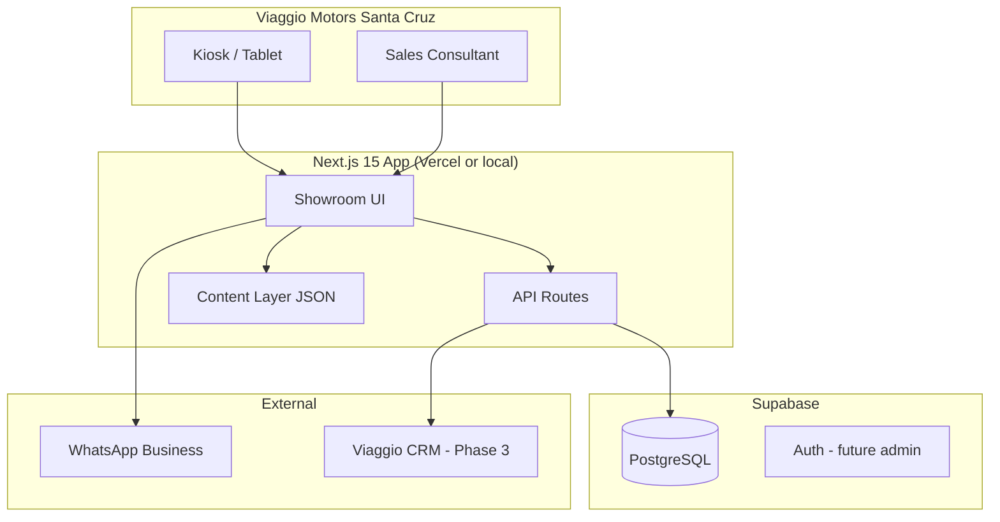

# Technical Architecture

Technical design for Viaggio Digital Showroom — **documentation only** in Phase 1. Planned stack: **Next.js 15**, **TypeScript**, **Tailwind CSS**, **Framer Motion**, **Supabase**.

> **See [Architecture Review](./architecture-review.md)** for P0 technical additions: Staff Dashboard (S35), session resume tokens (S37), Realtime handoff, extended analytics events, and pre-visit routes.

## Architecture Principles

1. **Content-driven, not hardcoded** — Vehicles, topics, tours are JSON; UI renders generically
2. **Static-first** — Pre-render vehicle content at build time; minimal server load for kiosk
3. **Anonymous sessions** — No login; privacy-conscious session handling
4. **Offline-tolerant** — Analytics buffer and lead queue for unreliable connectivity
5. **Add vehicles without deploy logic changes** — Content pack + registry update

## System Context



## Next.js 15 App Router Structure

### Route Groups

```
src/app/
├── layout.tsx                 # Root: fonts, providers
├── globals.css
├── (showroom)/                # Full-screen kiosk experience
│   ├── layout.tsx             # ShowroomLayout, no marketing chrome
│   ├── page.tsx               # S01/S02: Attract + Welcome
│   ├── visit/[slug]/page.tsx  # S21 Pre-visit QR
│   ├── resume/[token]/page.tsx # S37 Post-visit resume
│   └── vehicles/
│       ├── page.tsx           # S03: Selector
│       └── [slug]/
│           ├── layout.tsx     # VehicleShell
│           ├── page.tsx       # S04: Home hub
│           ├── hero/page.tsx  # S22
│           ├── tour/[tourId]/page.tsx
│           ├── themes/[themeId]/page.tsx
│           ├── themes/[themeId]/[topicId]/page.tsx
│           ├── trust/         # S23–S25, S29
│           ├── economics/     # S26–S28
│           ├── gallery/page.tsx
│           ├── specs/page.tsx
│           ├── compare/
│           ├── configure-lite/page.tsx  # S30
│           ├── share/page.tsx           # S33
│           └── convert/page.tsx
├── (staff)/
│   └── staff/page.tsx         # S35 Staff Dashboard
└── api/
    ├── sessions/route.ts      # POST: create; PATCH: resume token
    ├── analytics/route.ts     # POST: batch events
    ├── leads/route.ts         # POST: test drive / lead
    └── handoff/route.ts       # POST: S36 live handoff request
```

### Rendering Strategy

| Route | Strategy | Rationale |
|-------|----------|-----------|
| `/vehicles/[slug]/**` | SSG (generateStaticParams) | Content static; fast kiosk load |
| `/` welcome | SSG | Fixed content |
| `/api/*` | Serverless | Session/event writes |

`generateStaticParams` reads `registry.json`:

```typescript
// Planned — not implemented
export async function generateStaticParams() {
  const registry = await loadVehicleRegistry();
  return registry.vehicles
    .filter(v => v.status !== 'coming_soon')
    .map(v => ({ slug: v.slug }));
}
```

## Content Layer

### Loading Pipeline

```
src/content/vehicles/{slug}/*.json
        ↓
lib/content/loader.ts (validate with Ajv)
        ↓
lib/content/get-vehicle.ts (cached)
        ↓
Page components (RSC)
```

### Content Functions (Planned)

| Function | Returns |
|----------|---------|
| `getVehicleRegistry()` | All vehicles for selector |
| `getVehicle(slug)` | Vehicle metadata |
| `getThemes(slug)` | Theme list |
| `getTopic(slug, themeId, topicId)` | Topic + blocks |
| `getTour(slug, tourId)` | Tour + steps |
| `getCompareTargets(slug)` | Comparison profiles |
| `getPersonas()` | All personas |

Validation runs at build; runtime uses pre-validated imports or cached parsed JSON.

## Supabase Integration

### Client Setup

| Client | Use |
|--------|-----|
| `createBrowserClient` | Analytics, lead submit from kiosk |
| `createServerClient` | API routes |

### Tables

See [data-models.md](./data-models.md) for `sessions`, `analytics_events`, `leads`.

### Row Level Security (RLS)

```sql
-- Anonymous insert for kiosk sessions
alter table sessions enable row level security;
create policy "anon_insert_sessions" on sessions
  for insert to anon with check (true);

-- Anonymous insert events linked to own session
alter table analytics_events enable row level security;
create policy "anon_insert_events" on analytics_events
  for insert to anon with check (true);

-- Leads: anon insert only
alter table leads enable row level security;
create policy "anon_insert_leads" on leads
  for insert to anon with check (true);
```

**No public read** on leads/events — admin dashboard uses service role (Phase 3).

### Environment Variables

```
NEXT_PUBLIC_SUPABASE_URL=
NEXT_PUBLIC_SUPABASE_ANON_KEY=
SUPABASE_SERVICE_ROLE_KEY=      # Server only
NEXT_PUBLIC_WHATSAPP_NUMBER=    # Viaggio Santa Cruz
NEXT_PUBLIC_DEALERSHIP_NAME=Viaggio Motors
```

## Analytics Architecture

### Client-Side Tracker

```typescript
// Planned: lib/analytics/track.ts
type TrackOptions = {
  eventType: EventType;
  payload?: Record<string, unknown>;
};

// Batches events every 5s or on CTA
// Flushes to POST /api/analytics
// Falls back to IndexedDB queue
```

### Event Flow

```
User action → track() → buffer → POST /api/analytics → Supabase insert
                              ↘ (offline) IndexedDB → sync on reconnect
```

### Session Lifecycle

1. `session_started` on welcome complete (capture `entry_source`, optional UTM/campaign in metadata)
2. Periodic `depth_score` update server-side
3. **Resume token (S37):** optional `resume_token` in `sessions.metadata` — survives idle reset when customer opts in
4. `session_ended` on explicit exit or idle reset
5. Clear local state on reset; events flushed first; resume token preserved if opted in

### Staff Dashboard & Realtime Handoff (P0 — Phase 2)

- **S35** consultant route group `(staff)` — device PIN or Supabase Auth (consultant role)
- **S36** POST `/api/handoff` creates handoff request linked to `session_id`
- Supabase Realtime channel `handoffs` notifies S35; consultant claims via PATCH
- Session mirror: consultant tablet loads read-only view of customer `visited_topics` + current route

## WhatsApp Integration

```typescript
// Planned: lib/whatsapp/build-link.ts
function buildWhatsAppLink(params: {
  phone: string;
  vehicleName: string;
  topicsViewed: string[];
  intent: 'test_drive' | 'info' | 'price';
  customerName?: string;
}): string;
```

Returns `https://wa.me/591XXXXXXXX?text=...` with URL-encoded Spanish message.

## Styling — Tailwind CSS

### Design Tokens (Planned)

```typescript
// tailwind.config.ts theme extension
colors: {
  viaggio: { primary: '#...', dark: '#...' },
  gac: { primary: '#...', accent: '#...' },
  persona: {
    carlos: '#...',
    sofia: '#...',
    diego: '#...',
  }
}
```

### Kiosk Constraints

- Base font size: 18px (a11y scale to 22px, 26px)
- Touch targets: min 48×48px
- Safe area for 1920×1080 landscape
- Dark mode optional; default light premium

## Animation — Framer Motion

| Pattern | Implementation |
|---------|----------------|
| Page transitions | `AnimatePresence` in VehicleShell |
| Tour steps | Horizontal slide |
| Card grid | Stagger children |
| Reduced motion | `useReducedMotion()` → instant |

## API Routes

### POST `/api/sessions`

Creates session; returns `{ sessionId }`.

### POST `/api/analytics`

Body: `{ sessionId, events: ConversionEvent[] }`  
Batch insert to `analytics_events`.

### POST `/api/leads`

Body: Lead payload + sessionId  
Insert to `leads`; return `{ leadId }`.

## Security Considerations

| Concern | Mitigation |
|---------|------------|
| Spam leads | Rate limit by device_id + IP |
| PII in analytics | No phone in events; only in leads table |
| Session hijacking | UUID session IDs; no sensitive data in session |
| Content tampering | Build-time validation; content in Git |
| Kiosk escape | Kiosk browser locked; no arbitrary URL entry |

## Performance Targets (Kiosk)

| Metric | Target |
|--------|--------|
| LCP | < 2.5s on local network |
| First topic navigation | < 500ms (SSG) |
| Image format | WebP/AVIF, responsive sizes |
| Video | Lazy load; poster frames |
| JS bundle | Code-split per route |

## Deployment

### Recommended

| Environment | Host | Notes |
|-------------|------|-------|
| Production kiosk | Local mini-PC or Vercel + cache | Offline fallback important |
| Staging | Vercel preview | Content review |
| Supabase | Cloud project | São Paulo region (latency) |

### Kiosk Mode

- Chromium/Chrome kiosk shell pointing to app URL
- Auto-restart on crash
- Idle reset handled in app (S20)

## Testing Strategy (Phase 2)

| Layer | Tool |
|-------|------|
| Content validation | Ajv + CI script |
| Unit | Vitest — content loaders, WhatsApp builder |
| Component | Storybook — content blocks |
| E2E | Playwright — critical flows UF-01, UF-07 |
| Kiosk | Manual on 1080p touch display |

## Phase Roadmap

| Phase | Deliverable |
|-------|-------------|
| **1** (current) | Documentation, schemas, content templates, scaffold |
| **2** | Next.js app, GS4 MAX content, Supabase, kiosk deploy |
| **3** | Additional models, CRM, consultant dashboard, mobile QR resume |
| **4** | Admin CMS (optional), voice-over, A/B testing |

## Key Dependencies (Future `package.json`)

```json
{
  "dependencies": {
    "next": "^15",
    "react": "^19",
    "framer-motion": "^11",
    "@supabase/supabase-js": "^2",
    "ajv": "^8",
    "zod": "^3"
  },
  "devDependencies": {
    "typescript": "^5",
    "tailwindcss": "^3",
    "json-schema-to-typescript": "^15",
    "vitest": "^2",
    "playwright": "^1"
  }
}
```

---

*Related: [Folder Structure](./folder-structure.md) · [Data Models](./data-models.md) · [Component Tree](./component-tree.md)*
