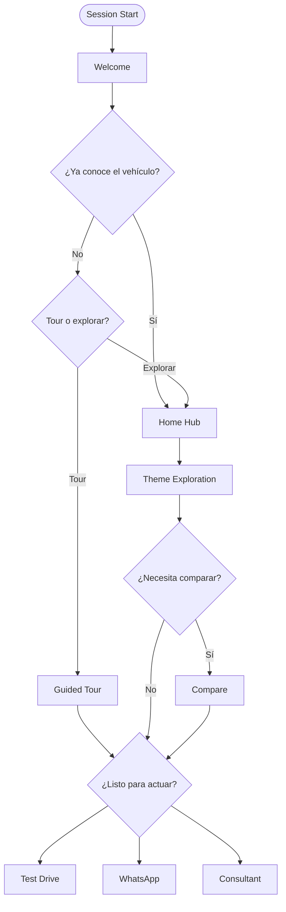

# User Flows

Detailed interaction flows for discovery, exploration, comparison, and conversion. Each flow references [Screen Map](./screen-map.md) screen IDs.

## Flow Legend

| Symbol | Meaning |
|--------|---------|
| `[Screen]` | Screen transition |
| `{action}` | User action |
| `<event>` | Analytics event |
| `(persona)` | Active digital guide |

---

## UF-01: First-Time Kiosk Discovery (Happy Path)

**Actor:** Solo visitor, first GAC exposure  
**Goal:** Understand GS4 MAX and request test drive  
**Duration:** ~25 minutes

```
[S01 Attract] → {tap anywhere}
[S02 Welcome] → {Empezar}
[S03 Vehicle Selector] → {select GS4 MAX}
[S04 Home Hub] → {Tour de Confianza}
[S05 Tour Picker] → {Trust Tour}
[S06 Tour Player] → steps 1-8 (Carlos)
  <tour_step_completed> × 8
[S06 end] → {Agendar prueba de manejo}
[S14 Test Drive Form] → {submit}
  <test_drive_requested>
[Confirmation] → {Volver al inicio} → [S01]
```

**Success criteria:** Form submitted with valid Bolivian phone number.

---

## UF-02: Family-Oriented Exploration

**Actor:** Parent(s) with kids on showroom floor  
**Goal:** Validate safety and space  
**Guide:** Diego primary, Carlos for safety

```
[S02 Welcome] → {Empezar}
[S04 Home Hub] → {Para tu familia}
[S07 Theme: Family] → {Espacio y asientos}
[S08 Topic: space] (Diego)
  <content_block_viewed>
[S08] → {related: Seguridad familiar}
[S07 Theme: Safety] → [S08 family-safety] (Diego + Carlos)
[S08] → {Comparar con otras SUVs}
[S11 Compare Hub] → {select competitor}
[S12 Compare Detail]
  <comparison_viewed>
[S12] → {WhatsApp}
[S15 WhatsApp Handoff]
  <whatsapp_initiated>
```

---

## UF-03: Quick Validator (Pre-Researched Buyer)

**Actor:** Customer who researched on Instagram  
**Goal:** Confirm warranty and price-value, talk to sales  
**Duration:** ~10 minutes

```
[S02 Welcome] → {Ya conozco el vehículo}
[S04 Home Hub]
  → {Garantía y servicio}
[S08 warranty-terms] (Carlos)
  → {Valor y equipamiento}
[S08 total-value] (Sofía)
  → {Hablar con consultor}
[S16 Consultant Handoff]
  <consultant_handoff>
```

---

## UF-04: Technology Enthusiast

**Actor:** Young professional, tech-forward  
**Goal:** Explore infotainment and ADAS  
**Guide:** Sofía + Carlos

```
[S04 Home Hub] → {Tecnología}
[S07 Theme: Technology] → {Pantalla y conectividad}
[S08 infotainment] (Sofía)
  <media_played>
[S08] → {Asistencias al conductor}
[S08 adas] (Carlos)
[S09 Gallery] → {Interior tab}
[S13 Convert Hub] → {Prueba de manejo}
[S14 Test Drive Form]
```

---

## UF-05: Comparison-Driven Decision

**Actor:** Buyer comparing 2–3 SUVs in segment  
**Goal:** Rational justification before test drive

```
[S04 Home Hub] → {Comparar}
[S11 Compare Hub] → {pick competitor A}
[S12 Compare Detail]
  → {expand: Seguridad rows}
  → {expand: Garantía rows}
  <comparison_row_expanded>
[S12] → {Cambiar competidor} → [S11] → [S12]
[S12] → {Sofía insight: valor total}
[S13 Convert Hub]
```

**Branch — internal GAC compare (Phase 3):**
```
[S11] → {GAC GS8} → [S12] (when gs8 content live)
```

---

## UF-06: Guided Tour Complete

**Actor:** Visitor with full time  
**Goal:** Comprehensive understanding

```
[S04] → {Tour Completo}
[S06] → 16 steps, mixed personas
  <tour_completed>
[S06 end] → [S18 Session Summary]
  → {Elegir siguiente paso}
[S13 Convert Hub]
```

---

## UF-07: WhatsApp-First Conversion

**Actor:** WhatsApp-native user, form-averse  
**Goal:** Start conversation without form

```
[Any content screen] → {sticky WhatsApp CTA}
[S15 WhatsApp Handoff]
  - Pre-fill: vehicle name + last 3 topics viewed
  <whatsapp_initiated>
[Confirmation screen on kiosk]
```

**Sticky CTA available on:** S04, S07, S08, S12, S13

---

## UF-08: Consultant-Assisted Presentation

**Actor:** Sales consultant with customer  
**Goal:** Support live presentation

```
{Consultant taps Start on tablet}
[S02 Welcome] → {skip personas intro}
[S04 Home Hub]
{Consultant navigates per customer questions}
[S08 relevant topics]
→ {Consultant Handoff} shows live session ID
[S16] → consultant notes interest level
```

**Note:** Consultant does not need login in Phase 2; session ID suffices.

---

## UF-09: Session Abandonment & Recovery

**Actor:** Distracted visitor  
**Goal:** System handles gracefully

```
[S08 Topic] → {idle 3 min}
[S20 Idle Prompt] → {¿Seguís ahí?} → {Sí}
[S08 Topic] → {idle 5 min total}
[S20] → session reset → [S01]
  <session_abandoned>
```

**Recovery (Phase 3):** QR on S20 to continue on phone.

---

## UF-10: Multi-Vehicle Browse (Future)

**Actor:** Customer unsure which GAC model  
**Goal:** Pick right vehicle

```
[S03 Vehicle Selector] → {GS4 MAX} → partial explore
[S04] → {back to selector via nav}
[S03] → {GS8 preview}
[Teaser modal] → {WhatsApp: avisame cuando esté}
  <future_model_interest>
```

---

## UF-11: Accessibility Flow

**Actor:** Visitor needing larger text  
**Goal:** Full access with a11y settings

```
[S02 Welcome] → {settings icon}
[S19 A11y Overlay] → {text size L} + {high contrast}
[S04 Home Hub] (adjusted typography)
→ normal exploration path
  <a11y_settings_changed>
```

---

## UF-12: Error & Edge Cases

### Network unavailable (Supabase down)

```
[S14 Test Drive Form] → {submit}
→ Queue locally (IndexedDB) → show success
→ sync when online (Phase 2)
  <lead_queued_offline>
```

### WhatsApp not installed (tablet)

```
[S15] → display QR code for phone scan
  <whatsapp_qr_shown>
```

### Content missing for topic

```
[S08] → fallback: "Contenido en actualización" + WhatsApp CTA
```

---

## Flow-to-Metrics Mapping

| Flow | Primary Metric | Secondary Metrics |
|------|----------------|-------------------|
| UF-01 | `test_drive_requested` | `tour_completed`, session depth |
| UF-02 | `whatsapp_initiated` | `comparison_viewed`, family theme views |
| UF-03 | `consultant_handoff` | warranty + value views |
| UF-05 | `comparison_viewed` | row expansions, CTA from compare |
| UF-07 | `whatsapp_initiated` | sticky CTA attribution |
| UF-09 | `session_abandoned` | idle prompt response rate |

---

## Decision Points



---

*Related: [Customer Journey](./customer-journey.md) · [Conversion Strategy](./conversion-strategy.md) · [Screen Map](./screen-map.md)*
